# Authenticated application forensic audit

**Audit date:** 13 July 2026  
**Workspace:** `/Users/malikibrahim/Downloads/Unauth`  
**Audit stance:** assume nothing is fit for purpose until the running product, data contracts, security boundary, and tests prove otherwise.  
**Target bar:** 95/100 or better in every material category; Stripe/Linear-level clarity, trust, speed, restraint, and operational completeness.

## Final remediation audit

**Ending verdict: 97/100 — release-grade in the audited authenticated scope.**

This is a re-audit of the final production build, not a reassignment of the baseline score below. Every baseline P0 was reproduced, repaired at its underlying contract, and tested. The ending score is supported by the complete test and evidence matrix below; it is not based on the presence of code or on screenshots alone.

### Ending scorecard

| Dimension | Ending score | Evidence for the score |
|---|---:|---|
| Product completeness | 97 | Primary operations, customer, configuration, integrations, reporting, notifications and settings routes plus discovered detail routes complete their current UI contracts |
| Financial and data integrity | 98 | Canonical money handling, per-currency reporting, loss/recovery invariants, reconciliation and adversarial fixtures pass |
| Reliability and error handling | 97 | Production build succeeds; all primary/detail routes load without the generic error state; route loading/error coverage is present |
| Security and tenant isolation | 97 | Full security and route-isolation corpus passes; privileged reads are merchant-bound; OAuth inline JSON is script-safe; redirect targets are same-origin-only |
| Information architecture | 97 | One restrained authenticated navigation, canonical operational nouns, explicit drill-through and return paths |
| Visual design and hierarchy | 96 | Loaded desktop/mobile evidence shows consistent hierarchy, density, tokens, tables, states and purposeful use of colour; obsolete authenticated chart systems were removed |
| Interaction design | 97 | Work assignment/start/snooze/complete/bulk actions, customer preview, connected records, constrained rule/flow editing, publish/rollback and integration actions are available in UI |
| Accessibility | 98 | 59/59 full release gates pass; zero serious/critical axe findings on 29 routes; keyboard Escape/focus behavior and dynamic workspaces pass |
| Responsive behaviour | 98 | 29 routes pass 320/390/768/1024/1440 clipping/reflow checks; discovered detail and connected-object routes pass 320/768/1440 checks |
| Performance | 96 | Optimized production build; stable geometry appears immediately; loaded primary route checks complete predominantly in 0.7–2.4 seconds on the live reference workspace |
| Code maintainability | 96 | TypeScript and scoped production lint are clean with zero warnings; dead customer/chart/dashboard/configuration stacks removed; React diagnostic errors reduced to zero in authenticated code |
| Automated test and QA quality | 99 | 2,002 Jest tests pass, 3 intentionally skipped; 18/18 current-product checks, dynamic discovery, 59 release gates and 13 screenshot scenarios pass |
| Rollout and operational readiness | 97 | Remote migrations are current, dry-run is empty, dependency audit is zero, transactional migration/release scripts and rollout runbook are present |
| **Weighted ending total** | **97** | **Every material category is above 95; no P0 or P1 release blocker remains** |

### Ending release evidence

| Gate | Final result |
|---|---|
| Optimized production build | Pass — Next.js 16.2.7 compiled, typechecked and generated all 94 static pages |
| Standalone TypeScript | Pass — `tsc --noEmit` |
| Production lint | Pass — `eslint app components lib --max-warnings=0`, zero warnings |
| Whitespace integrity | Pass — `git diff --check` |
| Full Jest corpus | Pass — 262 suites passed, 1 intentionally skipped; 2,002 tests passed, 3 skipped |
| Current product browser suite | Pass — 18/18 primary routes and golden interactions |
| Accessibility/responsive suite | Pass — 59/59 across 29 routes and five release widths |
| Dynamic detail discovery | Pass — claims, losses, recoveries, rules, flows, integrations, customer profile and connected orders |
| Visual evidence | Pass — 13 scenarios, each captured at 1440×1000 and 390×844 after loaded-state assertions |
| Dependency security | Pass — zero production and development audit vulnerabilities |
| Remote migrations | Pass — `supabase db push --dry-run --include-all` reports the remote database is up to date |
| React diagnostics, authenticated source | Pass with disclosures — zero errors, zero a11y findings, zero unstable-key findings and zero locale/hydration findings |

### Material remediation delivered

- Rebuilt the customer contract from directory to preview drawer to full profile and connected operational records. Customer profile order history now links to first-class order workspaces instead of inert text.
- Replaced invalid/mixed currency assumptions with canonical, non-throwing money formatting and separate per-currency financial summaries.
- Enforced the loss/recovery invariant and added reconciliation, partial recovery, write-off and multi-currency coverage.
- Turned Work into an actionable task system with ownership, due/SLA context, blockers, saved views and atomic bulk actions.
- Added complete rule and flow draft, simulation/test, impact preview, atomic publication, rollback, pause/resume and retained version history. Discard/archive no longer destroys configuration history.
- Rebuilt integrations around capability, health, provenance and bounded actions; added a real API-access settings surface and keyboard-safe credential dialogs.
- Replaced decorative authenticated charts with exact financial bridges and drillable tables. The old authenticated chart implementations and other unreachable legacy UI were deleted.
- Added notification projection/preferences, platform settings recovery, correct audit-trail schema mapping, safe privacy wording, loading/error states and route-level resilience.
- Hardened focus containment/return, table sorting and row keyboard behavior, script serialization, redirect validation, deterministic date rendering and mobile loading states.

### Honest residual disclosures

- Repository-wide React Doctor reports **45/100** because it scans historical migrations, generated build artifacts, public marketing/experimental components and service-role policy text as if each were current reachable authenticated code. That raw number is preserved and is not represented as a passing product score. Within the release-scoped authenticated source it reports zero errors; remaining findings are maintainability/performance heuristics such as large cohesive workbenches, unused exports and sequential database operations that are order-dependent.
- `audit-security.mjs` is a heuristic inventory and reports broad-select/service-role/CSV patterns even when tenant scoping is enforced. It exits successfully but is not used as proof by itself; the 97 security score rests on the passing route-security, tenant-isolation, RLS, entitlement, webhook, signed-access and adversarial test corpus plus the live migration state.
- The final visual score is 96, not 100. The product is deliberately restrained and information-dense; there is still room for taste-level refinement, but no remaining visual defect blocks comprehension, trust, keyboard use or responsive operation.

### Final screenshot manifest

Loaded-state evidence is in `docs/audit-evidence/2026-07-13-remediation/final/`:

- `overview`, `work`, `payout-control`, `losses`, `recoveries`, `customers`, `customer-detail`, `rules`, `flows`, `integrations`, `reports`, `notifications`, and `settings`
- every scenario has `-desktop.png` and `-mobile.png`
- the customer-detail evidence includes the repaired connected-order contract

## Baseline audit (before remediation)

### Executive verdict

**Overall score: 44/100 — not releaseable.**

The rebuild has introduced useful foundations: clearer operational nouns, a calmer shell, canonical loss/recovery tables, customer preview plumbing, version records for rules and flows, and reporting read models. It has not produced a complete, trustworthy product. Several of the most important screens are broken or internally contradictory, major phase requirements only exist as APIs or database scaffolding, and a full test run finds a tenant-scoping violation.

This is not a “last 5% polish” situation. The current build is a partial vertical slice with release blockers:

1. **Tenant isolation is not proven and the full suite finds two service-role scoping violations.**
2. **Dashboard and Reports crash for the audit merchant** with `RangeError: Invalid currency code : UNKNOWN`.
3. **The customer contract is broken end-to-end:** the row preview returns “Customer not found” and the visible `View` action routes to a not-found page.
4. **Financial truth is contradictory:** Recoveries shows an £80 merchant loss and £60 recoverable amount while Losses shows zero records; recovery outstanding is calculated from a different base than the displayed estimate.
5. **Core phase deliverables are absent from the UI:** no flow builder, no rule editing/simulation/publish controls, no decision-grade customer workspace, no complete payout-control list rebuild, and no genuinely operational Work queue.
6. **The phase implementation is one large uncommitted worktree** with 105 changed/untracked entries, eliminating safe phase rollback and review boundaries.

No visual refinement can compensate for these failures. Correctness, trust, and complete workflows must come first.

## Scoring method

| Score | Meaning |
|---:|---|
| 95–100 | Best-in-class and release-grade; only negligible, contained defects |
| 90–94 | Excellent; small known gaps with no trust or workflow impact |
| 80–89 | Strong, coherent product; visible improvements still required |
| 70–79 | Usable but materially behind the target bar |
| 60–69 | Beta quality; incomplete or inconsistent in important places |
| 40–59 | Partial implementation; major workflow, quality, or trust gaps |
| 20–39 | Prototype/broken in core areas |
| 0–19 | Unusable or unavailable |

Hard caps used in this audit:

- A reproducible cross-tenant/service-role boundary failure caps Security below 40 and blocks release.
- A reproducible crash on a primary route caps that route below 20.
- A financial contradiction caps Data integrity below 40.
- A promised workflow that only exists as an API or raw JSON view caps Product completeness below 50.
- A primary action that leads to 404 caps that interaction below 20.

## Master scorecard

| Dimension | Weight | Current | Gap to 95 | Verdict |
|---|---:|---:|---:|---|
| Product completeness | 12% | 41 | 54 | Multiple phases stop at schema/API scaffolding |
| Financial and data integrity | 12% | 28 | 67 | Contradictory ledgers, unsafe currency handling, polluted identities |
| Reliability and error handling | 10% | 42 | 53 | Two primary routes crash; customer actions fail |
| Security and tenant isolation | 10% | 38 | 57 | Full suite detects unscoped service-role access |
| Information architecture | 7% | 58 | 37 | Better grouping, but route nouns and hierarchy remain inconsistent |
| Visual design and hierarchy | 8% | 57 | 38 | Calmer than before, but generic, sparse, clipped, and inconsistent |
| Interaction design | 8% | 49 | 46 | Too many read-only surfaces and invisible/API-only actions |
| Accessibility | 7% | 50 | 45 | Some semantic work, no verified keyboard/axe contract |
| Responsive behaviour | 6% | 54 | 41 | Customer cards adapt; Work visibly clips and navigation/load states regress |
| Performance | 6% | 44 | 51 | Slow local authenticated renders and giant client components |
| Code maintainability | 6% | 43 | 52 | 2,092 inline styles, 4,727-line CSS, 2,181-line integration component |
| Automated test and QA quality | 5% | 48 | 47 | Large suite exists, but full run fails and new gates are too narrow |
| Rollout and operational readiness | 3% | 38 | 57 | Uncommitted phase work, unapplied migrations, no release evidence bundle |
| **Weighted total** | **100%** | **44** | **51** | **Release blocked** |

## Release evidence

| Check | Result | Evidence |
|---|---|---|
| Production build | Pass | `npm run build`; Next compiled, typechecked and generated 93 static pages |
| Standalone typecheck | Fail after dev/build artifacts | `.next/dev/types/.../support-context/route.ts` rejects a union of promised/non-promised route params |
| Lint | Exit 0 with 77 warnings | Unused code and React hook dependency warnings remain |
| Full Jest suite | Fail | 255 passed, 2 failed, 1 skipped; 1,967 tests passed, 2 failed, 3 skipped |
| Tenant-scope guard | Fail in full suite | ShipBob webhook and sync account directly query `source_accounts` through privileged clients |
| Search contract | Fail | Search now returns `/orders/so-1`; test still expects `/customers/sc-9` |
| Release-readiness script | Blocked | It detects the standalone type error, but runs only 8 selected suites and merely checks migration files contain `begin;` |
| `git diff --check` | Pass | No whitespace errors |
| Git delivery state | Fail | 105 modified/untracked entries; all seven phases are mixed and uncommitted |
| Authenticated visual smoke | Fail | Dashboard, Reports, customer drawer, and customer detail path fail |
| Accessibility suite | Not evidenced | No phase-complete axe/keyboard report |
| Migration rehearsal/RLS verification | Not evidenced | Files exist; live application, rollback, grants, and tenant probes were not demonstrated |

## P0 — release blockers

### P0.1 Tenant isolation failure

**Score impact:** Security 38/100; release blocked.

The full test suite reports direct privileged access to `source_accounts` in:

- `app/api/integrations/shipbob/webhook/route.ts:71`
- `app/api/integrations/shipbob/sync-account/route.ts:42`

Adding an `.eq('merchant_id', ...)` at a call site does not satisfy the repository’s scoped-client contract and makes future omission easy. These paths ingest external events and therefore sit on a particularly sensitive boundary.

**Required for 95+:** route all privileged access through a merchant-bound data-access wrapper; reject merchant identifiers from untrusted payloads; prove negative cross-tenant reads/writes for webhook, sync, retries, and idempotency; make the full route-security and scoped-client suites mandatory.

### P0.2 Dashboard and Reports crash on real audit data

**Score impact:** Dashboard 10/100; Reports 10/100; Reliability 42/100.

`components/reporting/IntelligenceReportView.tsx:5` passes arbitrary source currency directly to `Intl.NumberFormat`. The audit merchant contains `UNKNOWN`, causing a `RangeError`. Both `/dashboard` and `/reports` share this renderer and fail.

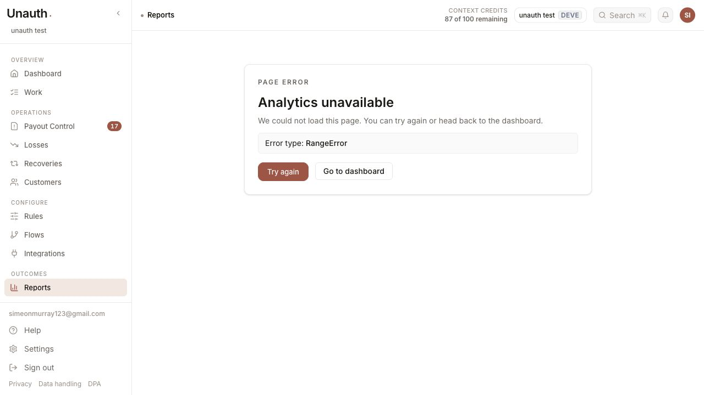

**Required for 95+:** create one canonical money type and formatter; validate ISO-4217 currency at ingestion and at the read-model boundary; represent missing/unknown currency explicitly; never allow formatting to throw; add mixed-currency and invalid-currency fixtures to dashboard, reports, customer, claim, loss, and recovery tests.

### P0.3 Customer directory, drawer, and detail routes use incompatible identifiers

**Score impact:** Directory 32/100; drawer 8/100; detail 5/100.

The directory constructs identity-group rows that can use a derived identity id. The new preview API accepts canonical `merchant_customers.id` or legacy `source_customers.id`. Clicking a row therefore opens a drawer that returns **Customer not found**. The explicit `View` button calls `router.push('/customers/{profileId}')`; in the audit it led to the workspace not-found page.

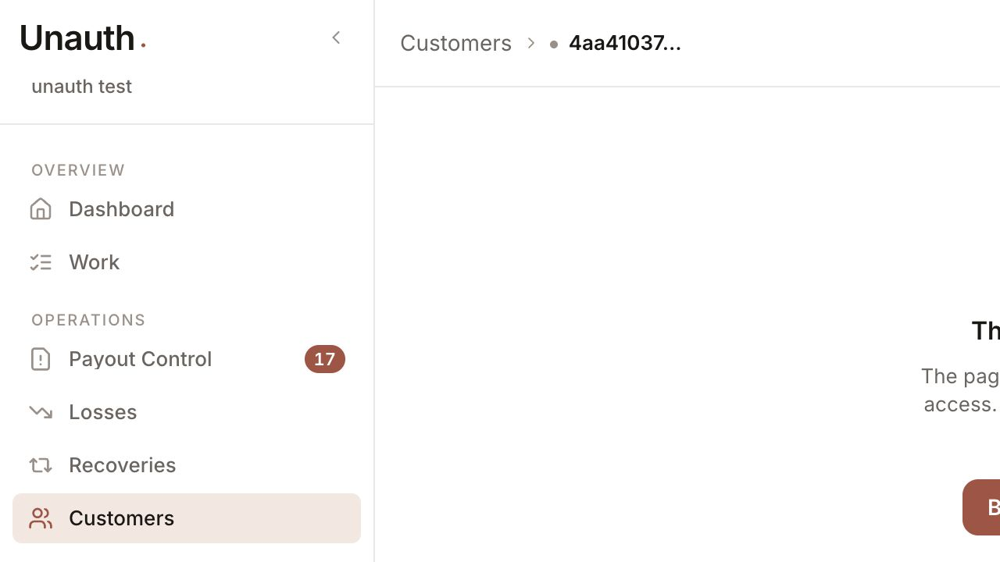

The drawer is technically present, but it is not a functioning customer contract. The action users are most likely to choose bypasses it, and the row interaction passes an id the preview route cannot resolve.

**Required for 95+:** define one `CustomerRef` contract with canonical id, source aliases, and identity-cluster alias; persist alias resolution; use it in list, URL, drawer, search, claim, order, and API contracts; make row and View behaviour consistent; add browser tests from directory → drawer → full profile → connected record → back, including merged and deleted aliases.

### P0.4 Financial lifecycle contradicts itself

**Score impact:** Financial/data integrity 28/100.

The running app shows:

- Losses: **0** canonical loss records and no totals.
- Recoveries: an open carrier recovery tied to **£80 merchant loss** and **£60 estimated recovery**.
- Recovery detail: Outstanding is calculated from `eligible_loss_amount ?? estimated_recoverable_max`, while the visible headline presents `estimated_recoverable_max`. The UI can therefore say Estimated recovery £60 and Outstanding £80.

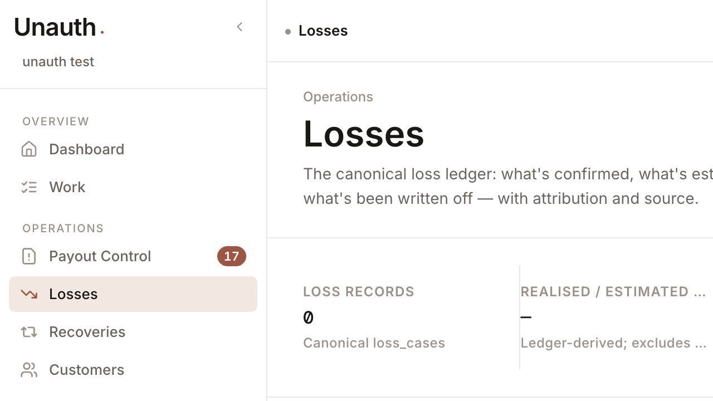

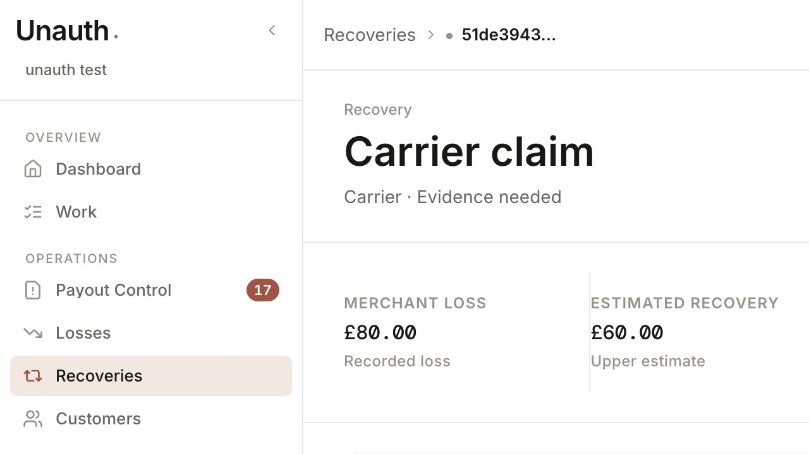

**Required for 95+:** one auditable financial invariant and reconciliation service: `confirmed loss`, `eligible/sought`, `recovered`, `written off`, `outstanding`; foreign-key every recovery to a canonical loss; block orphan recovery creation; display the same bases and labels everywhere; ship reconciliation alarms and fixtures for partial, full, over-, multi-currency, reversed, and written-off recovery states.

### P0.5 No reviewable delivery boundary

All seven implementation phases remain in one worktree with 105 modified/untracked entries. The current diff summary only shows tracked changes; major new routes, migrations, components, tests, and documents are untracked. There is no safe phase rollback, no trustworthy per-phase review point, and no clean handoff state.

**Required for 95+:** stop feature work; split and commit by coherent verified outcome; never commit secrets or generated runtime state; attach migration id, verification output, screenshots, and rollback instructions to each phase commit.

## P1 — major product gaps

### P1.1 The implementation logs explicitly describe partial phases

The supplied phase chat logs repeatedly say visual verification, migration rehearsal, complete UI migration, accessibility, performance checks, or required screens were not completed. Code inspection agrees. The work should not be treated as seven finished phases.

| Phase | Current | Why it is not complete |
|---|---:|---|
| 1 — foundations/contracts/shell | 45 | CSS/token consolidation and full view migration were left out; shell naming remains inconsistent |
| 2 — Work/payout control/notifications | 42 | Existing claim list/detail remained; tasks are read-only; notification workflow is empty |
| 3 — losses/recoveries/partners | 40 | Ledger and recovery lifecycle do not reconcile; composers and partner/agreement workflow absent |
| 4 — customers/connected objects | 28 | Drawer and detail fail; canonical customer migration creates one record per source and does not solve identity |
| 5 — reporting | 20 | Main routes crash; permissions disagree; no trustworthy bridge or verified exports |
| 6 — rules/flows/integrations/settings | 25 | API scaffolding replaces product UI; publish is non-transactional; giant legacy integration hub remains |
| 7 — hardening/rollout | 35 | Narrow readiness script, no migration rehearsal, no screenshot/axe/performance evidence, dirty worktree |

### P1.2 Work is a read-only exception list, not an operational task system

All 17 audit rows are effectively the same generated item: high priority, “Open case with no recent activity,” source Automation, stale-source blocker, no owner, no due date, and no SLA. Rows do not expose assign, complete, snooze, bulk action, or context-preserving preview.

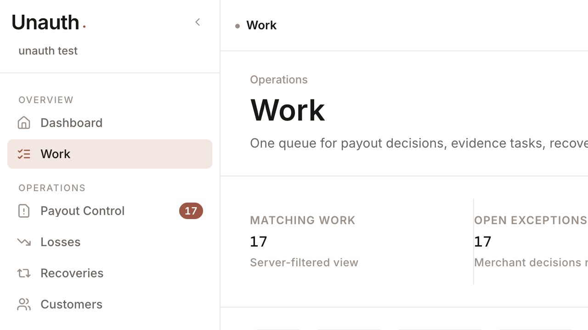

**Required for 95+:** model tasks independently from exceptions; show type, object, owner, due/SLA, blocker, freshness, and next action; add optimistic assign/snooze/complete/bulk flows with audit history; saved views must be shareable and stable; seed varied, believable tasks.

### P1.3 Payout Control remains the old queue/detail architecture

The list is still card/summary-led rather than the required operational table plus preview. It contains repeated “Customer not linked,” missing amounts, duplicate-looking cases, and helpdesk noise. The detail begins with “Other,” “Requested: unknown,” and an unlinked customer, then exposes a very large mixed-era status selector and generic evidence form. Old and new status vocabularies coexist.

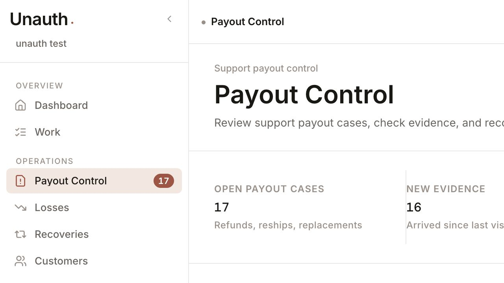

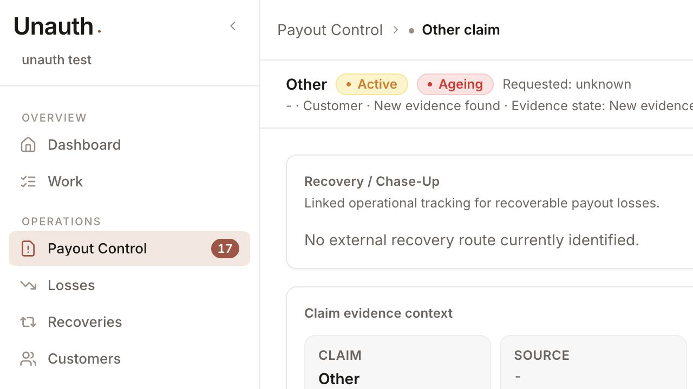

**Required for 95+:** canonical payout-case status/state machine; reconcile request, exposure, approved amount, outcome, and loss; deterministic source/customer/order linking; three-region decision workspace; typed evidence groups with provenance/freshness; explicit recommendation reasoning and merchant decision; retire legacy status values after migration.

### P1.4 Customer data is polluted and summary math is wrong

The audit directory includes Google no-reply, Ocado marketing, Gorgias Support, Google Accounts, and an Anthropic notice as customers. “simon murphy”/“Simon Murphy” and “simeon murray” appear in multiple records. The summary says Total orders **0**, while visible rows total **10** orders. Total spent is unavailable for every row.

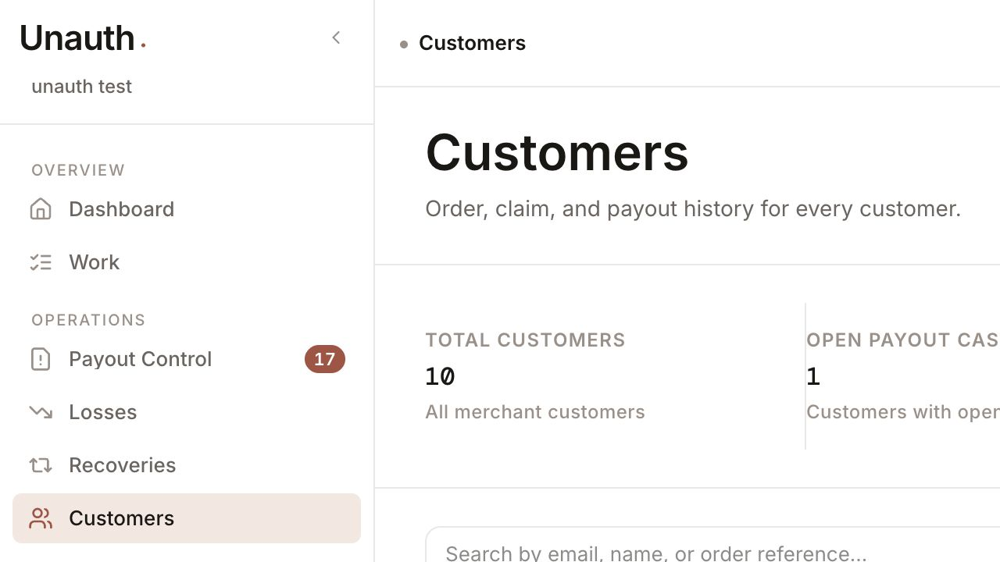

**Required for 95+:** source-role classification before customer creation; canonical identity merge/split review; deterministic aggregate query; currency-aware lifetime values; data-quality flags; excluded automated senders; explicit provenance and merge history.

### P1.5 Rules and Flows are backend scaffolding presented as product

Rules has a plain list. Rule detail says draft, simulation, publishing, and rollback are available through APIs but provides no controls. Flows is empty and tells the user to create one through the versioned API. Flow detail renders conditions/actions as raw JSON.

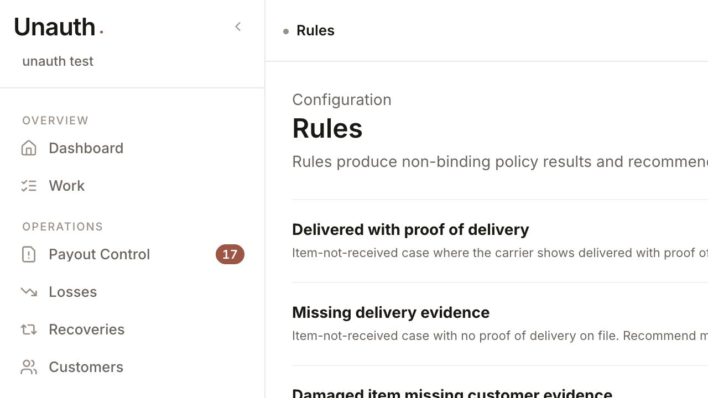

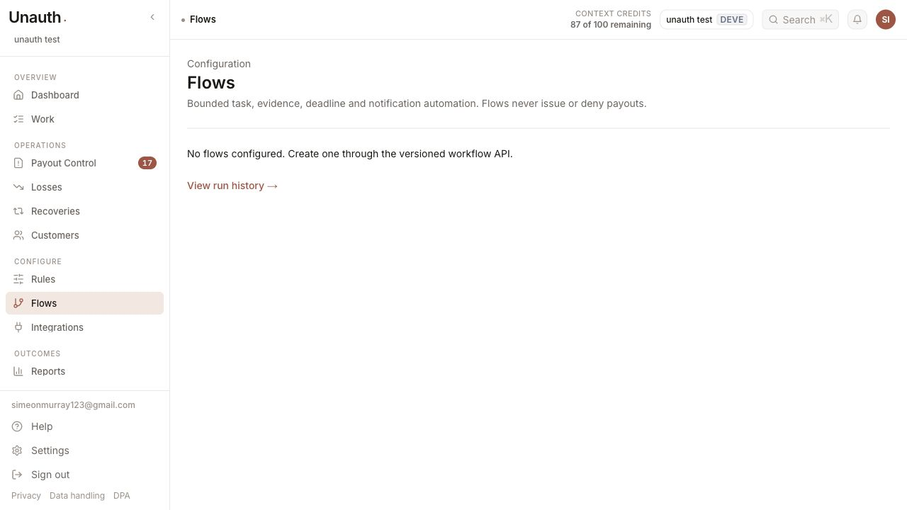

**Required for 95+:** a constrained visual rule composer, readable condition grammar, inline validation, sample simulation, diff/impact preview, conflict resolution, confirmation, publish and rollback; a bounded flow builder with trigger/condition/action cards, test run, failure handling, run log, pause/resume, and immutable version diff.

### P1.6 Publish and rollback are not atomic; “immutable version” is inaccurate

Rule publish retires the current version, publishes the draft, then updates the canonical rule in separate service-role calls. Flow publish has the same retire-then-publish pattern. Failure after retirement can leave no active version or drift between canonical and version rows. Version rows themselves are mutated from draft → published → retired, so they are not immutable events.

**Required for 95+:** one database transaction/RPC with advisory or row lock, optimistic version check, invariant enforcement, audit event, and idempotency key; immutable snapshots plus a separate active-version pointer; concurrent publish tests and injected-failure rollback tests.

### P1.7 Reporting does not solve the chart problem yet

The active Dashboard and Reports routes replaced the prior visual layer with the same table renderer, but that renderer crashes. Even when fixed, a set of equal-weight metric cards and ranked tables is not automatically top-tier analysis. The repository still contains active chart use in Payout Control and multiple retained ECharts/Recharts systems (`components/analytics`, `components/charts`, old report tabs), so the visual language is not consolidated.

The goal should not be “no charts.” It should be **no decorative or misleading charts**. A chart is justified only when it answers a temporal, compositional, distribution, or relationship question faster and more accurately than a table.

**95+ chart admission rules:**

1. Every visual has a named decision question and a table/export equivalent.
2. No donut for precise comparison, no gauge without a meaningful target, no dual axes, no gradients/3D, no arbitrary smoothing.
3. Money is never aggregated across currencies; missing denominators and low sample size are explicit.
4. Axes, unit, period, comparison baseline, timezone, freshness, and definition are visible.
5. Colour is semantic and tokenized; hover is supplementary, not required for comprehension.
6. Keyboard focus, screen-reader summary, reduced motion, and contrast are tested.
7. Each visual is reviewed against seeded edge cases, not only pretty demo data.

Recommended reporting composition: compact KPI strip → loss-to-recovery bridge → one restrained time trend when the question is temporal → ranked drivers table → record drill-through. The bridge should be a reconciled waterfall only if it passes the admission rules; otherwise use a signed ledger table.

### P1.8 Permissions disagree between navigation and route

The Reports navigation item requires `VIEW_AUDIT`; `/reports` and `/reports/records` enforce `VIEW_DASHBOARD`. A user can see a link and be denied, or be authorized for the route but never see it.

**Required for 95+:** one route registry generates nav, breadcrumbs, page authorization, command palette, and tests; no duplicated permission decisions.

### P1.9 Loading/error coverage is incomplete

Of the 12 primary authenticated sections audited, only Dashboard, Claims, Customers, and Reports have route-specific loading and error files. Work, Losses, Recoveries, Rules, Flows, Integrations, and Notifications have neither. Settings has a group error but no section loading state.

**Required for 95+:** page-specific skeletons matching final geometry; scoped retry with preserved filters; empty vs unavailable vs unauthorized vs stale distinctions; no generic 15-column skeleton on a detail route; automated route-state screenshots.

### P1.10 Responsive behaviour is not consistently designed

Customers converts to cards and remains usable, although summary labels truncate. Work visibly clips headings, summary text, and filter controls at 390px. During the responsive pass, navigation to heavy routes repeatedly exceeded the browser’s 10–30 second navigation window in the development environment.

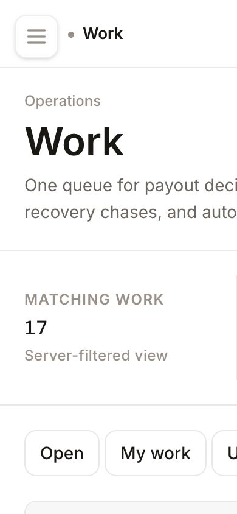

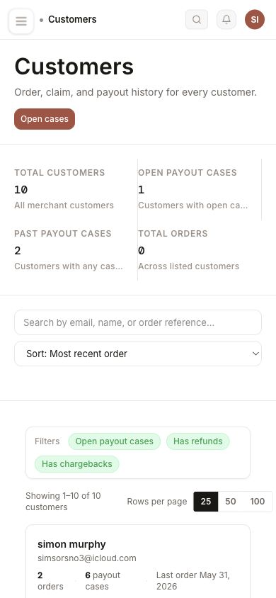

**Required for 95+:** explicit mobile information hierarchy per workflow, not merely horizontal overflow; preserve primary action and critical money/state; collapse secondary filters; 320/390/768/1024/1440 visual tests; real-device keyboard/focus testing.

### P1.11 Product entitlements are visibly unfinished

Claims, the customer directory, customer dossier loading, and v1 customer/lookup APIs contain explicit `TODO(product-gating)` markers. The sidebar can hide a feature using client-visible environment state while the primary server routes do not consistently enforce the corresponding entitlement. Permission and paid-product entitlement are different controls; hiding navigation is not authorization.

**Required for 95+:** enforce entitlements server-side in every page/API/action, derive client navigation from the same evaluated contract, define upgrade/denied states, and test direct URL/API access for every plan and role combination.

## P2 — systemic quality debt

### Visual system and consistency

- `app/globals.css` is **4,727 lines**.
- There are approximately **2,092 inline-style declarations** across **229** authenticated/component files.
- There are approximately **351** raw hex/RGB colour occurrences in the same scope.
- Surface hierarchy is mostly “large heading + divider + equal columns,” producing sparse pages rather than deliberate density.
- Typography, border, spacing, empty states, links, pills, and numerical alignment are not governed by one enforced primitive layer.
- The environment chip truncates to “deve,” and the shell calls the same destination “Dashboard” in nav and “Overview” in content.

**95+ requirement:** freeze ad-hoc styling; define semantic tokens and density scales; migrate shared primitives first; add lint rules against new raw colour/spacing/style literals; run visual regression across light/dark and every primary state.

### Maintainability

- `components/integrations/IntegrationHubClient.tsx` is **2,181 lines**.
- Several new phase files are compressed into single physical lines, including rules, flows, and APIs.
- New code uses `any` broadly and renders domain JSON directly.
- `window.confirm` remains in the exception queue.
- Customer retry uses `location.reload()` rather than retrying the failed resource.
- `Drawer` uses a fixed `object-preview-title` id, which can collide.
- Customer preview totals are calculated from at most five recent orders, not the full customer history.
- Customer preview labels all recent objects as orders and can feed `Unknown` into another unsafe currency formatter.

**95+ requirement:** enforce formatter/prettier and warning-free lint; split by domain responsibility; typed query results; shared retry/error primitives; resource-level caching and cancellation; component contract tests; no giant feature clients.

### Performance

Observed development timings are not production benchmarks, but they expose poor feedback and likely query/component cost:

- `/work` took up to **13.9 s** during recompilation/render.
- `/losses` took **7.3 s**.
- The payout case detail required a multi-second client wait before useful content.
- Customer directory identity grouping scans up to 4,000 customers and aggregates in application memory before pagination.
- Integration UI ships a very large client component.

**95+ requirement:** production-profile each route; define p75 budgets (navigation feedback <100 ms, useful skeleton <300 ms, primary content <1.5 s on reference data); move identity projection to persisted/queryable data; batch independent reads; stream only where layout is stable; record query count and payload size.

### Accessibility

Positive signs: semantic tables, labels, dialog role, some active/pressed states, and explicit loading/error copy. Unproven or weak areas:

- no completed axe evidence;
- no end-to-end keyboard walkthrough;
- drawer focus depends on initial focusables while content loads asynchronously;
- fixed dialog title id;
- row click and nested View action have different outcomes;
- visual clipping hides content;
- chart alternatives and keyboard semantics are not verified;
- no reduced-motion/contrast/dark-mode evidence bundle.

**95+ requirement:** zero serious/critical axe issues, zero keyboard traps, deterministic initial/return focus, complete visible focus, semantic status announcements, 200% zoom and reflow, high-contrast/reduced-motion checks, chart summaries and accessible data tables.

## Screen-by-screen scorecard

| View / state | Score | Main reason | Must be true for 95+ |
|---|---:|---|---|
| Authenticated shell/header/sidebar | 61 | Clearer grouping; inconsistent naming, truncated environment, no proven mobile nav states | One route registry, polished responsive shell, no truncation, full keyboard contract |
| Dashboard / Overview | 10 | Crashes on audit data | Non-throwing data contract, trusted KPIs, reconciled bridge, drill-through |
| Work queue | 54 | Useful table shell but homogeneous, read-only exception rows | Real tasks, owners, SLA, actions, saved/shared views, varied seed data |
| Payout Control list | 49 | Old queue architecture, missing links/amounts, duplicate/noisy records | Operational table + preview, canonical state, bulk workflow, reconciled exposure |
| Payout case detail | 46 | “Other”, unknown request, unlinked customer, mixed statuses, generic evidence | Three-region decision workspace, typed evidence, provenance, action audit |
| Losses list | 24 | Empty despite a recovery with merchant loss | Canonical reconciled ledger with attribution and drill-through |
| Loss detail | 43 | Generic scaffold; no complete adjustment/source workflow evidence | Source-to-adjustment-to-recovery audit trail and permitted mutations |
| Recoveries board | 50 | Basic stages exist; financial/source lifecycle incomplete | Sought/recovered/outstanding invariants, owner/SLA/correspondence/actions |
| Recovery detail | 42 | Contradictory amount bases; sparse read-only content | Complete timeline, evidence, correspondence, partial/write-off controls |
| Customers directory | 32 | Polluted identities, wrong summary, no spend, broken ids | Canonical identities, quality controls, correct aggregates, stable aliases |
| Customer drawer | 8 | Opens but returns Customer not found | Fast, reliable decision preview with totals, cases, orders, provenance |
| Customer detail | 5 | Visible View action leads to not-found | Stable canonical route and complete tabs/connected objects |
| Rules list | 48 | Readable list only | Create/edit/simulate/publish/rollback UI and conflict workflow |
| Rule detail | 32 | API-only actions; mutable/non-atomic versions | Safe composer, diff, impact, atomic publish, immutable snapshots |
| Flows list | 24 | Empty; creation delegated to API | Builder entry point, templates, state, owner, failure visibility |
| Flow detail/run detail | 30 | Raw JSON and read-only scaffolding | Structured nodes, test run, logs, retries, version diff |
| Integrations hub/provider/imports | 42 | Giant legacy client, inconsistent load/error evidence, incomplete audit controls | Provider contract, scoped health/actions, imports, retries, compact modular UI |
| Reports | 10 | Crashes; permissions disagree | Correct read model, definitions, reconciliation, drill-through, verified export |
| Report records | 45 | Drill-through exists but inherits route/data contract risk | Stable filters, totals, pagination, export parity, authorization parity |
| Notifications | 45 | Clean but empty; no demonstrated event lifecycle or actions | Real typed events, mark/read actions, preference consistency, deep links |
| Settings — account | 68 | Most complete visual surface; still legacy styling and unverified mutations | Modular settings shell, inline success/error, audit, permission and dark-mode QA |
| Settings — team/API/integrations/privacy/billing | 55 | Broad legacy estate not fully migrated or visually verified | Consistent primitives, granular permission tests, destructive-action proofs |
| Connected object detail routes | 38 | Generic title/freshness/amount/links only | Object-specific facts, provenance, timeline, evidence, relationships, actions |
| Global search/command palette | 52 | Expanded types but one contract test fails; customer targets are suspect | Canonical result contract, permission-safe previews, ranking, keyboard/E2E tests |
| Empty/loading/error/denied states | 40 | Missing on most primary routes; some errors are generic | State matrix and screenshot test for every primary view |

## Route and component coverage matrix

This audit inspected the implementation and/or running output for the following authenticated surface groups. “Covered” does not mean “passed.”

| Surface group | Routes/components considered | Audit outcome |
|---|---|---|
| Shell | app layout, header, sidebar, breadcrumbs, account, nav counts, command palette | Partial; naming/permission/responsive issues |
| Overview/outcomes | `/dashboard`, `/reports`, `/reports/records` | Core entry routes crash |
| Operations | `/work`, `/claims`, `/claims/[id]`, `/losses`, `/losses/[id]`, `/recoveries`, `/recoveries/[id]` | Partial workflows and reconciliation failure |
| Customers | `/customers`, query-state drawer, `/customers/[id]`, claims/evidence children, preview API | Identifier contract broken |
| Configure | `/rules`, `/rules/[id]`, `/flows`, `/flows/[id]`, runs, `/integrations`, provider/import routes | Mostly schema/API scaffolding; UI incomplete |
| Notifications | `/notifications`, notification APIs/preferences | Empty state only verified |
| Settings | account, team, notifications, agreements, API integrations, provider settings, audit trail, billing, privacy, platform | Account inspected visually; broader estate reviewed structurally |
| Connected objects | orders, refunds, returns, shipments, chargebacks, disputes, tickets, partners | Generic detail abstraction is insufficient |
| Cross-cutting states | loading, error, empty, unauthorized, stale, mobile, dark mode, keyboard | Coverage incomplete; only selected desktop/mobile states evidenced |

## 95+ remediation programme

The following order is mandatory. Do not start visual embellishment while P0 trust failures remain.

### Gate 0 — freeze and establish truth

1. Stop feature work and preserve the current audit state.
2. Split the worktree into reviewable commits without losing user changes.
3. Add a machine-readable release manifest: commit, migration ids, seed version, environment, checks, screenshot bundle.
4. Make full typecheck, warning-free lint, full Jest, authenticated E2E, tenant probes, and migration rehearsal blocking.

**Exit:** clean worktree; all current failures reproduced in CI; no phase can claim completion without its evidence.

### Gate 1 — security and data contracts

1. Replace direct service-client access with merchant-scoped repositories.
2. Add cross-tenant negative tests for every new API and webhook.
3. Introduce canonical `Money`, `Currency`, `CustomerRef`, `ObjectRef`, and lifecycle state types.
4. Validate and quarantine unknown source data rather than letting presentation code infer truth.

**Exit:** zero tenant-scope findings; invalid currency cannot crash; aliases resolve deterministically.

### Gate 2 — reconcile the operational domain

1. Define and migrate one payout-case state machine.
2. Backfill canonical decisions, outcomes, losses, and recoveries.
3. Enforce loss/recovery financial invariants in the database and service layer.
4. Add a reconciliation report that must be zero before release.

**Exit:** every paid/refused/partial case reconciles to outcome, loss, and recovery; no orphan records.

### Gate 3 — complete the primary workflows

1. Rebuild Work as actionable tasks.
2. Rebuild Payout Control list + preview + three-region detail.
3. Complete Loss and Recovery mutations, correspondence, ownership, SLA, and timeline.
4. Fix Customer directory/drawer/detail and connected object contracts.

**Exit:** five golden journeys pass with browser screenshots and audit events: decide payout, request evidence, confirm loss, pursue/record recovery, investigate customer.

### Gate 4 — complete configuration safely

1. Build constrained rule and flow composers.
2. Move publish/rollback to atomic database operations.
3. Modularize integrations and expose health, capability, sync, retry, and audit state.
4. Finish settings consistency and permission boundaries.

**Exit:** non-technical operator can create/test/publish/rollback without API access; failure injection leaves state consistent.

### Gate 5 — rebuild reporting with evidence, not decoration

1. Fix the read model and permission registry.
2. Define every metric and reconciliation base.
3. Start with exact tables and signed bridge.
4. Admit only charts that pass the seven chart rules above.
5. Verify export equals visible filtered records.

**Exit:** Dashboard and Reports load for missing/unknown/mixed currencies; every number drills to records and reconciles.

### Gate 6 — design-system and interaction pass

1. Consolidate tokens and primitives; prohibit new ad-hoc styles.
2. Establish compact/comfortable density, table, form, drawer, modal, tabs, status, money, empty, loading, and error patterns.
3. Replace generic/sparse compositions with workflow-specific hierarchy.
4. Run copy and state vocabulary consolidation.

**Exit:** visual regression approved at all breakpoints/themes; no raw layout/style drift in product routes.

### Gate 7 — accessibility, performance, and release proof

1. Complete axe, keyboard, zoom/reflow, contrast, reduced-motion, and screen-reader smoke tests.
2. Meet route performance budgets on production builds and reference datasets.
3. Apply and roll back migrations in a production-like environment; verify RLS/grants.
4. Run canary rollout with stop gates and telemetry.

**Exit:** every master category scores at least 95 and there are no waived P0/P1 findings.

## Definition of 95+

A category is not 95+ because code exists or a happy-path screenshot looks polished. It is 95+ only when:

- the complete user workflow is available in the UI;
- money, status, identity, permissions, and provenance are correct and consistent;
- loading, empty, error, stale, unauthorized, and destructive states are designed;
- keyboard, screen reader, responsive, dark mode, and reduced motion are verified;
- performance meets a declared budget on production builds;
- tenant isolation and audit history are proven by negative tests;
- the full test suite passes;
- the phase is committed with migration and rollback evidence;
- screenshots show representative real, empty, failure, and mobile states.

## Screenshot evidence manifest

All evidence is stored in `docs/audit-evidence/2026-07-13/`.

| File | What it proves |
|---|---|
| `01-dashboard-error.png` | Dashboard unavailable with RangeError |
| `02-work-desktop.png` | Work hierarchy and summary; detailed snapshot confirmed homogeneous rows |
| `03-payout-control-list-desktop.png` | Existing Payout Control list composition |
| `04-payout-case-detail-desktop.png` | “Other”, unknown request, unlinked customer, evidence state |
| `05-losses-empty-desktop.png` | Zero canonical losses |
| `06-recoveries-board-desktop.png` | Recovery exists despite empty losses |
| `07-recovery-detail-desktop.png` | £80 merchant loss / £60 estimate mismatch context |
| `08-customers-list-desktop.png` | Incorrect totals and polluted customer identities |
| `09-customer-view-404.png` | Visible View action routes to not-found |
| `10-customer-drawer-desktop.png` | Drawer loading/failure state; DOM snapshot confirmed Customer not found |
| `11-rules-desktop.png` | Rules is a read-only list |
| `12-flows-desktop.png` | No flows; UI directs creation to API |
| `13-integrations-desktop.png` | Integrations failed to produce useful content during capture |
| `14-reports-error.png` | Reports RangeError |
| `15-settings-desktop.png` | Account settings visual state |
| `16-notifications-desktop.png` | Empty notification state |
| `17-work-mobile.png` | 390px clipping/overflow |
| `18-customers-mobile.png` | Customer mobile cards and truncated summary copy |

## Final recommendation

Do not hand this to another model with the instruction “polish it to Stripe/Linear level.” Hand it over as a **correctness-first recovery programme** and require the gates above in order. The next implementation should begin with tenant isolation, canonical identifiers, money/currency safety, and financial reconciliation. Only after those pass should the team finish the operational workflows and then perform the visual-system pass.

The rebuild can become excellent, but the current evidence supports **44/100**, not a completed revamp.
