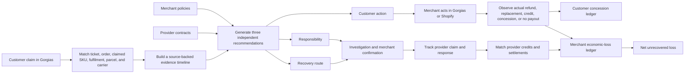

# Evidence reconciliation pivot — implementation plan

**Status:** Implemented vertical slice; staged rollout work remains connector-gated

**Prepared:** 25 July 2026

**Scope:** Release 1 product focus, canonical data model, recommendation logic, Gorgias experience, outcome observation, recovery reconciliation, and reporting

**Inputs:** The supplied product brief and conversation, the current repository, `README.md`, `docs/PRODUCT.md`, `ARCHITECTURE.md`, `docs/CONNECTORS.md`, the current capability baseline, and the Release 1 implementation status

### Implementation delivered (25 July 2026)

The first production-shaped slice is now present in the repository:

- additive item/parcel, recommendation-snapshot, outcome, provider-credit, provenance, and settlement-stage schema in `supabase/migrations/20260725100000_evidence_reconciliation_pivot.sql`, with generated contract/table updates and privacy purge support;
- deterministic three-answer reconciliation engine in `lib/reconciliation/types.ts` and `lib/reconciliation/recommendations.ts`, including system-record-versus-physical-proof handling;
- evidence-link enrichment in `lib/reconciliation/caseStore.ts`, so shipment-line evidence can resolve to its parent parcel without changing its fact kind;
- explicit case reconciliation, item matching, outcome observation, provider-credit, credit-match, and provider-stage API commands;
- a case workspace reconciliation panel and a re-framed Gorgias sidebar payload/template;
- Shopify refund projection changed to keep a Refund object pending until its transaction state is explicitly successful;
- financial projection now tags customer-concession, merchant-economic-loss, and provider-recovery entries separately and skips duplicate concession posting when the canonical outcome event already created it;
- legacy attribution consumers now remain unresolved when delivery/inspection artifacts do not establish parcel contents, and frequency/network history no longer becomes a responsibility verdict;
- targeted regression, migration-security, outcome-ledger, and Supabase contract checks.

The remaining rollout items in this document are deliberately still capability-gated: live connector line-item backfills, merchant policy/partner-contract version stores, provider-specific evidence normalisation, and end-to-end settlement matching need controlled runtime evidence before the new default is enabled for every merchant.

---

## 0. Executive decision

This is a focus pivot, not a replatform.

Unauth should move from being presented primarily as a **post-purchase payout-control product** to being an **evidence reconciliation, decision-support, and recovery-control product**:

> Unauth reconciles identities, events, and money. It does not ask AI to guess who is at fault.

The existing architecture is a strong fit for the new brief. Keep the canonical source graph, cases, evidence items, investigations, human responsibility confirmation, work queues, append-only financial records, recovery cases, audit controls, and connector capability model. Extend and recompose them around a more precise workflow:



The material implementation work is:

1. Reconcile at **claimed item × parcel** level, rather than stopping at order level.
2. Store individual facts with explicit provenance and distinguish source facts, human findings, and inferences.
3. Replace the current combined payout/attribution/recovery result with **three independently versioned recommendations**.
4. Make “unresolved” a first-class, acceptable responsibility result whenever physical proof is absent.
5. Reframe the Gorgias widget and Unauth case workspace around the three answers, their reasons, and missing evidence.
6. Observe what the merchant actually did without issuing refunds or replacements in Release 1.
7. Separate customer concessions from the merchant’s incremental economic loss.
8. Distinguish a provider approving a claim from a credit being received and reconciled.
9. Change reporting from case volume and theoretical recovery to avoidable concessions prevented, money actually reconciled, and net unrecovered loss.

No destructive rewrite or immediate route migration is required. Existing `/claims` URLs can remain for compatibility while user-facing terminology changes to **Cases** or **Reconciliation cases**.

---

## 1. Binding target product contract

### 1.1 Product job

For each post-purchase claim, Unauth must:

1. Identify the correct customer, order, claimed item, fulfilment, parcel, carrier movement, and relevant provider records.
2. Preserve every relevant fact as a traceable record rather than compressing the evidence into one opaque score.
3. Recommend what the merchant should do for the customer now.
4. State where responsibility currently appears to sit, including an explicit unresolved result.
5. Identify whether a recovery route exists and the best next step.
6. Observe the action the merchant actually takes.
7. Track investigation, provider claim, credit receipt, and reconciliation.
8. Calculate the merchant’s net unrecovered loss without double-counting customer value and economic cost.

### 1.2 Truthfulness invariants

These rules are more important than any individual UI or schema choice:

- A provider record shows what that provider’s system recorded. It is not automatically proof of physical reality.
- A Shopify fulfilment allocation does not prove that a warehouse physically packed the item.
- A ShipBob product recorded against a shipment is stronger fulfilment context, but is not a picker scan, pack photo, weight reconciliation, or physical proof unless the source artifact actually is one.
- A carrier “delivered” scan is not equivalent to a photo, signature, GPS position, or verified receipt by the intended customer.
- A customer message is the customer’s account of the event, not proof of liability.
- “Likely” and “merchant-confirmed” responsibility are different states.
- Customer treatment can proceed while responsibility remains unresolved.
- Customer history may influence a merchant’s customer-resolution policy. It must not be used to prove that a warehouse or carrier caused an incident.
- No response from a provider is not an admission of responsibility.
- A provider claim approval is not money received.
- A credit received but not matched to a case is not reconciled recovery.
- A recommendation never means that Unauth executed the action.

### 1.3 Release 1 action boundary

Unauth remains supervised in Release 1:

- It may ingest, reconcile, explain, recommend, prepare, track, and observe.
- It may prepare a provider request and support copy/send/manual workflows already in scope.
- It must not automatically issue a refund, create a replacement, accuse a provider, submit a provider claim, or mark money recovered without supporting evidence.
- The merchant acts in Gorgias, Shopify, a provider portal, or another approved operational surface.
- Unauth records the actual outcome from a verified source event or an explicit, auditable merchant confirmation.

### 1.4 Role of AI

AI may assist with:

- classifying the customer’s issue;
- extracting suggested order, SKU, variant, quantity, requested outcome, and supplied evidence from a message;
- summarising a timeline or provider response;
- drafting an evidence request.

AI must not:

- silently select among ambiguous orders or items;
- convert a system record into physical proof;
- assign responsibility without deterministic evidence rules and clear caveats;
- automatically mark a photo consistent or inconsistent;
- automatically confirm provider liability;
- execute the customer or recovery action.

Deterministic matching, policy evaluation, provider capability checks, versioned inputs, and human confirmation remain authoritative.

---

## 2. Current product compared with the target

### 2.1 Capability disposition

| Current capability | Current implementation | Target disposition | Required change |
|---|---|---|---|
| Canonical source records | Orders, lines, fulfilments, shipments, tracking events, tickets, messages, refunds, transactions, and generic source records already exist. | **Keep and extend** | Add explicit shipment-line allocations and preserve item-to-parcel relationships. |
| Relationship graph and ambiguity | Confirmed/probable relationships, match candidates, and manual match resolution already exist. Ticket-to-order resolution already refuses to auto-pick an ambiguous email match. | **Keep and extend** | Apply the same model to claimed item, fulfilment, shipment, and provider-record matching. |
| Support payout case | `support_payout_cases` is the canonical operational case but is order-level and carries one recommendation, attribution, and recovery state. | **Keep as case aggregate; stop overloading** | Add claimed-item records and independent recommendation snapshots. Retain compatibility columns during migration. |
| Evidence items | Evidence already retains source system, source record, occurred time, ingestion time, raw payload, structured value, freshness, and sync state. | **Keep and tighten** | Add explicit fact kind and external reference; link evidence to order lines, shipments, shipment lines, and claimed items. |
| Unified timeline | `lib/cases/readModel.ts` and `lib/cases/timeline.ts` already merge case, ticket, commerce, work, recovery, and domain events. | **Keep and expand** | Include line allocations, parcel events, manual findings, recommendation snapshots, observed outcomes, and provider credits. |
| Customer payout recommendation | Merchant rules currently produce one payout recommendation and one combined next-action workflow. | **Replace the combined contract** | Introduce a separate customer-action recommendation with its own state, reasons, evidence, and policy snapshot. |
| Loss attribution | Current deterministic logic can infer warehouse/carrier/customer labels. Some branches infer too much from delivered status, a customer statement, or customer history. | **Correct immediately** | Make unresolved the default where physical evidence is missing; remove customer/network history from operational responsibility assignment. |
| Recovery path | Current recovery is derived directly from attribution and an evidence checklist. | **Decouple and strengthen** | Evaluate contract eligibility, deadline, amount, required evidence, merchant confirmation, provider contact, and received credits independently. |
| Responsibility confirmation | Release 1 work already distinguishes advisory assessment from merchant confirmation and protects confirmed responsibility from silent overwrite. | **Keep and elevate** | Make confirmation state visible in the core recommendation model and require it for provider-performance reporting and formal recovery positioning. |
| Investigations | The app already recommends a target, drafts requests, supports email/portal/manual channels, tracks due dates and chases, records responses, and turns attachments into evidence. | **Keep and reframe** | Route from explicit evidence gaps and select one best next party. Preserve “no response is neutral.” |
| Gorgias widget | A read-only widget exists, but its payload and title remain rooted in identity/network context and payout-control terminology. | **Reframe as the core surface** | Show Customer action, Responsibility, Recovery, Why, Missing evidence, and a full-investigation link. Remove legacy risk/network fields from the default case view. |
| Shopify outcome ingestion | Orders, lines, fulfilments, refunds, and webhooks exist; refund projection currently treats a refund record too readily as confirmed loss. | **Extend and correct** | Inspect refund transaction success, correlate replacements, ingest store credit where supported, and support auditable manual goodwill/no-payout confirmation. |
| ShipBob connector | Order and shipment data are available, including products in provider payloads, but canonical mapping is coarse and loses SKU × shipment detail. Current webhooks do not include billing credits or line mutations. | **Extend** | Persist shipment lines, logs/mutations, fulfilment-centre context, and validated billing credit/refund/charge events. |
| Carrier evidence | UPS/FedEx tracking paths and capability metadata exist. Rich POD evidence is not safely promiseable from the current repository proof. | **Keep capability-gated** | Keep scans separate from photo/signature/GPS artifacts. Expose only capabilities proven for the merchant connection. |
| Financial history | Append-only `case_financial_entries` and summaries already distinguish requested, exposed, approved, paid, loss, recoverable, recovered, prevented, and written-off states. | **Extend, do not replace** | Add ledger kind, economic component, valuation basis, and source observation; compute two distinct ledgers and net unrecovered loss. |
| Recovery cases | Recovery already tracks evidence, deadlines, chases, approval, payment, and written-off amounts. It correctly notes that approval is not recovered cash. | **Extend** | Add the explicit Prepared → Sent → Acknowledged → Approved → Credited → Reconciled settlement contract and credit matching. |
| Merchant rules and partner terms | Customer rules are versioned. Partner recovery rules contain claimable costs, exclusions, evidence, deadlines, caps, submission method, source type, and confidence. Agreements can be uploaded. | **Keep and harden** | Require merchant approval/effective dates for provider terms and snapshot the applied policy/contract version into each recommendation. |
| Work queues, audit, tenancy, idempotency | Strong operational foundations already exist. | **Keep** | Extend them to every new entity and state transition. |
| Identity/network risk surfaces | Existing code and widget payload still include cross-store history, evidence scores, and repeat-claimant concepts. | **De-emphasise from this workflow** | Do not delete unrelated capability without a separate decision, but remove it from responsibility and the default evidence-reconciliation experience. |

### 2.2 What should not be rebuilt

The following should remain the foundation:

- `source_*` canonical commerce, support, fulfilment, shipment, refund, and transaction records;
- `source_records` and provider-specific raw metadata;
- `entity_relationships`, `record_match_candidates`, and `record_match_resolutions`;
- `support_payout_cases` as the internal case aggregate during the compatibility period;
- `evidence_items`, `evidence_links`, evidence freshness, and canonical evidence ingestion;
- `case_clarification_requests` and the investigation services/UI;
- `domain_events`, claim events, recovery events, work tasks, and the unified timeline;
- responsibility confirmation/correction and the recovery handoff boundary;
- `case_financial_entries` as the append-only financial journal;
- `recovery_cases`, partner records, and partner recovery rules;
- tenant isolation, append-only protections, audit logging, idempotency, and connector maturity controls.

The pivot should be implemented as additive schema changes, new read models, and a staged UI cutover. It should not begin with broad table renames or deletion of legacy routes.

### 2.3 Current logic that conflicts with the brief

These are correctness issues, not merely copy changes:

1. `lib/payouts/attribution.ts` currently returns `warehouse_missing_item` at medium confidence when a parcel is delivered and customer evidence exists, while simultaneously acknowledging that no pick/pack record is available. The target result is **unresolved**, with a request for the exact pack evidence.
2. The same module can turn a weak customer-claim result into `repeat_claimant` using own-store or cross-store history. History can affect customer policy, but it cannot assign physical responsibility.
3. `lib/payouts/recovery.ts` derives recoverability directly from advisory attribution. Recovery must also require an applicable merchant-approved contract, deadline, eligible cost, evidence requirements, and the appropriate confirmation state.
4. A reviewed delivery artifact can currently lead to “nothing to recover” too broadly. A consistent photo strengthens evidence; it does not necessarily prove parcel contents or customer possession.
5. Shopify refund projection currently risks treating a refund record as completed money movement and as the full economic loss. A successful transaction must be observed, and concession value must be separated from incident cost.
6. The Gorgias payload remains dominated by identity/network fields and one payout recommendation, which no longer reflects the product’s core job.

These should be corrected before the wider UI pivot is exposed.

---

## 3. Target domain model

### 3.1 Case aggregate

Keep `support_payout_cases.id` as the canonical case identifier for Release 1 compatibility. User-facing copy should call it a **case**, not a “payout case.”

The case aggregate owns:

- source ticket and source order;
- one or more claimed items;
- identity/match state;
- evidence facts and missing evidence;
- three recommendation streams;
- investigations;
- merchant-confirmed responsibility;
- observed customer outcomes;
- financial entries;
- zero or more recovery cases;
- work, timeline, comments, and audit history.

Do not add more recommendation or accounting fields directly to `support_payout_cases`. Its existing fields should be treated as a compatibility projection until consumers have moved to the new read model.

### 3.2 Claimed item

Add `case_claimed_items`.

Suggested fields:

| Field | Purpose |
|---|---|
| `id`, `merchant_id`, `support_payout_case_id` | Tenant-scoped identity and case link. |
| `source_order_line_id` | Confirmed canonical Shopify/order-line match; nullable while unresolved. |
| `claimed_sku`, `claimed_variant_ref`, `claimed_title` | Extracted or manually entered claim identity. |
| `claimed_quantity` | Quantity affected by this claim. Must be positive. |
| `source_message_id` / `source_evidence_item_id` | Provenance for the customer statement or agent entry. |
| `extraction_method` | `deterministic`, `ai_suggestion`, `agent_selected`, `imported`. |
| `match_status` | `unmatched`, `candidate`, `confirmed`, `rejected`. |
| `match_method`, `match_confidence` | Explain how the item was linked. |
| `confirmed_by`, `confirmed_at` | Required when an ambiguous match is resolved by a user. |
| `created_at`, `updated_at` | Operational timestamps. |

One case may contain several claimed items. A claimed quantity must not exceed the order-line quantity without raising an exception for manual review.

Use the existing match-candidate and match-resolution model when several order lines are plausible. Do not encode unconfirmed candidates as confirmed foreign keys.

### 3.3 Shipment-line allocation

Add `source_shipment_lines` or equivalently named `shipment_item_allocations`.

Suggested fields:

| Field | Purpose |
|---|---|
| `id`, `merchant_id`, `source_shipment_id` | Canonical allocation identity. |
| `source_order_line_id` | Matched canonical order line; nullable if provider identity cannot be resolved. |
| `source_fulfillment_id` | Optional direct fulfilment link. |
| `external_id`, `external_product_ref`, `sku`, `variant_ref` | Provider identifiers retained without lossy remapping. |
| `quantity_recorded` | Quantity the provider system associates with this shipment. |
| `record_kind` | For example `shopify_allocation`, `shipbob_shipment_product`, `shipbob_line_mutation`, `manual`. |
| `evidence_basis` | `system_record`, `scan`, `weight_record`, `photo`, `video`, `human_finding`. |
| `source_record_id` | Link to the raw canonical source record. |
| `source_created_at`, `source_updated_at`, `ingested_at` | Preserve provider and collection timing. |
| `raw_metadata` | Provider-specific fields and references. |

The name and UI must not imply physical proof. For example:

- “ShipBob recorded SKU X against shipment Y” is valid.
- “ShipBob packed SKU X” is invalid unless the evidence is specifically a qualifying pack scan, pack image, or other physical record.

### 3.4 Relationship graph

Use the existing graph for these links:

```text
source_ticket
  → source_order
  → source_order_line
  → source_fulfillment
  → source_shipment
  → source_shipment_line
  → carrier tracking record
  → provider billing or claim record
```

Strong match keys, in descending preference, are:

1. provider-native IDs and reference IDs;
2. explicit linked order IDs from the helpdesk;
3. fulfilment IDs and external line IDs;
4. tracking numbers;
5. exact SKU/variant plus quantity within a confirmed order;
6. stated order number with customer corroboration;
7. email plus a bounded time window.

Weak keys may produce candidates but must not silently confirm a match. If email finds three recent orders, recommendations remain blocked by an identity gap until the user chooses one.

### 3.5 Evidence fact contract

Retain `evidence_items` and expose its existing fields through a stricter canonical fact interface:

```ts
type EvidenceFact = {
  id: string;
  factKind: 'source_fact' | 'human_finding' | 'inference';
  evidenceType: string;
  sourceProvider: string;
  externalReference: string | null;
  sourceRecordId: string | null;
  occurredAt: string | null;
  collectedAt: string;
  rawValue: unknown;
  normalizedValue: unknown;
  freshness: 'fresh' | 'stale' | 'unavailable' | 'unknown';
  confidence: number | null;
  createdBy: string | null;
  supportsEvidenceIds: string[];
};
```

Schema changes:

- add `fact_kind` with the three values above;
- add a first-class `external_reference` if it cannot be derived reliably from `source_record_id` or `source_metadata`;
- extend `evidence_links` to link an item to `case_claimed_item_id`, `source_order_line_id`, `source_shipment_id`, and `source_shipment_line_id`;
- require `created_by` for a human finding;
- require an engine/version and supporting evidence references for an inference;
- retain `raw_payload` and `structured_value` as the stored raw and normalised forms;
- continue to use `occurred_at` and `ingested_at` as event and collection time.

Add discrete evidence types for:

- customer statement;
- customer attachment;
- order line;
- fulfilment-line allocation;
- shipment-line system record;
- shipment-line mutation;
- pick scan;
- pack scan;
- parcel weight;
- pack photo/video;
- carrier acceptance;
- carrier checkpoint;
- delivery scan;
- delivery photo;
- signature;
- GPS location;
- provider response;
- merchant photo finding;
- customer policy snapshot;
- provider contract snapshot;
- refund transaction;
- replacement order/fulfilment;
- store credit;
- provider claim decision;
- provider credit or settlement.

Do not merge delivery scan, photo, signature, and GPS into a generic “proof of delivery” boolean.

### 3.6 Recommendation snapshots

Add append-only `case_recommendation_snapshots`.

Each row represents one version of one recommendation stream:

| Field | Purpose |
|---|---|
| `id`, `merchant_id`, `support_payout_case_id` | Tenant-scoped identity. |
| `recommendation_type` | `customer_action`, `responsibility`, or `recovery`. |
| `result_code` | Machine-stable result. |
| `assessment_state` | `known`, `likely`, `unresolved`, `not_applicable`, or `blocked`. |
| `headline`, `explanation` | User-facing answer and concise rationale. |
| `reason_codes` | Stable deterministic reasons. |
| `supporting_evidence_ids` | Facts supporting the result. |
| `contradicting_evidence_ids` | Facts that prevent stronger certainty. |
| `missing_evidence` | Exact artifacts or facts that could change the result. |
| `merchant_rule_version_id` | Applied customer-policy version where relevant. |
| `partner_recovery_rule_version_id` | Applied provider-term version where relevant. |
| `input_hash`, `engine_version` | Reproducibility and idempotency. |
| `supersedes_snapshot_id` | Version lineage. |
| `generated_at`, `generated_by` | Audit provenance. |

Snapshots must remain independent. A customer-action refresh must not silently replace merchant-confirmed responsibility, and a responsibility change must not imply that a recovery route is contractually available.

The latest snapshot for each type can be exposed through a view or read-model query. Historical snapshots remain immutable.

### 3.7 Customer outcome observations

Add append-only `case_outcome_events`.

Suggested outcome types:

- `cash_refund`;
- `replacement`;
- `store_credit`;
- `goodwill_discount`;
- `no_payout`;
- `other_manual_concession`.

Suggested lifecycle:

- `reported`;
- `observed_pending`;
- `observed_success`;
- `observed_failed`;
- `reversed`;
- `merchant_confirmed`.

Important fields:

- case, order, claimed item, and source-event links;
- provider and external reference;
- correlation method and match state;
- amount, currency, retail value, and relevant cost fields;
- action timestamp and observation timestamp;
- idempotency key;
- `recommended_action_snapshot_id`;
- whether the recommendation was followed, overridden, or not comparable;
- override reason where recorded;
- actor or source system.

Do not store a recommendation as an outcome. Do not record a Shopify Refund object as successful until its associated transaction is successful. Use reversal entries/events rather than editing history.

### 3.8 Financial journals

Keep `case_financial_entries` append-only and add:

- `ledger_kind`: `customer_concession`, `merchant_economic_loss`, or `provider_recovery`;
- `component_type`;
- `valuation_basis`;
- `quantity`;
- `case_outcome_event_id`;
- `provider_credit_record_id`;
- optional claimed-item link.

Recommended component types:

**Customer concession**

- `cash_refund_face_value`;
- `store_credit_face_value`;
- `replacement_retail_value`;
- `goodwill_discount_face_value`.

**Merchant economic loss**

- `successful_cash_refund`;
- `replacement_product_cost`;
- `additional_pick_pack_cost`;
- `additional_shipping_cost`;
- `nonrecoverable_fee`;
- `handling_cost`;
- `other_incremental_cost`.

**Provider recovery**

- `three_pl_credit`;
- `carrier_settlement`;
- `supplier_credit`;
- `other_provider_credit`;
- `recovery_reversal`.

The summaries should expose:

```text
Customer concession value =
    successful cash refunds at face value
  + store credit under merchant-selected valuation
  + replacement retail value
  + goodwill discount

Incremental incident cost =
    successful cash refund
  + replacement product cost
  + additional pick/pack cost
  + additional shipping cost
  + nonrecoverable fees
  + optional handling cost

Net unrecovered loss =
    incremental incident cost
  - provider credits and settlements reconciled to the case
```

Avoid double counting:

- replacement retail value belongs in the concession ledger;
- replacement product and logistics cost belong in the economic-loss ledger;
- a provider approval does not reduce net loss;
- an unmatched provider credit does not reduce a specific case’s net loss;
- a reversed refund or credit posts a reversing entry.

Store-credit valuation must be merchant-configurable. At minimum support:

- face value;
- expected redemption percentage;
- expected incremental cost.

Persist the valuation setting/version applied to every entry.

### 3.9 Provider claim and credit reconciliation

The canonical provider claim stages are:

```text
Prepared → Sent → Acknowledged → Approved → Credited → Reconciled
```

Do not immediately replace the existing `recovery_cases.status` enum. Use a compatibility migration:

1. Add `provider_claim_stage`.
2. Backfill it from current statuses.
3. Dual-write and verify.
4. Make work-list states such as “chase due” derived from stage plus dates/tasks.
5. Move UI and reporting to `provider_claim_stage`.
6. Retire or narrow the old status only in a later, separately approved migration.

Add `provider_credit_records`:

| Field | Purpose |
|---|---|
| `id`, `merchant_id`, `provider`, `source_account_id` | Tenant and provider identity. |
| `external_credit_id`, `external_claim_id`, `external_order_ref`, `external_shipment_ref` | Correlation keys. |
| `amount_minor`, `currency` | Received credit or settlement value. |
| `credit_type` | Credit, refund, settlement, adjustment, or reversal. |
| `occurred_at`, `ingested_at` | Provider and collection time. |
| `evidence_item_id`, `source_record_id` | Raw evidence and provenance. |
| `match_status` | `unmatched`, `candidate`, `matched`, `rejected`. |
| `recovery_case_id`, `support_payout_case_id` | Confirmed match. |
| `match_method`, `match_confidence`, `matched_by`, `matched_at` | Reconciliation audit. |
| `idempotency_key` | Prevent duplicate credits. |

Stage meanings:

- **Prepared:** evidence pack and route are ready; no external submission is claimed.
- **Sent:** the merchant confirms submission or an approved outbound channel confirms acceptance.
- **Acknowledged:** the provider confirms receipt/reference.
- **Approved:** the provider says an amount is payable.
- **Credited:** a credit/settlement is observed on a provider or carrier account but may not yet be matched and checked.
- **Reconciled:** the credit is matched to the recovery case, currency/value are validated, and the financial entry has been posted.

### 3.10 Policies and provider terms

Reuse the published `merchant_rule_versions` model for customer-resolution policy. A customer-action recommendation must reference the exact published version it evaluated and retain a JSON snapshot of the relevant conditions and action.

The current `partner_recovery_rules` rows are useful but mutable. Add immutable `partner_recovery_rule_versions` before treating provider terms as an authoritative historical input.

Suggested fields:

- `partner_recovery_rule_id`, `merchant_id`, and monotonically increasing `version`;
- `status`: `draft`, `published`, `retired`, or `discarded`;
- all current claimable cost, excluded cost, required evidence, deadline, cap, submission, source, and confidence fields;
- `agreement_id` and optional extracted-term references;
- `effective_from` and `effective_to`;
- `approved_by`, `approved_at`, and approval note;
- `supersedes_version_id`;
- created/published audit fields.

Only a published, merchant-approved, effective version may establish formal recovery eligibility. An extracted or uploaded term may be shown for review, but must not silently become an executable rule.

Each recommendation snapshot should retain both the version ID and the applied term snapshot so history remains explainable if the source agreement or rule is later changed or removed.

---

## 4. Reconciliation pipeline

### 4.1 Intake from Gorgias

Extend the current support intake to create suggestions for:

- stated order number;
- issue type;
- claimed SKU, variant, or product description;
- claimed quantity;
- requested outcome;
- customer-supplied attachments;
- claim occurrence/message time.

The extraction result must preserve:

- source message;
- extracted text span where available;
- method and model/version where AI assisted;
- confidence;
- confirmation requirement.

Order and item suggestions are not responsibility signals.

### 4.2 Identity gates

Run matching in this order:

1. Resolve the ticket and customer.
2. Resolve the order.
3. Resolve each claimed item to an order line.
4. Resolve the order line to all relevant fulfilments and parcels.
5. Resolve each parcel to carrier tracking.
6. Resolve provider operations/logs and later billing/credit events.

Recommendation generation should be blocked when a material identity is ambiguous:

- unknown order;
- several plausible orders;
- several plausible order lines;
- tracking number reused or malformed;
- provider order linked only by a weak key with conflicting candidates.

The read model should expose the candidates and the exact confirmation needed. Existing `record_match_candidates` and `record_match_resolutions` should be reused.

### 4.3 SKU × parcel matrix

The canonical reconciliation result should contain a matrix such as:

| Claimed item | Ordered | Shopify allocation | ShipBob shipment record | Carrier parcel | Current state | Physical pack proof |
|---|---:|---|---|---|---|---|
| BLACK-BODY-XS | 1 | Fulfilment 2 | Shipment 94822, quantity 1 | 1Z…822 | In transit | None |

This matrix is the primary defense against split-shipment errors. It must show all parcels associated with the claimed item, not only the first fulfilment or first tracking number.

### 4.4 Evidence timeline

Build a single ordered timeline from source facts, human findings, and inferences. Sort by provider event time, then collection time, then stable ID. Never overwrite provider time with ingestion time.

Each visible row must answer:

- What happened?
- Which source says so?
- Which external object does it refer to?
- When did it happen?
- When did Unauth collect it?
- Is it fresh?
- Is it a source fact, human finding, or inference?
- Which claimed item/parcel does it affect?

The timeline should include recommendation changes and observed outcomes, but label those as Unauth decisions/observations rather than source facts.

### 4.5 Reconciliation refresh

Use an explicit, idempotent command or background job:

```text
collect/normalise sources
→ update relationships and candidates
→ assemble evidence facts
→ compute item × parcel state
→ evaluate three recommendation streams
→ append changed recommendation snapshots
→ project work and read models
```

GET routes must remain side-effect free. Opening a case or loading the Gorgias widget must not silently write a new recommendation version. Refresh should be triggered by:

- a relevant source event;
- an investigation response;
- a policy or contract version change;
- a manual match/finding/confirmation;
- an explicit user refresh command;
- a scheduled freshness recheck when deadlines or promised windows expire.

Use `input_hash` to avoid appending identical snapshots.

---

## 5. Three independent recommendation engines

### 5.1 Shared output contract

Every recommendation returns:

- assessment state;
- result code;
- headline;
- concise explanation;
- reason codes;
- supporting and contradicting evidence IDs;
- exact missing evidence;
- applicable deadline or recheck time;
- applied policy/contract snapshot;
- engine version and input hash;
- generated time.

It must be possible for the three answers to diverge. For example:

- customer action: reship now;
- responsibility: unresolved;
- recovery: ask the 3PL for pack evidence before opening a formal claim.

### 5.2 Customer-action recommendation

Question:

> What should the merchant do for this customer now?

Suggested result codes:

- `wait_and_explain`;
- `provide_tracking`;
- `request_customer_evidence`;
- `refund`;
- `targeted_reship`;
- `replacement`;
- `store_credit`;
- `deny_under_policy`;
- `manual_review`;
- `no_action_needed`.

Inputs:

- matched item and parcel state;
- current evidence and contradictions;
- merchant customer-resolution policy version;
- promised and actual delivery window;
- order value, product value, and availability where available;
- whether requested information could materially change the decision;
- previous recommendations and observed merchant actions;
- own-store customer context only where the merchant policy explicitly uses it.

This engine may recommend a customer-friendly action while responsibility is unresolved. It must explain when waiting is safe and give a concrete recheck date.

### 5.3 Responsibility assessment

Question:

> Where in the chain does the evidence currently point?

Suggested result codes:

- `no_loss_established`;
- `fulfilment_side_likely`;
- `carrier_side_likely`;
- `no_fulfilment_failure_identified`;
- `post_delivery_or_uncovered`;
- `unresolved`;
- `merchant_confirmed_three_pl`;
- `merchant_confirmed_carrier`;
- `merchant_confirmed_supplier`;
- `merchant_confirmed_internal`.

Rules:

- “Likely” is advisory and must include the evidence basis and caveat.
- “Merchant-confirmed” is an explicit user action with actor, time, reason, and supporting evidence.
- A system record that lists an item in a shipment is not enough to confirm that it was physically packed.
- A delivered scan without richer POD is unresolved for delivery-to-address disputes.
- A missing-item case with no physical pack evidence remains unresolved even when the 3PL system lists the SKU.
- Customer or cross-store claim frequency must not select a warehouse/carrier/customer responsibility result.
- Manual photo findings are `consistent`, `inconsistent`, or `unclear`; they are not automatic verification.
- Provider reporting and negotiation views use merchant-confirmed responsibility, not merely likely assessment.

### 5.4 Recovery recommendation

Question:

> What is the best available route to recover the merchant’s cost?

Suggested result codes:

- `none`;
- `gather_evidence`;
- `request_three_pl_evidence`;
- `request_carrier_pod`;
- `prepare_three_pl_claim`;
- `prepare_carrier_claim`;
- `prepare_supplier_claim`;
- `send_or_mark_sent`;
- `chase_provider`;
- `review_provider_response`;
- `match_expected_credit`;
- `reconcile_received_credit`;
- `closed_unrecoverable`;
- `manual_review`.

Inputs:

- responsibility assessment and merchant confirmation state;
- merchant-approved provider terms;
- claim deadline;
- eligible and excluded costs;
- liability cap;
- required evidence;
- prior provider contact;
- provider response;
- claim stage;
- approved amount;
- observed credits and match status.

Recovery must not be marked available solely because responsibility is “likely.” Before a formal route is presented as eligible, the system must know:

- the applicable provider and contract/rule;
- the deadline has not expired;
- the cost is eligible;
- required evidence is present or identified;
- the appropriate merchant confirmation has been made;
- the amount and cap can be calculated or are explicitly unknown.

An investigation request can still be recommended before responsibility is confirmed.

---

## 6. Required decision scenarios

The following scenarios are Release 1 acceptance contracts:

| Reconciled evidence | Customer action | Responsibility | Recovery |
|---|---|---|---|
| Claimed SKU is in a second parcel still within its promised window. | Wait, explain the split shipment, and provide tracking/recheck date. | `no_loss_established` | `none` |
| Item is absent from every shipment record or a fulfilment exception prevented shipment. | Resolve under merchant policy, usually a targeted reship. | `fulfilment_side_likely` unless the cause is already merchant-confirmed. | Request fulfilment record; prepare 3PL recovery only when terms and confirmation allow. |
| ShipBob lists the item in the parcel; customer says it was absent; no physical pack evidence exists. | Resolve according to merchant policy/value threshold. | `unresolved` | Request pack scan, actual weight, photo/video, or warehouse investigation response. |
| Whole parcel stalls or has a lost/damage exception after carrier handoff. | Refund/reship when the merchant delay threshold is met. | `carrier_side_likely` | Prepare carrier claim when contract, deadline, and evidence are satisfied. |
| Delivered plus photo/GPS/signature is inconsistent with the delivery address. | Resolve according to policy. | `carrier_side_likely` | Prepare carrier claim with the contradiction. |
| Delivered scan but no richer POD. | Merchant policy decides customer treatment. | `unresolved` | Request POD before assigning responsibility. |
| Damaged product plus damaged-carton evidence or carrier damage exception. | Replace/refund under policy. | Carrier likely; packaging responsibility may remain unresolved. | Carrier claim or 3PL packaging investigation, depending on evidence and terms. |
| Provider has approved £40 but no credit is visible. | No change to customer action. | Preserve current confirmed responsibility. | Stage is `approved`; net loss is unchanged. |
| A £40 provider credit is visible but not matched to a case. | No change. | No change. | Stage may be `credited`; case recovery and net loss remain unchanged until matched. |
| The £40 credit is matched, validated, and posted. | No change. | No change. | Stage becomes `reconciled`; net unrecovered loss decreases by £40. |

Add regression tests for these cases before changing the default UI.

---

## 7. Connector implementation

### 7.1 Provider proof rule

The supplied brief contains updated field observations, but the repository’s 21 July proof matrix still states that no provider has complete controlled-runtime evidence for every applicable capability. Do not promote catalogue maturity merely from the brief or from public API documentation.

For each provider change:

1. implement the canonical field mapping;
2. add automated contract tests;
3. execute a controlled merchant/account workflow;
4. record environment, account, build, date, scenario, result, limitations, and artifact;
5. expose capability per merchant connection;
6. only then update the displayed maturity.

### 7.2 Gorgias

Current assets:

- API-key connection and identity probe;
- backfill and webhook ingestion;
- ticket/order linking;
- widget registration and read-only JSON route;
- bounded internal note/tag adapter;
- investigation email/manual flows.

Required work:

- validate ticket, messages, internal notes, tags, custom fields, timestamps, attachments, and agent history against the intended runtime account;
- preserve message and attachment provenance;
- extract suggested claimed item, quantity, requested outcome, and supplied evidence;
- create match candidates when order or item is ambiguous;
- replace the widget payload/template with the new six-part answer;
- add a reliable case-correlation mechanism for merchant actions, preferably an Unauth case ID in an approved tag, note, or action callback;
- keep the widget read-only and keep customer/provider actions in the merchant’s chosen surface.

### 7.3 Shopify

Current assets:

- order and line ingestion;
- fulfilment and tracking ingestion;
- return/refund records;
- webhook verification and idempotency;
- canonical transactions table;
- product cost fields in the canonical order-line model.

Required work:

- ingest and persist fulfilment-line-item allocation, not only order-level fulfilment;
- map each Shopify fulfilment allocation to `source_shipment_lines`;
- ingest refund transaction state and post a successful cash outcome only when the transaction succeeds;
- support pending, failed, reversed, and partially successful refund states;
- correlate refund quantities/lines where available;
- ingest store-credit events when supported by the merchant’s API permissions and model them separately from cash;
- detect replacement order/fulfilment candidates;
- require a case tag/note/action callback or explicit confirmation when Shopify alone cannot prove that a zero-charge order is a replacement for this case;
- retain unit-cost provenance and permission/capability state;
- ensure one order with several active cases does not attach one refund/replacement to the wrong case.

### 7.4 ShipBob core

Current assets:

- order/reference IDs;
- shipments, status, tracking, locations, and products in provider payloads;
- OAuth/PAT, import, incremental sync, webhook verification, and canonical source persistence.

Current gap:

- provider products are reduced to a coarse warehouse evidence summary and are not persisted as canonical shipment-line allocations.

Required work:

- persist ShipBob shipment products and quantities in `source_shipment_lines`;
- retain ShipBob order ID, reference ID, shipment ID, product ID/reference, fulfilment centre, tracking number, status details, actual fulfilment date, invoice fields, signature requirement, and operational logs where returned;
- ingest line addition/removal/quantity mutation events as new facts rather than rewriting history invisibly;
- distinguish the current shipment-line system state from the mutation timeline;
- label every recorded product as a system record unless a stronger evidence artifact is explicitly supplied;
- add reconciliation/backfill for deleted or changed provider records.

### 7.5 ShipBob billing

Required work:

- add signed, idempotent ingestion for `billing.charge.created`, `billing.refund.created`, and `billing.credit.created`;
- preserve raw payloads and source timestamps;
- validate payloads in a controlled runtime before relying on fields;
- create `provider_credit_records`;
- correlate first by provider claim/order/shipment/reference IDs, then expose candidates;
- never auto-match a weak candidate based only on amount and date;
- keep the feature capability-gated until payload correlation and replay behavior are proven.

### 7.6 UPS

Treat basic tracking as the initial dependable scope:

- possession/handoff;
- current status;
- checkpoints/exceptions;
- delivery time.

Photo, signature, and other POD artifacts must be separate capabilities. Until controlled retrieval is proven for the merchant account, the recommendation should ask for portal/provider evidence rather than implying that the API has it.

### 7.7 FedEx

Keep sandbox and production capability separate:

- basic tracking may be used only where production credentials and runtime verification exist;
- signature image requires the required account context;
- picture/GPS POD must be gated by the merchant’s product/access;
- no UI or recovery pack should promise these fields from public documentation alone.

### 7.8 Manual evidence and uploads

Extend the existing upload/evidence flows for:

- customer photos;
- packaging photos;
- packing slips;
- pick/pack records;
- actual parcel weights;
- provider emails;
- portal screenshots;
- carrier POD;
- credit memos;
- claim decisions;
- settlement statements.

Manual image review records a human finding of `consistent`, `inconsistent`, or `unclear`, with actor and time. The original image remains a separate source artifact.

### 7.9 Deferred portability

WooCommerce, BigCommerce, Zendesk, Freshdesk, and AfterShip remain portability paths. They should adopt the same canonical interfaces later, but must not be presented as equivalent in maturity to the initial Gorgias + Shopify + ShipBob + carrier route without the same runtime proof.

---

## 8. API and service contract

### 8.1 Canonical case read model

Extend `GET /api/claims/[claimId]` to return one side-effect-free case read model:

```ts
type ReconciliationCaseReadModel = {
  case: CaseSummary;
  identities: {
    ticket: MatchedEntity;
    order: MatchedEntity;
    claimedItems: ClaimedItem[];
    candidates: MatchCandidate[];
  };
  itemParcelMatrix: ItemParcelRow[];
  facts: EvidenceFact[];
  timeline: TimelineItem[];
  recommendations: {
    customerAction: RecommendationSnapshot | null;
    responsibility: RecommendationSnapshot | null;
    recovery: RecommendationSnapshot | null;
  };
  missingEvidence: MissingEvidenceRequest[];
  investigations: InvestigationSummary[];
  responsibilityConfirmation: ResponsibilityConfirmation | null;
  outcomes: CaseOutcomeEvent[];
  ledgers: {
    customerConcessions: FinancialSummary[];
    merchantEconomicLoss: FinancialSummary[];
    providerRecovery: FinancialSummary[];
    netUnrecoveredLoss: MoneyByCurrency[];
  };
  recoveryCases: RecoveryCaseSummary[];
  relatedRecords: RelatedRecord[];
};
```

The existing `lib/cases/readModel.ts` is the starting point. It already obeys the read-only rule and merges several current stores.

### 8.2 Commands

Recommended routes:

| Route | Purpose |
|---|---|
| `POST /api/claims/[claimId]/reconcile` | Explicitly refresh relationships, facts, and changed recommendation snapshots. Requires idempotency key and expected case version. |
| `POST /api/claims/[claimId]/matches/resolve` | Confirm or reject an order/item/parcel candidate. |
| `POST /api/claims/[claimId]/responsibility` | Reuse the existing merchant confirmation/correction path, adapted to the new result codes. |
| `POST /api/claims/[claimId]/outcomes` | Record a manual goodwill/no-payout/ambiguous replacement outcome with audit context. |
| `POST /api/claims/[claimId]/investigations` | Reuse the existing investigation creation path. |
| `POST /api/recoveries/[recoveryId]/stage` | Advance or correct provider claim stage with evidence and optimistic concurrency. |
| `POST /api/recoveries/[recoveryId]/credits/[creditId]/match` | Confirm or reject a credit match and post/reverse financial entries idempotently. |

Keep `app/api/claims/[claimId]/decision/route.ts` as a compatibility adapter while consumers move to reconciliation snapshots. It must not remain a second source of truth.

### 8.3 Services

Suggested module boundaries:

```text
lib/reconciliation/
  assembleCaseEvidence.ts
  matchTicketOrder.ts
  matchClaimedItems.ts
  buildItemParcelMatrix.ts
  factContract.ts
  refreshCase.ts

lib/recommendations/
  types.ts
  customerAction.ts
  responsibility.ts
  recovery.ts
  snapshots.ts

lib/outcomes/
  observeRefund.ts
  observeReplacement.ts
  observeStoreCredit.ts
  recordManualOutcome.ts
  projectOutcome.ts

lib/recoveries/
  providerClaimStage.ts
  ingestProviderCredit.ts
  matchProviderCredit.ts
  reconcileProviderCredit.ts
```

Refactor, rather than duplicate, the useful deterministic logic in `lib/payouts/*`, `lib/claims/decision/*`, `lib/investigations/*`, and `lib/finance/*`.

### 8.4 Concurrency and idempotency

Every command must:

- require merchant scope and the existing permission contract;
- accept an idempotency key;
- verify expected case/recovery version for user transitions;
- append an audit/domain event;
- avoid duplicate snapshots, outcomes, credits, and financial entries;
- fail closed on cross-merchant relationships;
- preserve the original provider event timestamp;
- post reversals rather than editing settled financial history.

---

## 9. User experience

### 9.1 Navigation and naming

Change user-facing language while retaining route compatibility:

| Current | Target |
|---|---|
| Payout decisions | Cases or Reconciliation cases |
| Payout case | Case |
| Payout overview | Operations overview |
| Loss attribution | Responsibility |
| Payout exposure | Customer concession / value at issue, depending on context |
| Recovery paid | Credited or Reconciled, according to actual state |

Keep `/claims`, `/losses`, and `/recoveries` URLs initially. Update `lib/navigation/appRoutes.ts`, command-palette text, page titles, public positioning, onboarding, demo copy, and help content together so the promise is consistent.

### 9.2 Gorgias sidebar

Replace the current title and rows:

```text
Unauth case

CUSTOMER ACTION
Wait — no payout recommended yet.
The claimed item is in parcel 2, due tomorrow.

RESPONSIBILITY
No loss currently established.

RECOVERY
None.

WHY
✓ Shopify: SKU BLACK-BODY-XS ordered
✓ ShipBob: SKU recorded in shipment 94822
✓ UPS: parcel currently in transit
! Recheck if not delivered by 17 July

MISSING EVIDENCE
None

[Open full investigation in Unauth]
```

Implementation changes:

- rename `GORGIAS_SIDEBAR_CARD_TITLE`;
- replace `GORGIAS_SIDEBAR_ROW_LABELS`;
- replace payout/network-first fields in `GorgiasWidgetJsonPayload`;
- build values from the canonical case read model and latest three snapshots;
- keep a short, bounded evidence explanation;
- show unresolved and missing evidence without euphemism;
- include freshness or a stale-data warning when material;
- keep the link to the full Unauth case;
- preserve a safe no-case/no-match state;
- retain GET/read-only behavior.

Legacy identity, network, score, credit-unlock, watchlist, and repeat-claim fields must not appear in the default case decision card. If retained elsewhere, they remain clearly separated as optional customer context.

### 9.3 Full case workspace

Recompose `components/claims/ClaimReviewContextColumn.tsx` in this order:

1. Case identity and match status.
2. Three answer cards:
   - Customer action;
   - Responsibility;
   - Recovery.
3. “Why” — concise supporting and contradicting facts.
4. Claimed item × parcel matrix.
5. Missing evidence and primary investigation.
6. Customer outcome: recommended, authorised/reported, observed, and reconciled.
7. Customer concession ledger.
8. Merchant economic-loss and provider recovery ledger.
9. Full evidence timeline and related records.

Component disposition:

| Current component | Change |
|---|---|
| `PayoutCaseLeadBlock.tsx` | Replace with a three-answer case summary. |
| `GateRecommendationPanel.tsx` | Replace with `CustomerActionRecommendationCard`. Do not preserve “gate” as the core metaphor. |
| `ResponsibilityAssessmentCard.tsx` | Adapt to likely/unresolved/merchant-confirmed states and explicit evidence gaps. |
| `RecoveryPathCard.tsx` | Adapt to contract eligibility, deadline, evidence, stage, expected credit, and received/reconciled credit. |
| `EvidenceChecklistCard.tsx` | Keep, but organise by facts that affect each recommendation and item/parcel. |
| `IntegrationEvidenceSourcePanel.tsx` | Keep and expose provider capability/freshness. |
| `CaseInvestigationsCard.tsx` | Keep; make it the operational response to missing evidence. |
| `CaseFinancialHistoryCard.tsx` | Split the view into customer concession, economic loss, and provider recovery while retaining one append-only journal. |
| Timeline/history components | Keep and extend with fact kind, parcel/item, outcomes, and credits. |

The current duplicate “overview/evidence and recovery/timeline” composition should converge on one canonical read model rather than loading a legacy payout workbench and a newer case read model in parallel.

### 9.4 Investigations

When evidence is missing, show one recommended next party:

- 3PL for pick/pack, mutation, weight, packaging, or internal investigation evidence;
- carrier for scan history, POD, photo, signature, GPS, or damage investigation;
- customer only for evidence that could materially change the decision.

Prefill the request with:

- order, line, shipment, and tracking identifiers;
- SKU and quantity;
- relevant timeline;
- claim summary and appropriate attachments;
- existing provider evidence;
- exact missing evidence;
- contract deadline;
- requested response and due date.

Initially the user sends/copies through email or portal and marks it sent unless a bounded, verified channel is enabled. Existing deadline/chase/response behavior should be reused.

### 9.5 Recovery workspace

The recovery board and detail view must show:

- provider claim stage;
- evidence completeness;
- filing deadline;
- amount sought;
- amount approved;
- expected credit;
- observed unmatched/candidate credits;
- amount credited;
- amount reconciled;
- next chase or reconciliation task;
- current net unrecovered loss.

Never label Approved as Recovered. Never label a received but unmatched credit as case-level Reconciled.

### 9.6 Reports

Primary metrics:

- avoidable concessions prevented;
- customer concession value;
- incremental incident cost;
- provider money credited;
- provider money reconciled;
- net unrecovered loss;
- time to first recommendation;
- investigation response time;
- recommendation acceptance and override rate;
- unresolved responsibility rate and time to resolution;
- order/item/parcel match coverage and ambiguity rate;
- recovery deadline compliance.

Operational breakdowns:

- merchant-confirmed loss by fulfilment centre;
- merchant-confirmed loss by SKU;
- merchant-confirmed loss by carrier/service;
- merchant-confirmed loss by geography;
- merchant-confirmed loss by failure type;
- provider response and credit-reconciliation performance.

Do not rank providers using advisory “likely” responsibility without a separate, clearly caveated exploratory view.

---

## 10. File-by-file implementation map

### 10.1 Product contract and positioning

Update:

- `README.md`;
- `docs/PRODUCT.md`;
- `ARCHITECTURE.md`;
- `docs/CONNECTORS.md` where new capabilities are added;
- public landing, pricing, signup, onboarding, demo, and help copy;
- `lib/navigation/appRoutes.ts`;
- shared labels in `lib/ui/labels.ts` and claim-review copy.

Keep the current security, audit, connector maturity, and supervised-action boundaries.

### 10.2 Intake and matching

Refactor/extend:

- `lib/support/intake/normalizeTicket.ts`;
- `lib/support/intake/classifyClaim.ts`;
- `lib/support/intake/ingestSupportCase.ts`;
- `lib/support/intake/resolveTicketOrderLink.ts`;
- `lib/support/gorgias/resolveUnambiguousEmailOrder.ts`;
- `lib/relationships/relatedRecords.ts`;
- relationship/match APIs and `components/relationships/*`.

Add claimed-item extraction and confirmation, then extend match candidates to line/parcel/provider records.

### 10.3 Canonical provider data

Refactor/extend:

- Shopify ingestion/backfill/webhook processing under `lib/shopify/*` and `app/api/shopify/webhooks`;
- `lib/connectors/providers/shipbob/mappings.ts`;
- `lib/connectors/providers/shipbob/persistence.ts`;
- `lib/integrations/evidenceMapper.ts`;
- ShipBob webhook topic definitions and inbound route;
- UPS/FedEx evidence normalisation;
- `lib/integrations/canonicalEvidence.ts`;
- canonical connector/evidence types.

Add shipment lines, transaction-backed refunds, replacement/store-credit observations, provider billing facts, and capability gates.

### 10.4 Recommendation engine

Refactor:

- `lib/payouts/types.ts`;
- `lib/payouts/recommendation.ts`;
- `lib/payouts/attribution.ts`;
- `lib/payouts/recovery.ts`;
- `lib/payouts/workflow.ts`;
- `lib/claims/decision/evaluate.ts`;
- `lib/claims/decision/types.ts`;
- `lib/claims/decision/context.ts`.

The old modules may remain as compatibility adapters, but new consumers should use `lib/recommendations/*`.

Immediate regression fixes belong in the old attribution/recovery path as well, so legacy consumers cannot continue producing overconfident results during migration.

### 10.5 Read model and APIs

Extend:

- `lib/cases/readModel.ts`;
- `lib/cases/timeline.ts`;
- `app/api/claims/[claimId]/route.ts`;
- `app/api/claims/[claimId]/decision/route.ts` as a temporary adapter;
- responsibility, issue, investigation, and recovery-handoff routes.

Add explicit reconcile, match-resolution, outcome, provider-stage, and credit-match commands.

### 10.6 Gorgias

Replace/reframe:

- `lib/gorgias/widgetJson.ts`;
- `lib/gorgias/widgetData.ts`;
- `lib/support/gorgias/registerSidebarWidget.ts`;
- `app/api/gorgias/widget/route.ts`;
- Gorgias preview/settings UI and related tests.

Remove legacy identity/network fields from the default widget contract and build the new fields from the canonical read model.

### 10.7 Case UI

Recompose:

- `app/(app)/claims/page.tsx`;
- `app/(app)/claims/[id]/page.tsx`;
- `components/claims/ClaimReviewPanel.tsx`;
- `components/claims/ClaimReviewContextColumn.tsx`;
- `components/claims/payout/*`;
- `components/claims/investigations/*`;
- case timeline, relationship, evidence, and financial components.

Retain current design-system primitives and accessibility/responsive contracts.

### 10.8 Outcomes, finance, and recovery

Extend:

- `lib/events/handlers/refundProjection.ts`;
- Shopify webhook event vocabulary and handlers;
- `lib/finance/financialLedger.ts`;
- `lib/finance/financialProjection.ts`;
- recovery creation, calculation, transition, and projection services;
- `components/claims/payout/CaseFinancialHistoryCard.tsx`;
- `components/recoveries/*`;
- `/losses`, `/recoveries`, and `/reports` read models.

Add outcome observation, the two-ledger projection, provider credits, and settlement reconciliation.

### 10.9 Schema and generated contracts

Forward-only migration sequence, proposed for schema review:

1. `20260725100000_item_parcel_reconciliation.sql`
   - `case_claimed_items`;
   - `source_shipment_lines`;
   - item/parcel evidence links;
   - tenant-safe FKs, uniqueness, indexes, and RLS.
2. `20260725110000_policy_contract_versions.sql`
   - immutable `partner_recovery_rule_versions`;
   - approval/effective-date constraints;
   - links to agreements and superseded versions.
3. `20260725120000_recommendation_snapshots.sql`
   - fact-kind/external-reference evidence extensions;
   - `case_recommendation_snapshots`;
   - immutable snapshot protections.
4. `20260725130000_case_outcomes_financial_ledgers.sql`
   - `case_outcome_events`;
   - financial ledger dimensions;
   - new summaries/views;
   - append-only/reversal protections.
5. `20260725140000_recovery_credit_reconciliation.sql`
   - provider claim stage;
   - `provider_credit_records`;
   - credit matching and idempotent financial posting.

These filenames are sequencing proposals, not a request to create them before reviewing the current dirty migration work.

After every schema change:

- regenerate `lib/supabase/types.ts`;
- update `lib/supabase/tables.ts`;
- update the schema manifest/provenance register required by the repository;
- run migration sanity and the Supabase contract audit;
- add cross-merchant, immutability, and idempotency tests.

---

## 11. Delivery sequence

### Phase 0 — contract and truthfulness

1. Approve the target product statement and terms.
2. Update `docs/PRODUCT.md` and architecture language.
3. Add regression tests for unresolved responsibility.
4. Correct overconfident missing-item/delivery/customer-history attribution.
5. Prevent recovery eligibility from being inferred from responsibility alone.
6. Freeze provider maturity labels until current controlled evidence exists.

Exit condition: existing consumers no longer generate results that violate the new truthfulness contract.

### Phase 1 — item and parcel foundation

1. Add claimed-item and shipment-line schema.
2. Extend Shopify fulfilment-line allocation.
3. Persist ShipBob shipment products and line mutations.
4. Extend matching candidates and confirmations.
5. Build the item × parcel matrix.
6. Backfill recent pilot orders/cases idempotently.

Exit condition: a split order can be traced from ticket to the correct SKU and every relevant parcel.

### Phase 2 — facts and three-answer engine

1. Add fact kind and item/parcel links.
2. Expand the unified evidence timeline.
3. Add recommendation snapshots.
4. Implement customer-action, responsibility, and recovery evaluators.
5. Add explicit refresh/event triggers.
6. Expose the canonical read model.

Exit condition: every acceptance scenario produces three independent, reproducible answers with evidence and missing evidence.

### Phase 3 — core user experience

1. Rebuild the Gorgias widget contract.
2. Recompose the full case workspace.
3. Rename navigation and operational copy.
4. Update investigation creation to use explicit missing evidence.
5. Remove identity/network/risk content from the default case flow.

Exit condition: an agent can understand and act on a case from Gorgias, then open the full evidence investigation when needed.

### Phase 4 — merchant action observation and ledgers

1. Observe successful refund transactions.
2. Correlate replacements.
3. Ingest/store store-credit outcomes where supported.
4. Add auditable manual goodwill/no-payout outcomes.
5. Project customer concessions and economic costs separately.
6. Add merchant-configurable store-credit valuation.

Exit condition: the system can show what it recommended, what the merchant did, and the resulting incremental incident cost.

### Phase 5 — recovery settlement and reporting

1. Add provider claim stages.
2. Ingest ShipBob billing events behind a capability flag.
3. Add carrier/manual credit import and matching.
4. Reconcile credits to cases and financial entries.
5. Update recovery workspace and reports.
6. Add confirmed-responsibility operational breakdowns.

Exit condition: approved, credited, and reconciled amounts are distinct and net unrecovered loss is correct.

---

## 12. Rollout and compatibility

### 12.1 Feature flags

Use merchant-scoped flags:

- `evidence_reconciliation_v1`;
- `gorgias_reconciliation_widget_v1`;
- `outcome_observation_v1`;
- `provider_credit_matching_v1`.

### 12.2 Shadow mode

Before exposing recommendations:

1. Backfill a bounded set of historical cases.
2. Run the three-answer engine in shadow mode.
3. Compare item/order/parcel matches to merchant-known outcomes.
4. Review every case where the new responsibility differs from the old attribution.
5. Measure unresolved rate, missing evidence quality, false match rate, and recommendation reproducibility.
6. Do not train or tune toward apparent certainty; unresolved is correct when the evidence does not support more.

### 12.3 Dual-read and dual-write period

During migration:

- project latest customer-action recommendation into legacy payout fields only where a compatibility consumer requires it;
- keep legacy responsibility fields as a projection of the latest advisory/confirmed state, not a second write path;
- dual-write financial states and new ledger dimensions until totals reconcile;
- retain existing routes and redirects;
- keep old reports labelled legacy until they use the new accounting definitions.

Add reconciliation checks that compare legacy and new projections without assuming they should always be semantically identical.

### 12.4 Pilot gate

Enable the new Gorgias widget only after:

- the target merchant’s Gorgias, Shopify, ShipBob, and carrier paths have current runtime evidence;
- order/item/parcel match accuracy is reviewed;
- refund transaction observation is proven;
- widget stale/error/no-match states are tested;
- case links and tenant boundaries are validated;
- merchant policy and provider terms are approved;
- a rollback to the current widget template is available.

---

## 13. Verification plan

### 13.1 Unit tests

Add deterministic tests for:

- ticket/order/item extraction suggestions;
- strong, weak, and ambiguous matching;
- split shipments;
- shipment-line mutations;
- fact kind and provenance;
- evidence freshness;
- all three recommendation engines;
- “unresolved” guardrails;
- customer history excluded from responsibility;
- contract/deadline/cap recovery eligibility;
- refund transaction success/failure/reversal;
- replacement correlation;
- store-credit valuation;
- ledger double-count prevention;
- provider credit candidate matching;
- Approved/Credited/Reconciled distinctions.

### 13.2 Database and security tests

Prove:

- every new table is merchant-scoped;
- composite FKs prevent cross-merchant case/item/shipment/credit links;
- RLS and service-path authorization match the current contract;
- recommendation snapshots, outcome events, credit records, and financial entries are append-only where required;
- idempotency constraints stop replayed webhooks and commands;
- reversals preserve history;
- match confirmation records actor and time;
- merchant-confirmed responsibility cannot be silently overwritten by a later advisory refresh.

### 13.3 Connector tests

For each connector:

- fixture-level field mapping;
- provider timestamp preservation;
- raw/normalised value retention;
- missing-field degradation;
- capability reporting;
- webhook signature-before-parse;
- replay/idempotency;
- merchant/account isolation;
- backfill plus incremental update;
- deleted/mutated record reconciliation;
- controlled-runtime proof artifact.

Specific provider scenarios:

- Shopify split fulfilment and successful/failed refund transaction;
- Gorgias ambiguous order and item confirmation;
- ShipBob product add/remove/quantity mutation;
- ShipBob billing credit with strong, weak, and absent correlation;
- UPS delivered scan with no rich POD;
- FedEx rich POD absent when the connection lacks production capability.

### 13.4 End-to-end scenarios

Automate the scenarios in section 6 through:

```text
Gorgias event
→ canonical case
→ order/item/parcel match
→ evidence timeline
→ three recommendations
→ Gorgias widget
→ merchant action observation
→ investigation/recovery
→ provider credit
→ final ledgers and report
```

Verify responsive and keyboard-accessible case, investigation, recovery, and match-confirmation experiences.

### 13.5 Financial invariants

For every currency:

- pending/failed refunds create no successful cash-loss entry;
- a successful refund creates one idempotent outcome and financial entry;
- a replacement’s retail value and economic cost are reported separately;
- provider approval changes no recovered amount;
- credited-but-unmatched money changes no case net loss;
- reconciliation creates one provider-recovery entry;
- reversing or unmatching creates an equal reversing entry;
- `net unrecovered loss` never subtracts more than reconciled recovery without an explicit correction event.

---

## 14. Success measures

The pivot is succeeding when Unauth can measure:

- avoidable concessions prevented;
- provider money actually reconciled;
- net unrecovered loss;
- median time from claim to first usable recommendation;
- median time spent waiting for external evidence;
- recommendation follow/override rate;
- proportion of cases correctly left unresolved;
- proportion of unresolved cases later resolved by the requested evidence;
- item × parcel match coverage;
- ambiguous match confirmation rate;
- provider claim filing before deadline;
- credited-to-reconciled time;
- repeated confirmed failure modes reduced over time.

Ticket volume, total “approved” recovery, or the number of cases assigned a likely provider are not sufficient success measures.

---

## 15. Decisions to lock before implementation

Recommended defaults:

1. **Navigation label:** use **Cases** while retaining `/claims`.
2. **Core description:** use **Evidence reconciliation, decision support, and recovery control**.
3. **Responsibility reporting:** use merchant-confirmed responsibility for provider scorecards and commercial reporting.
4. **Customer action boundary:** no automated refund or replacement in Release 1.
5. **Provider request boundary:** prepare and track first; send only through an already approved bounded channel.
6. **Physical evidence language:** “recorded against shipment” unless the source artifact is genuinely a scan/photo/weight/other physical record.
7. **Store-credit default:** show face value in the concession ledger, but require a merchant-selected economic valuation before including it in economic loss.
8. **Recovery accounting:** reduce case net loss only at Reconciled.
9. **Replacement correlation:** require an Unauth case reference or explicit user confirmation when the source event is ambiguous.
10. **Legacy risk/network capability:** keep out of the default case/recommendation path; decide separately whether it remains as optional customer context.

Open product/implementation decisions:

- exact Gorgias tag/note/action-callback mechanism for case correlation;
- which Shopify store-credit surfaces and permissions are dependable for the pilot merchant;
- whether handling cost is manual, rule-based, or imported;
- whether provider contract rules become a fully versioned table immediately or are snapshotted into recommendations first;
- how ShipBob billing credits identify orders/shipments in the controlled runtime payload;
- which carrier settlement import format is first: manual evidence, CSV, or provider-specific feed.

These decisions should not block Phase 0 or the item/parcel foundation.

---

## 16. Definition of done

The pivot is implemented when:

- the product contract and all primary product surfaces use the new evidence-reconciliation positioning;
- a Gorgias ticket can be matched to the correct order, claimed item, fulfilment, parcel, and carrier record;
- ambiguous order/item matches require confirmation;
- split shipments are correctly represented;
- every material fact has source, external reference, event time, collection time, raw and normalised value, type, freshness, and fact kind;
- the app produces three independent, versioned recommendations;
- missing physical evidence produces `unresolved` with an exact next evidence request;
- the Gorgias sidebar shows Customer action, Responsibility, Recovery, Why, Missing evidence, and a full-case link;
- merchant actions are observed or explicitly confirmed, not assumed;
- refund success is transaction-backed;
- replacements and store credits are separately represented;
- customer concessions and merchant economic loss are separate and do not double count;
- provider claim stages distinguish Prepared, Sent, Acknowledged, Approved, Credited, and Reconciled;
- only reconciled credits reduce case net loss;
- investigations select one best next party and preserve no-response neutrality;
- reports use actual outcomes and merchant-confirmed responsibility;
- all new schema and routes pass tenant isolation, idempotency, audit, migration, and append-only checks;
- the acceptance scenarios in this document pass end to end;
- provider capabilities shown to merchants are backed by current controlled-runtime evidence;
- no Release 1 path automatically refunds, reships, accuses, or submits a claim.

The resulting product is not a liability oracle. It is a disciplined system that can say, with equal clarity:

- **we know;**
- **the evidence currently points here;**
- **we still need this exact artifact.**
