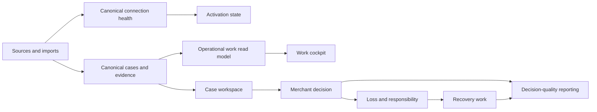

# IMPL — Merchant operations experience

**Status:** Implementation in progress — local gates passing; migration rollout pending  
**Written:** 24 July 2026  
**Baseline:** Current working tree; Release 1 is implemented locally but not yet approved for a real-merchant pilot  
**Binding product contract:** [`PRODUCT.md`](PRODUCT.md)  
**Binding architecture:** [`../ARCHITECTURE.md`](../ARCHITECTURE.md)  
**Binding authenticated design system:** [`../styles/authenticated/README.md`](../styles/authenticated/README.md)  
**Related release state:** [`release-1-implementation-status-2026-07-23.md`](release-1-implementation-status-2026-07-23.md)

**Current implementation note:** The Work cockpit, exception review flow, saved views, connection read model, activation states, truthful demo/marketing copy, case tabs, and bounded customer loading are implemented in the working tree. The forward migrations in §4 are still pending application to Supabase; the local release-readiness gate cannot run until the isolated local Supabase stack is available. Cursor-based Work pagination, the fully transaction-bound candidate-resolution RPC, SLA calendars, and telemetry remain follow-on rollout phases rather than silently implied as complete.

---

## 0. Executive decision

Unauth should feel like a quiet financial operations control room, not a fraud dashboard and not a generic analytics product.

Every primary operational surface must answer six questions without requiring the operator to reconstruct the case:

1. What needs attention?
2. Why does it need attention?
3. How much money is exposed?
4. When must the merchant act?
5. Which evidence supports the recommendation?
6. What exactly will happen if the merchant confirms?

The target product loop is:

`connect sources → verify source health → prioritise work → inspect evidence → merchant decides → attribute loss → pursue recovery → report outcome`

This programme changes presentation, read models, navigation, and operator workflow. It does **not** change the following product invariants:

- The merchant makes every final payout, customer-outcome, responsibility, and recovery decision.
- Unauth does not automatically approve, deny, refund, accuse, submit a carrier claim, or close a case.
- `support_payout_cases` remains the canonical case.
- Provider records enrich canonical cases; they do not create parallel provider workflows.
- Recommendation, merchant decision, source-confirmed outcome, loss, recoverable value, approved recovery, and recovered cash remain separate facts.
- Every displayed fact retains provenance.
- Money remains minor-unit, currency-explicit, and auditable.
- Applied migrations remain immutable; this plan uses forward migrations only.
- Scoring, matching thresholds, identity resolution, and rule weights are out of scope unless a separately approved recalibration supplies evidence.

This programme does not introduce autonomous payouts, refunds, customer decisions, responsibility assignments, carrier submissions, new provider promises, cross-merchant intelligence, a second case lifecycle, or a new authenticated visual language.

### 0.1 Product decisions made in this document

| ID | Decision |
|---|---|
| D-01 | `/work` is the primary operational home. It combines tasks and integration exceptions into one paginated, filterable work model. |
| D-02 | Integration exceptions are a work-item type, not a separate merchant-facing queue. `/exceptions` remains a compatibility redirect. |
| D-03 | Every work row is openable. A row without a canonical case opens a work detail drawer rather than becoming inert. |
| D-04 | Connection state uses one canonical read model with separate **configuration** and **operational health** axes. Raw booleans do not drive merchant-facing copy. |
| D-05 | The navigation label and page title **Payout Control** become **Payout decisions**. The product category remains “post-purchase payout control.” The route stays `/claims`. |
| D-06 | The case detail becomes a decision-led workspace with a sticky summary and five sections: Evidence, Investigation, Decision, Recovery, and Timeline. |
| D-07 | Deadline types remain distinct. Customer-decision, investigation-response, carrier-submission, recovery-chase, and generic task deadlines are never blended into one SLA. |
| D-08 | Empty operational surfaces show one route-specific activation path. Empty recovery stages are not rendered as a board of repeated “No cases” cards. |
| D-09 | Raw capability IDs, test artefacts, build hashes, and controlled-proof metadata are removed from merchant integration pages. They remain in registry code, release tooling, and audit documents. |
| D-10 | The public promise describes evidence assembly, explainable recommendations, merchant decisions, loss ownership, and assisted recovery. Autonomous “blocked” or “got it back” claims are prohibited until the capability exists. |
| D-11 | `/demo` becomes a deterministic, interactive synthetic case walkthrough. It does not depend on a configured demo merchant and performs no mutations. |
| D-12 | Context-credit usage leaves the global header. Billing shows full usage; the header shows a warning only at or below 10% remaining. |
| D-13 | Production performance is judged by real-user Core Web Vitals and server timings. Local warmed navigation is a regression gate, not the product benchmark. |
| D-14 | Decision-quality reporting uses existing immutable recommendation snapshots and `followed_recommendation`. It does not invent a “false positive” label where no ground truth exists. |
| D-15 | WCAG 2.2 AA, complete keyboard access, focus restoration, screen-reader status announcements, and 320px access are release requirements. |

---

## 1. Current baseline and verified problems

The current authenticated visual system is strong. The shell, density, typography, rules experience, truthful report gaps, and mobile reflow should be preserved. The work below addresses operational coherence.

| Finding | Current evidence | Required outcome |
|---|---|---|
| F-01 — Exceptions are dead ends | `/work` loads open exceptions, but an unlinked exception has no `objectHref`; its row menu only exposes assignment. The complete `ExceptionQueue` resolution UI is not mounted on any route. | Every exception opens a detail surface and can be safely confirmed, rejected, resolved, or dismissed by an authorised merchant operator. |
| F-02 — Connection state contradicts itself | Integrations can group stale, pending, no-data, and unverified providers under “Connected”; the sidebar and page gate use separate boolean state and can say the helpdesk is not connected. | One provider has one merchant-facing status, impact statement, and repair action everywhere. |
| F-03 — Public promise exceeds the product | The landing page says “Unauth gets it back” and illustrates “Unauth blocked payout,” while the product contract explicitly keeps decisions with the merchant. | Marketing, demo, authenticated UI, and sales screenshots describe the same supervised product. |
| F-04 — Runtime and schema failures reach users | In the reviewed local environment, `/customers` took 96 seconds and Recovery Rules referenced a missing `merchants.investigation_response_sla_hours` column. | A release cannot start against an incompatible schema; route errors become bounded, recoverable states rather than indefinite skeletons or raw failures. |
| F-05 — Data-health wording is ambiguous | “Ledger checks passed” appears beside incomplete financial coverage. | Integrity, coverage, freshness, and availability are named as separate dimensions. |
| F-06 — Work rows omit decision context | Rows do not consistently show amount, customer/order, required action, source freshness, or a meaningful deadline. Technical names such as `source_order` leak into copy. | Operators can triage without opening every row. |
| F-07 — Deadline summary creates false calm | Work can show zero overdue while many open exceptions have no SLA and are excluded. | Every open item is represented under overdue, due today, upcoming, no SLA, or invalid deadline. |
| F-08 — Case detail is a long card stack | Evidence, recommendation, investigations, responsibility, finance, recovery, support context, outcomes, and timeline render in one scrolling column beside actions. | The case reads as a staged decision story while preserving all existing actions and audit detail. |
| F-09 — Investigation creation is all-at-once | Target, partner, channel, evidence gap, requested evidence, summary, subject, body, recipient, due date, and rationale are presented together. | Recommended defaults lead; review/send is obvious; advanced fields use progressive disclosure. |
| F-10 — Empty states do not activate the product | Losses and reports give truthful gaps, but Losses and Recovery do not consistently explain how to create the first useful record. Empty Recovery renders every stage. | Empty states show prerequisite, next action, expected result, and a direct repair path. |
| F-11 — Integration detail is aimed at implementers | Merchant pages expose capability IDs, scopes, controlled runtime evidence, builds, and artefact references. | Merchant pages explain what works, impact, freshness, and repair. Engineering proof stays in release/audit surfaces. |
| F-12 — Decision calibration is not visible | Current reporting focuses on volume and financial outcomes, not handling time, recommendation overrides, or review burden. | Merchants can evaluate whether controls recover value without creating excessive review or customer friction. |
| F-13 — Public demo is not a product walkthrough | `/demo` shows legacy analytics and links back to marketing rather than letting a visitor experience a case. | A visitor can complete a synthetic evidence-to-recovery journey in roughly 90 seconds. |
| F-14 — Billing noise occupies operational chrome | Context credits render in the global header even when usage is healthy. | Usage is visible when actionable, not constantly competing with case work. |
| F-15 — Accessibility gate stops at WCAG 2.1 tags | Automated tests use `wcag2a`, `wcag2aa`, and `wcag21aa`. | WCAG 2.2 AA and interaction-specific keyboard/focus tests become release gates. |
| F-16 — “Payout Control” is ambiguous | In ecommerce, payout can also mean platform settlement. | “Payout decisions” names the operator task; supporting copy explains the scope. |

---

## 2. Target experience

### 2.1 Navigation

The signed-in navigation becomes:

- Overview
- Work
- Payout decisions
- Losses
- Recovery
- Customers
- Rules
- Flows
- Reports
- Integrations
- Settings

Routes do not change. In particular, `/claims` remains the canonical list route and `/claims/[id]` remains the canonical detail route.

### 2.2 Target information hierarchy



### 2.3 Global interaction rules

1. A queue row always has a safe destination.
2. The primary row action is visible; secondary actions can live in `RowActionsMenu`.
3. A destructive, financial, matching, responsibility, or final-outcome action uses a review modal that states its exact effect.
4. Bulk operations are limited to reversible operational actions: assign, start, snooze, and complete compatible tasks. Bulk payout decisions, exception matches, responsibility confirmations, and recovery outcomes are prohibited.
5. URL state is shareable. Filters, saved view, selected work item, and case section survive refresh and browser navigation.
6. Desktop uses list/detail or drawer composition; mobile uses a full-width drawer/page and restores focus to the originating row on close.
7. Loading, empty, stale, partial, permission-denied, error, and version-conflict states remain distinct.
8. No UI silently treats null, missing, stale, unverified, or unsupported as zero or healthy.

---

## 3. Shared contracts

### 3.1 Operational work item

Create `lib/work/types.ts` and use this type across server loaders, `/api/work`, Work UI, tests, and telemetry:

```ts
export const WORK_ITEM_KINDS = [
  'task',
  'integration_exception',
] as const;

export type WorkItemKind = (typeof WORK_ITEM_KINDS)[number];

export type OperationalDeadlineKind =
  | 'customer_decision'
  | 'investigation_response'
  | 'carrier_submission'
  | 'recovery_chase'
  | 'task_due'
  | 'exception_review';

export type OperationalWorkItem = {
  key: `${WorkItemKind}:${string}`;
  id: string;
  kind: WorkItemKind;
  title: string;
  summary: string | null;
  requiredAction: string;
  status: string;
  priority: 'critical' | 'high' | 'normal' | 'low';
  ownerUserId: string | null;
  sourceSystem: string | null;
  sourceHealth: 'operational' | 'delayed' | 'blocked' | 'unknown' | null;
  caseId: string | null;
  customerId: string | null;
  customerLabel: string | null;
  orderId: string | null;
  orderLabel: string | null;
  amountMinor: number | null;
  currency: string | null;
  deadlineKind: OperationalDeadlineKind | null;
  dueAt: string | null;
  deadlineState: 'overdue' | 'due_today' | 'upcoming' | 'no_sla' | 'invalid';
  createdAt: string;
  updatedAt: string;
  detailHref: string;
  canResolve: boolean;
};
```

Rules:

- `key` is the stable UI selection key.
- `detailHref` is always present. Unlinked exceptions use `/work?item=integration_exception:<id>`.
- `amountMinor` is never converted to a major-unit float inside the read model.
- Mixed currencies are not aggregated into one amount.
- `sourceHealth` comes from the canonical connection read model in §3.2.
- Priority is stored or deterministically derived. The UI never hardcodes all exceptions to high.
- `requiredAction` is merchant-facing copy, not an enum transformed with `replaceAll("_", " ")`.

### 3.2 Canonical connection read model

Create `lib/connections/readModel.ts`:

```ts
export type ConnectionConfiguration =
  | 'not_configured'
  | 'configured'
  | 'reauthorisation_required';

export type ConnectionOperation =
  | 'not_started'
  | 'initialising'
  | 'operational'
  | 'delayed'
  | 'blocked'
  | 'on_demand_ready'
  | 'verification_unavailable'
  | 'not_applicable';

export type ConnectionReadModel = {
  providerId: string;
  providerName: string;
  category: string;
  stage: 'live' | 'beta' | 'partial' | 'planned';
  configuration: ConnectionConfiguration;
  operation: ConnectionOperation;
  deliveryModel: 'periodic_sync' | 'webhook' | 'on_demand';
  lastDataReceivedAt: string | null;
  lastCheckAt: string | null;
  importedRecordCount: number;
  impact: string | null;
  nextAction: {
    label: string;
    href: string;
  } | null;
};
```

Merchant-facing status is derived once:

| Configuration | Operation | Badge | Catalogue group | Default action |
|---|---|---|---|---|
| `not_configured` | any | Not connected | Available | Connect |
| `reauthorisation_required` | `blocked` | Reconnect required | Needs attention | Reconnect |
| `configured` | `initialising` | Setting up | Setting up | View progress |
| `configured` | `operational` | Operational | Operational | View |
| `configured` | `delayed` | Data delayed | Needs attention | Review sync |
| `configured` | `blocked` | Not syncing | Needs attention | Repair |
| `configured` | `on_demand_ready` | Ready on demand | Operational | Test connection |
| `configured` | `verification_unavailable` | Verification unavailable | Needs attention | Retry check |
| any | `not_applicable` | Not applicable | Planned/manual | Learn more |

Rules:

- “Connected” is configuration, not health. It is not used as a catalogue group.
- A stale provider is configured but not operational.
- An on-demand provider is never described as continuously syncing.
- A provider with no measurable freshness does not become healthy by default.
- The sidebar, `PageConnectionGate`, Overview, Integrations catalogue, provider detail, onboarding, and route activation states consume this same read model.
- `getConnectionState.ts` may remain as a compatibility adapter for business eligibility, but it must be derived from this read model and must not create merchant-facing labels.

### 3.3 Activation snapshot

Create `lib/onboarding/activationSnapshot.ts` and cache it per server render:

```ts
export type ActivationSnapshot = {
  orderSource: 'missing' | 'setting_up' | 'operational' | 'needs_attention';
  helpdesk: 'missing' | 'setting_up' | 'operational' | 'needs_attention';
  hasCases: boolean;
  hasDecision: boolean;
  hasLoss: boolean;
  hasRecovery: boolean;
  hasRecoveryPartnerTerms: boolean;
  financialCoverage: 'none' | 'partial' | 'complete';
  blockers: Array<{
    code: string;
    title: string;
    body: string;
    actionLabel: string;
    actionHref: string;
  }>;
};
```

This extends, then replaces UI use of the coarse `MerchantSetupState`. Existing setup state remains available until all callers migrate.

### 3.4 Data-health display

Create `lib/ui/dataHealth.ts`:

```ts
export type DataHealthDisplay = {
  integrity: 'passed' | 'failed' | 'not_checked';
  coverage: 'complete' | 'partial' | 'none';
  freshness: 'fresh' | 'delayed' | 'stale' | 'unknown';
  affectedRecordCount: number | null;
  lastRefreshedAt: string | null;
  sourceLabels: string[];
  impact: string | null;
};
```

Required copy pattern:

> Ledger integrity passed. Financial coverage is incomplete: 464 records are stale. Last source activity 23 July 2026, 14:32 Europe/London. Dashboard totals exclude records without canonical financial entries.

Never compress integrity and completeness into one “healthy/passed” badge.

---

## 4. Database and API changes

All SQL changes use forward migrations after the current Release 1 migration set.

### 4.1 Proposed migrations

#### `20260724100000_operational_work_read_model.sql`

Add to `case_exceptions`:

- `priority text not null default 'normal'` with check `critical|high|normal|low`.
- `due_at timestamptz null`.
- `deadline_kind text null` with check `exception_review` when populated.
- `state_version bigint not null default 1`.

Add indexes:

- `(merchant_id, status, due_at, created_at desc)`.
- `(merchant_id, assigned_to, status, due_at)`.
- Existing queue/case indexes remain.

Add service-role-only RPCs:

```text
work_queue_page_v1(
  p_merchant_id uuid,
  p_user_id uuid,
  p_can_view_pii boolean,
  p_view text,
  p_filters jsonb,
  p_search text,
  p_limit integer,
  p_cursor jsonb
)

work_queue_counts_v1(
  p_merchant_id uuid,
  p_user_id uuid,
  p_can_view_pii boolean,
  p_filters jsonb
)
```

The page RPC returns the canonical fields in `OperationalWorkItem`, except `sourceHealth`, plus an opaque next cursor. It unions `work_tasks` and `case_exceptions`, then joins canonical cases, source orders, source customers, and financial summaries only where needed. The server loader enriches `sourceHealth` from `loadConnectionReadModels`; SQL must not create a second connection-health resolver.

The counts RPC performs database aggregates. `/work` must stop fetching up to 10,000 rows to count views.

Security requirements:

- RPCs are executable by `service_role` only.
- The caller still resolves authenticated membership and `VIEW_INBOX` before execution.
- `p_can_view_pii` is derived server-side from the authenticated permission context; it is never accepted from a browser query/body. Customer name/email search and display are excluded when false.
- Every joined table is constrained by `p_merchant_id`.
- Tests call the RPC with foreign IDs and prove no cross-merchant row or count is returned.
- Cursor values never include PII.

#### `20260724110000_work_saved_views.sql`

Create:

```text
work_saved_views
  id uuid primary key
  merchant_id uuid not null
  created_by uuid not null
  name text not null
  visibility text not null check (private|shared)
  filters jsonb not null default '{}'
  columns jsonb not null default '[]'
  sort jsonb not null default '{}'
  position integer not null default 0
  created_at timestamptz not null
  updated_at timestamptz not null
```

Constraints and policies:

- Unique `(merchant_id, created_by, lower(name))` for private views.
- Shared names may repeat only when IDs differ; UI disambiguates owner if required.
- Members can read shared views for their merchant and their own private views.
- Add `MANAGE_WORK_VIEWS`. Owners/admins receive it by default; existing viewer permissions do not expand.
- Creating a private view requires `VIEW_INBOX`. Publishing or mutating a shared view requires `MANAGE_WORK_VIEWS`.
- A creator may edit/delete their private view; shared-view changes follow the explicit permission even when the user created the view.
- Filter, column, and sort JSON are validated with Zod at the API boundary and have size limits.
- Saved views cannot contain free-text customer data; only query configuration.

#### `20260724120000_exception_resolution_integrity.sql`

Add an idempotent, transaction-bound exception-resolution RPC:

```text
resolve_case_exception_v1(
  p_merchant_id uuid,
  p_exception_id uuid,
  p_expected_state_version bigint,
  p_action text,
  p_selected_candidate_id uuid,
  p_resolution text,
  p_actor_user_id uuid,
  p_idempotency_key text
)
```

The RPC:

1. Locks the exception row.
2. Confirms merchant ownership, open status, and expected version.
3. Validates that a selected candidate belongs to the exception subject.
4. Applies candidate statuses and the confirmed relationship when required.
5. Appends `record_match_resolutions`.
6. Settles the exception.
7. Appends the required domain-event/outbox records.
8. Returns the existing result for a repeated idempotency key with the same fingerprint.
9. Rejects an idempotency-key reuse with a different fingerprint.

This replaces the current multi-step application transaction in `resolveExceptionAction.ts`, where candidate updates, relationship creation, exception settlement, and events can partially succeed.

#### `20260724130000_sla_calendars.sql` — Phase 3

Create one default SLA calendar per merchant:

```text
merchant_sla_calendars
  id uuid primary key
  merchant_id uuid not null
  name text not null
  timezone text not null
  clock_type text not null check (calendar_hours|business_hours)
  weekly_schedule jsonb not null
  holiday_dates date[] not null default '{}'
  created_at timestamptz not null
  updated_at timestamptz not null
```

Rules:

- Existing due dates remain valid; no historic deadline is recomputed silently.
- New investigation/internal task deadlines can use the merchant’s default calendar.
- Carrier submission deadlines remain absolute external deadlines.
- The UI always labels whether a duration uses calendar or business hours.

### 4.2 API changes

#### Work

`GET /api/work`

Query:

```text
view
savedViewId
q
priority
owner
deadline
kind
source
sort
cursor
limit (25|50, default 25)
```

Response:

```ts
{
  items: OperationalWorkItem[];
  counts: {
    allOpen: number;
    mine: number;
    unassigned: number;
    overdue: number;
    dueToday: number;
    upcoming: number;
    noSla: number;
    blocked: number;
    integrationExceptions: number;
    completed: number;
  };
  nextCursor: string | null;
  generatedAt: string;
}
```

#### Work views

- `GET|POST /api/work/views`
- `PATCH|DELETE /api/work/views/[id]`

All routes require authentication, merchant membership, and `VIEW_INBOX`; mutation uses the ownership and `MANAGE_WORK_VIEWS` rules in §4.1.

#### Exception detail

Add `GET /api/ops/exceptions/[id]`.

It returns:

- Typed exception summary.
- Subject record summary.
- Typed candidate list with merchant-friendly labels.
- Match reasons/evidence.
- Linked case summary where present.
- Current assignment and version.
- Allowed actions for the current user.

Extend `POST /api/ops/exceptions/[id]`:

- Require `Idempotency-Key`.
- Require `expectedVersion`.
- Route through `resolve_case_exception_v1`.
- Return `409 version_conflict` with the current safe summary.

`PATCH` assignment remains separate and reversible.

---

## 5. Workstream 0 — Release/schema parity and bounded failures

**Priority:** P0  
**Dependency:** Must complete before visual rollout  
**Outcome:** The application never runs a UI build against a schema that cannot satisfy its required read/write contracts.

### 5.1 Implementation

1. Extend `scripts/verify-canonical-database.mjs` and `scripts/release-readiness.mjs` to assert:
   - `merchants.investigation_response_sla_hours`.
   - Release 1 investigation, responsibility, recovery, dispatch, privacy, and reporting objects.
   - The new work RPCs and saved-view table before enabling the corresponding flags.
2. Add `scripts/verify-operations-experience-runtime.mjs`:
   - Read-only schema check by default.
   - Rollback-only functional checks when explicitly invoked in a disposable environment.
3. Add route-level `error.tsx` boundaries for `/work`, `/customers`, `/rules/recovery`, `/claims/[id]`, and `/integrations`.
4. Error states contain:
   - Plain-language outcome.
   - Retry action.
   - Safe navigation destination.
   - Correlation/reference ID.
   - No raw SQL, provider error, secret, or table name.
5. A loading skeleton cannot remain indefinitely:
   - Client resource loads expose retry after 10 seconds.
   - Route navigation monitoring records a timeout at 15 seconds.
   - The browser remains usable; do not auto-reload in a loop.

### 5.2 Acceptance criteria

- A build with a missing required column fails release readiness before deployment.
- `/rules/recovery` does not render a raw server exception.
- A deliberately failed customer-directory request reaches a labelled error/retry state.
- Sentry receives route, correlation ID, merchant-safe anonymous ID, and failure class without PII.
- All existing fail-closed Release 1 feature flags remain disabled by default.

---

## 6. Workstream 1 — End-to-end exception resolution in Work

**Priority:** P0  
**Outcome:** An authorised operator can understand and resolve every integration exception without leaving the operational queue or guessing about the consequence.

### 6.1 Component plan

Create:

```text
components/work/
  WorkCockpit.tsx
  WorkTable.tsx
  WorkMobileList.tsx
  WorkDetailDrawer.tsx
  WorkFilters.tsx
  WorkSavedViews.tsx
  ExceptionResolutionPanel.tsx
  ExceptionCandidateComparison.tsx
  ExceptionResolutionReviewModal.tsx
```

`WorkTable` must compose the canonical `DataTable` rather than introduce another hand-written table. The detail surface uses `Drawer`, final-action review uses `Modal`, saved/system view selection uses `Tabs` or `SegmentedControl` as appropriate, and filters use the existing filter-control family.

Retire:

- Merchant-facing use of `components/exceptions/ExceptionQueue.tsx`.
- Exception-specific action branching inside `WorkItemActions` once the resolution panel is active.

The old component can be deleted after `/exceptions`, tests, and all imports prove it is unused.

### 6.2 Exception detail behaviour

For a match exception, show:

- “Order match needs review” or “Customer match needs review.”
- Source record identity and provider.
- Candidate order/customer reference.
- Candidate date, amount, email/name where the operator has permission, and provider source.
- Confidence as supporting context, not a verdict.
- Plain-language reasons behind each candidate.
- Links to existing canonical records when available.
- Actions: **Confirm match**, **Reject all candidates**, **Assign**, **Release assignment**.

For non-match exceptions, show:

- What could not be reconciled.
- The operational/financial impact.
- Relevant source activity and freshness.
- Actions: **Resolve**, **Dismiss**, **Assign**, **Release assignment**.

Before a final action, the review modal states:

- Which relationship or exception status will change.
- Whether downstream case, finance, customer, and report projections will update.
- That an immutable audit event will be recorded.
- The optional/required rationale.

Use `Modal`, not `window.confirm`.

### 6.3 Copy mapping

Add exception copy to `lib/ui/labels.ts`. Required examples:

| Internal value | Merchant label |
|---|---|
| `source_order` | Order |
| `source_customer` | Customer |
| `match_uncertainty` | Match needs review |
| `unmatched_refund` | Refund could not be linked |
| `ambiguous_replacement` | Replacement has multiple possible orders |
| `conflicting_financials` | Financial records disagree |
| `stale_source_data` | Source data is delayed |

Unknown values use a neutral “Integration issue” fallback and are logged for copy coverage. They are not title-cased raw snake_case.

### 6.4 Acceptance criteria

- Every open exception row has a working detail destination.
- The reviewed fixture with unlinked source-order exceptions can be resolved from `/work`.
- Confirming a candidate updates the relationship, settles the exception, records audit/domain events, and updates affected projections atomically.
- A repeated idempotency key does not duplicate writes.
- Two simultaneous operators produce one success and one version-conflict response.
- A user with `VIEW_INBOX` but without `SUBMIT_PAYOUT_DECISIONS` can inspect but not resolve.
- Keyboard users can open a row, compare candidates, confirm, close, and return focus to that row.
- Mobile uses a full-width drawer and exposes the same evidence/actions.
- No exception is automatically confirmed.

---

## 7. Workstream 2 — Canonical connection and capability health

**Priority:** P0  
**Outcome:** A merchant sees the same provider status and repair action on every surface.

### 7.1 Loader changes

1. Introduce `loadConnectionReadModels(client, merchantId)` in `lib/connections/readModel.ts`.
2. Reuse:
   - Provider registry/catalogue.
   - Provider-specific credential/configuration rows.
   - `resolveConnectorFreshness`.
   - Live verification results.
   - Delivery model.
3. Batch independent reads and cache within the server render.
4. Keep `merchant_integrations` as a projection where currently required; do not delete provider-specific credential/state tables.
5. Add reconciliation logging when provider-specific state and the canonical mirror disagree.

### 7.2 Caller migration

Migrate, in order:

1. `/integrations` catalogue and counts.
2. `/integrations/[provider]`.
3. `PageConnectionGate`.
4. Sidebar connection prompt.
5. Onboarding completion/repair state.
6. Overview source-health card.
7. Losses, Recovery, Reports, and Customers activation states.

Delete merchant-facing status derivation from callers after migration. A static test should reject new imports of provider-specific connection status in page components outside the approved loader.

### 7.3 Capability-based page requirements

Replace:

```ts
requires: 'both' | 'shopify' | 'helpdesk'
```

with:

```ts
type SurfaceRequirement = {
  anyOf?: string[];
  allOf?: string[];
  allowExistingData: boolean;
};
```

Examples:

| Surface | Requirement |
|---|---|
| Payout decisions | Order context plus helpdesk case intake for live activation; existing cases remain readable when a source degrades. |
| Customers | Any order/helpdesk/imported customer data. |
| Losses | At least one canonical decision/outcome/loss record; sources improve coverage but do not hard-gate history. |
| Recovery | At least one loss/recovery record; partner terms improve execution but do not hide history. |
| Reports | Existing canonical records are always readable; completeness strip explains missing sources. |

Full-page gates are used only when there is no useful data. Existing data remains visible with a non-blocking impact strip.

### 7.4 Acceptance criteria

- Gorgias cannot appear as both connected and not connected during one render.
- Stale connections appear under **Needs attention**, not **Operational**.
- On-demand carrier connections say **Ready on demand** and never “Last successful sync.”
- The sidebar prompt uses the highest-impact activation blocker from `ActivationSnapshot`.
- A degraded source does not hide existing cases or history.
- Every status includes a next action when the merchant can repair it.
- Catalogue, detail, sidebar, gate, and overview snapshot tests assert identical status for the same fixture.

---

## 8. Workstream 3 — Product promise, terminology, and demo

**Priority:** P0 for truthful copy; P2 for the complete interactive demo  
**Outcome:** A prospect and an operator understand the same supervised product.

### 8.1 Approved terminology

| Existing | Approved |
|---|---|
| Payout Control | Payout decisions |
| Claims, where it means the shared operational unit | Payout cases |
| Fraud verdict language | Evidence, confidence, recommendation, merchant decision |
| Unauth blocked payout | Merchant held payout for review |
| Unauth recovered it | Recovery recorded / recovery handoff prepared / recovered value confirmed |
| source_order | Order |
| source_customer | Customer |
| connected, when freshness is unknown/stale | Configured; separate operational status |

Update `docs/PRODUCT.md` primary surface label and all route/navigation/content tests in the same change. Do not change the `/claims` route or canonical type names merely for copy.

### 8.2 Approved landing copy

Hero:

> **Decide post-purchase payouts with the full evidence in front of you.**
>
> Unauth brings order, delivery, support, and financial context into one merchant-controlled case, applies your rules, and keeps loss ownership and recovery work in the same auditable timeline.

Primary CTA: **Request access**  
Secondary CTA: **Walk through a case**

Product-proof visual states:

- Evidence assembled
- Merchant rule matched
- Recommended action: hold for evidence
- Merchant decision recorded
- Recovery handoff prepared

Required persistent clarification:

> Unauth recommends and records. Your team makes every final customer, payout, responsibility, and recovery decision.

Delete or replace:

- “Unauth gets it back.”
- “Unauth blocked payout.”
- “Before anyone pays out” where it implies autonomous interception.
- Any automatic approve/deny/refund/submit copy.

Add a content-compliance test with prohibited phrases and approved merchant-control language.

### 8.3 Interactive demo

`/demo` becomes a read-only, deterministic walkthrough using a versioned fixture in:

```text
lib/demo/merchantCaseV1.ts
components/demo/OperationalCaseDemo.tsx
```

The fixture contains no real merchant, customer, email, address, token, or provider identifier.

Five steps:

1. **Incoming case** — missing item, order value, customer/support context.
2. **Evidence** — commerce, helpdesk, warehouse, and carrier facts with source/time.
3. **Recommendation** — matched rule, evidence gap, confidence, and rationale.
4. **Merchant decision** — visitor selects a simulated option; copy states that nothing external is executed.
5. **Loss and recovery** — simulated responsibility confirmation and recovery handoff.

Behaviour:

- State is local to the browser and resets on refresh.
- No authenticated or service-role request.
- No fake claim that money moved.
- “Create workspace” is available after every step but does not interrupt the walkthrough.
- Demo analytics contain only step number, completion, and CTA click; no free text.
- The demo uses a scoped product-preview surface consistent with authenticated tokens/components. Landing styles remain isolated.
- Remove legacy analytics charts and the dependency on `NEXT_PUBLIC_DEMO_MERCHANT_ID` from the primary demo path. A legacy synthetic-runs page, if still required internally, moves to a non-public development route.

### 8.4 Acceptance criteria

- Marketing and authenticated content-compliance tests contain no autonomous payout/recovery promise.
- A visitor can complete the demo with keyboard only.
- The demo works with no environment configuration and no database.
- The final state explicitly says “Simulated merchant decision — no payout or external claim was executed.”
- Visual regression captures exist at 390px and 1440px.

---

## 9. Workstream 4 — Work cockpit

**Priority:** P1 after exception resolution and connection health  
**Outcome:** `/work` lets an operator prioritise and complete daily work without opening every record.

### 9.1 Default system views

System views are code-defined and cannot be deleted:

1. All open
2. My work
3. Unassigned
4. Due today
5. Overdue
6. No SLA
7. Blocked
8. Evidence needed
9. Decision needed
10. Integration exceptions
11. Completed

Saved views layer on top and may be private or shared.

### 9.2 Table columns

Default desktop columns:

1. Work item — title, required action, source.
2. Exposure — currency-explicit amount or “Not available.”
3. Customer / order.
4. Owner.
5. Deadline — type plus state/date.
6. Status.
7. Actions.

Optional columns:

- Priority.
- Source health.
- Created.
- Updated.
- Work-item type.

Mobile card priority:

1. Required action.
2. Exposure.
3. Customer/order.
4. Deadline.
5. Owner/status.

### 9.3 Filters and search

Search:

- Case reference.
- Order number.
- Ticket reference.
- Customer name/email only when the user may view PII.
- Work title.

Filters:

- Kind.
- Priority.
- Owner.
- Deadline state.
- Required action category.
- Source.
- Source health.
- Status.
- Currency.

Sort:

- Deadline ascending — default.
- Priority then deadline.
- Exposure descending within one selected currency.
- Oldest/newest.

Do not sort mixed-currency amounts as if directly comparable unless a single currency filter is active.

### 9.4 Keyboard model

- `j` / `k`: next/previous row when focus is not in an input, select, textarea, dialog, or editable element.
- `Enter`: open selected row.
- `a`: assign selected reversible work item to me.
- `Esc`: close detail and restore row focus.
- `/`: focus Work search.

Shortcuts are documented in a compact help disclosure and never override browser/assistive-technology behaviour.

### 9.5 Summary semantics

The primary insight becomes:

> **12 items need action today:** 3 overdue, 5 due today, and 4 blocked.

The rail always includes:

- Overdue.
- Due today.
- Upcoming.
- No SLA.
- Blocked.

Integration exceptions are included in deadline totals when they have a due date and in **No SLA** when they do not. The footnote does not hide them.

### 9.6 Saved views

- “Save view” appears only after the current filter/sort differs from a system view.
- Default visibility is private.
- Sharing requires an explicit visibility change.
- Shared views show creator and last update.
- Deleting a view returns the user to All open.
- A saved view referencing a retired filter degrades safely and reports the ignored field.

### 9.7 Telemetry

Add approved non-PII events:

```text
Work Viewed
Work Filter Applied
Work Saved View Created
Work Item Opened
Work Item Assigned
Work Item Completed
Exception Resolution Started
Exception Resolved
Exception Version Conflict
```

Properties may include kind, view key, action, source category, deadline state, and duration bucket. Never send case IDs, order numbers, names, emails, notes, exception details, or merchant business names.

### 9.8 Acceptance criteria

- Initial page size is 25; users may choose 50.
- Counts do not require reading 10,000 application rows.
- Searching and filter changes update URL state.
- Every system and saved view is deep-linkable.
- An item can be opened, actioned, and advanced to the next item without returning to the list.
- Bulk actions never include final merchant decisions or exception resolution.
- Mixed currencies remain separate.
- Mobile exposes all critical actions at 320px.
- `j/k`, Enter, Escape, and search shortcuts pass Playwright coverage.

---

## 10. Workstream 5 — Decision-led case workspace

**Priority:** P1  
**Outcome:** The case detail tells one coherent story from evidence to merchant decision to recovery.

### 10.1 Page anatomy

At `/claims/[id]`:

1. Existing page header and breadcrumbs.
2. New sticky `CaseDecisionSummary`.
3. Section tabs.
4. Active section content.
5. Existing sticky action rail on desktop; bottom action bar on mobile.

`CaseDecisionSummary` shows:

- Case issue and current state.
- Amount at risk with explicit currency.
- Customer/order reference.
- Required merchant action.
- Decision or external deadline and deadline type.
- Evidence completeness.
- Recommendation and confidence, labelled advisory.
- Source-health warning when a material source is delayed.

### 10.2 Sections

#### Evidence

- Evidence checklist.
- Delivery/fulfilment facts.
- Source provenance and freshness.
- Evidence gaps.
- Financial context relevant to the decision.

#### Investigation

- Recommended investigation.
- Open/previous investigations.
- Response deadlines.
- Chases and attachments.
- Create/edit/review request.

#### Decision

- Matched merchant rule and reasons.
- Recommended action.
- Responsibility assessment when relevant.
- Merchant decision form.
- Recorded decision/outcome and override rationale.

#### Recovery

- Confirmed responsibility.
- Loss financial summary.
- Recovery eligibility and required evidence.
- Explicit handoff.
- Existing recovery status and deep link.

#### Timeline

- Unified case events.
- Claim/decision history.
- Support cases.
- Comments.

### 10.3 URL and default section

Use `?section=evidence|investigation|decision|recovery|timeline`.

Default:

- Open case requiring a merchant decision → `decision`.
- Open investigation awaiting/reviewing response → `investigation`.
- Final decision with active recovery → `recovery`.
- Closed case → `timeline`.

Existing hash deep links such as `#investigation-<id>` redirect/select the Investigation section and focus the target record. Return paths from Work remain intact.

### 10.4 Decomposition

Split `ClaimReviewContextColumn.tsx` into section components. Do not duplicate loaders or business logic:

```text
components/claims/workspace/
  CaseDecisionSummary.tsx
  CaseWorkspaceTabs.tsx
  CaseEvidenceSection.tsx
  CaseInvestigationSection.tsx
  CaseDecisionSection.tsx
  CaseRecoverySection.tsx
  CaseTimelineSection.tsx
  CaseMobileActionBar.tsx
```

`useClaimReviewWorkbench` remains the client state seam until a separate server-read-model project replaces it.

### 10.5 Investigation composer

Replace the all-at-once dialog with three visible stages in one modal:

1. **Evidence needed**
   - Recommended target and partner.
   - Evidence-gap sentence.
   - Requested-evidence checklist chips.
2. **Delivery**
   - Recommended channel, recipient, and response deadline.
   - Merchant-friendly partner details.
3. **Review**
   - Subject/body preview.
   - Exact statement of whether Unauth will send, record a manual send, or only save a draft.

Advanced disclosure:

- Change target/partner.
- Edit subject/body.
- Change channel/recipient.
- Change due date.
- Override recommendation.

An override rationale is required only when the target, partner, or material evidence gap differs from the recommendation. Existing version and idempotency protections remain.

### 10.6 Acceptance criteria

- Every current card/action remains reachable in one activation from the relevant section.
- The active section is shareable and survives refresh.
- Work investigation deep links focus the correct record.
- The summary never describes a recommendation as a decision.
- Final financial actions retain confirmation, rationale, idempotency, and version protection.
- Mobile does not depend on a sticky right rail.
- Tab semantics, focus movement, browser back/forward, and deep links pass tests.
- The existing unified timeline remains authoritative.

---

## 11. Workstream 6 — Deadline and SLA semantics

**Priority:** P1 for truthful deadline types; Phase 3 for business-hours calendars  
**Outcome:** Operators know what is due, why, and which clock governs it.

### 11.1 Existing sources of truth

| Deadline kind | Canonical source |
|---|---|
| Customer decision | Existing claim SLA logic and case timestamps |
| Investigation response | `case_investigations.due_at` |
| Generic task | `work_tasks.due_at` |
| Exception review | `case_exceptions.due_at` |
| Carrier/partner submission | `recovery_cases.deadline_at` or partner term |
| Recovery chase | Recovery status/activity plus the next scheduled follow-up |

Do not copy all deadlines into one new table. `lib/operations/deadlines.ts` creates a display projection while canonical domains retain ownership.

### 11.2 Display contract

Every deadline renders:

- Type.
- Absolute date/time.
- Merchant timezone.
- Relative state.
- Calendar basis: calendar hours, business hours, or external absolute deadline.
- Paused reason, if the domain supports pausing.

Examples:

- **Customer decision · due today at 16:00 Europe/London**
- **Waiting for carrier · 18 business hours remaining**
- **Carrier submission window · 3 calendar days remaining**
- **No review SLA assigned**

### 11.3 Settings

Recovery Rules settings expose:

- Default investigation response hours.
- Calendar or business-hours clock.
- Merchant timezone.
- Weekly business schedule and holidays in Phase 3.

Partner-specific response SLA continues to override the merchant default. The UI states the applied source.

### 11.4 Acceptance criteria

- UTC midnight is not used to determine “today” for a merchant in another timezone.
- No-SLA items are counted and filterable.
- Invalid dates have a visible repair state and are not sorted as valid deadlines.
- A customer deadline passing never automatically approves, denies, refunds, closes, or assigns responsibility.
- Carrier submission windows are not paused by merchant business hours.
- Tests cover DST transition, timezone boundary, no SLA, overdue, due today, and invalid timestamp.

---

## 12. Workstream 7 — Activation and empty states

**Priority:** P1  
**Outcome:** Every empty surface explains how value begins without fabricating data.

### 12.1 Shared component

Create `components/activation/ActivationState.tsx` with:

- Outcome-oriented title.
- Why the page is empty or incomplete.
- Up to three ordered prerequisites.
- One primary CTA.
- Optional secondary CTA.
- “What happens next” sentence.
- Optional source-health detail.

It uses authenticated tokens and `EmptyState`; it does not add a marketing hero.

### 12.2 Route behaviour

#### Overview

When no meaningful operational data exists, show a compact activation checklist:

1. Connect order source.
2. Connect helpdesk.
3. Verify first case.
4. Review first recommendation.

Once any case exists, the normal dashboard renders and incomplete metrics use truthful availability states.

#### Payout decisions

When empty:

> No payout cases yet. Cases appear when a connected helpdesk creates a supported post-purchase request or when an authorised user creates one manually.

Primary CTA depends on blocker: connect/repair helpdesk or create case.

#### Losses

When empty:

> No merchant loss has been recorded. Losses appear only after a merchant decision and source-confirmed outcome establish an actual or estimated loss.

Primary CTA: **Review payout decisions**.  
Secondary CTA: **Check financial coverage** when incomplete.

#### Recovery

When zero recoveries exist, do not render the stage board. Show:

> No recovery work yet. Confirm responsibility and create a recovery handoff from a payout case with a merchant loss.

Primary CTA: **Review recoverable losses**.  
Secondary CTA: **Configure partner rulebook**.

When at least one recovery exists, render the board; empty columns may remain compact.

#### Reports

Keep truthful unavailable states. Add a route-specific connection/coverage CTA beneath the explanation, never replace missing data with zero.

#### Customers

Differentiate:

- No connected/imported customer data.
- No matches for current search/filter.
- Source is delayed.
- Permission/entitlement missing.

### 12.3 Acceptance criteria

- No zero-recovery merchant sees a board of repeated “No cases.”
- Every empty route has a primary path to the first useful record or repair action.
- Search-empty states preserve and clear filters without suggesting connection setup.
- Existing historical data remains visible when a source is disconnected.
- Empty states do not claim automatic record creation that is not implemented.

---

## 13. Workstream 8 — Merchant-facing integration detail

**Priority:** P1  
**Outcome:** Integration pages help a merchant operate and repair the product; release evidence remains available to engineers without leaking into normal workflow.

### 13.1 Provider detail layout

1. Provider header and canonical status.
2. Impact banner when degraded/blocked.
3. Primary action: connect, reconnect, retry, or view setup.
4. Health grid:
   - Configuration.
   - Data delivery model.
   - Last data received.
   - Last verification.
   - Imported records.
   - Affected product surfaces.
5. “What Unauth can use” capability groups in merchant language.
6. Recent sync/import issues with repair actions.
7. Import history when the provider uses imports/sync jobs.

### 13.2 Capability copy

Examples:

| Internal capability | Merchant copy |
|---|---|
| `tickets.read` | Read support tickets used to create payout cases |
| `messages.read` | Read ticket messages used as case evidence |
| `orders.read` | Read orders, customer, item, and fulfilment context |
| `tracking.read` | Retrieve tracking events for linked shipments |
| `request.deny` | Not shown as a capability; autonomous denial remains unsupported |

Required scopes are shown only when they explain a repair step:

> Reconnect Gorgias and allow ticket and message read access.

Do not show raw scope lists by default.

### 13.3 Engineering proof

Remove from merchant page:

- Capability IDs.
- Evidence-level enum values.
- Test filenames.
- Environment/build strings.
- Artefact references.
- “Controlled runtime proof pending” matrices.

Keep them in:

- `lib/integrations/providers/*`.
- `docs/audits/unauth-mvp-plus/08-provider-proof-matrix.md`.
- Controlled live validation scripts.
- Release-readiness output.

If an internal runtime screen is retained, it must require an internal-only permission unavailable to merchant roles and a non-production/approved environment flag. It is not linked from merchant navigation.

### 13.4 Acceptance criteria

- A merchant can answer what works, what is delayed, the impact, and how to repair it.
- No normal merchant role sees test artefact/build metadata.
- Provider stage remains truthful and continues to derive from capability proof in registry/release code.
- Required autonomous actions remain visibly unsupported.
- Connection detail and catalogue show the same status.

---

## 14. Workstream 9 — Performance and read-model hardening

**Priority:** P0 for failures; P1 for read-model work  
**Outcome:** Core routes respond predictably at realistic merchant scale.

### 14.1 Work

- Replace page-level 10,000-row counting with §4 RPCs.
- Default to 25 rows and cursor pagination.
- Fetch exception detail on drawer open; do not load all candidate context for every row.
- Prefetch the selected/next detail only on intent.

### 14.2 Customers

The current page scans up to 4,000 source customers, groups identities in application memory, and separately aggregates up to 5,000 cases.

Implement `customer_directory_page_v1`:

- Database-side merchant-scoped grouping.
- Cursor pagination before expensive enrichment.
- Sort/filter/search in SQL.
- Return only current-page IDs plus aggregates.
- Join display PII only for authorised current-page rows.
- Preserve customer identity semantics and k-anonymity rules.
- Do not duplicate PII into a new projection unless profiling proves an RPC cannot meet the budget.

If a projection becomes necessary, store relationship IDs and numeric/date aggregates only; join source PII at read time. Subject erasure and account deletion must cover the projection.

### 14.3 Shell and route requests

- Continue batching independent shell reads.
- Removing healthy context-credit usage eliminates one global request.
- Cache non-blocking nav/notification resources and avoid re-fetch on every same-session navigation.
- Add query timing around every core route loader.
- Record count, duration, result-size bucket, and error class without query values or PII.

### 14.4 Budgets

Production p75 targets:

| Metric | Target |
|---|---:|
| Largest Contentful Paint | ≤ 2.5 s |
| Interaction to Next Paint | ≤ 200 ms |
| Cumulative Layout Shift | ≤ 0.1 |
| Server route response for warmed core pages | ≤ 1.5 s |
| Immediate visual acknowledgement after an action | ≤ 100 ms |

CI/local warmed regression gate:

- p75 navigation to visible route heading: `< 3,000 ms`.
- Maximum warmed route: `< 5,000 ms`.
- Test reports each route independently; a global percentile cannot hide one pathological route.
- Cold development compilation is reported separately and is not mixed into warmed samples.

Mutation target:

- Button enters a labelled busy state immediately.
- p75 successful response `< 1,500 ms` in controlled environment.
- Longer operations return durable progress rather than holding an unbounded request.

### 14.5 Observability

Use:

- Sentry for errors, traces, route transactions, and version-conflict rates.
- Amplitude for approved behavioural events.
- Web Vitals reporting for LCP, INP, and CLS by route group and UI cohort.

Never transmit:

- Customer/order/ticket identifiers.
- Free-text case, investigation, or resolution content.
- Merchant business name.
- Raw provider errors.

### 14.6 Acceptance criteria

- `/customers` no longer performs the capped full-directory scan in application code.
- `/work` no longer reads 10,000 rows for counts.
- The release performance test uses the tighter per-route budgets.
- Route errors are visible and retryable within 15 seconds.
- Web Vitals and server timings are observable by route/cohort.
- Performance changes preserve merchant scoping, permission checks, and source provenance.

---

## 15. Workstream 10 — Decision quality and operational value

**Priority:** P1/P2  
**Outcome:** Merchants can judge whether Unauth improves decisions and recovery without creating unnecessary review or customer friction.

### 15.1 Metrics

Add `lib/reporting/operationsQuality.ts` and a **Decision quality** section in Reports.

| Metric | Definition |
|---|---|
| Median time to merchant decision | Median of final decision `recorded_at - first_viewed_at`; disclose excluded nulls. |
| Decision SLA compliance | Final merchant decisions recorded on/before the applicable customer-decision deadline divided by decisions with a valid deadline. |
| Recommendation follow rate | Decisions where immutable `case_decisions.followed_recommendation = true` divided by decisions with a recorded recommendation snapshot. |
| Recommendation override rate | Complement of follow rate, with top structured override categories. Do not chart free-text rationale. |
| Review burden | Cases requiring human review per 100 payout cases in the selected period. |
| Investigation burden | Cases with one or more investigations and median external wait time. |
| Unresolved exception age | Open exceptions by overdue/due/no-SLA and age buckets. |
| Confirmed loss | Existing currency-separated confirmed-loss measure. |
| Prevented payout | Existing prevention measure only after its observation/waiting contract is satisfied. |
| Recovered value | Existing currency-separated cash/credit actually received. |
| Recovery cycle time | Recovery creation to paid/closed, separated by outcome. |

Do not label:

- A merchant override as a false positive.
- A recommendation follow as a correct decision.
- An approved recovery as recovered cash.
- A denied payout as prevented immediately.

### 15.2 Rule simulation

Extend rule detail simulation to show, for a selected historical period:

- Cases matched.
- Estimated additional review volume.
- Recommendation distribution.
- Historic merchant-decision follow/override counts where the exact rule/version snapshot exists.
- Data coverage and excluded cases.

The simulation:

- Never mutates cases.
- Uses the selected immutable rule version.
- Does not claim causal loss prevention.
- Keeps currencies separate.
- Requires no scoring/threshold recalibration.

### 15.3 Pilot scorecard

Monitor, do not hard-code as contractual promises:

- Median handling time.
- Percentage of work with an owner and valid SLA.
- Exception backlog age.
- Recommendation override reasons.
- Confirmed loss and recovered value by currency.
- Customer-decision time.
- Source-health downtime.
- Operator completion and abandonment in the case workspace.

### 15.4 Acceptance criteria

- All metrics publish numerator, denominator, date range, timezone, currency, and exclusions.
- Recommendation metrics use the snapshot recorded at decision time, not the current rule.
- No metric combines currencies.
- No metric implies ground-truth fraud or causation without evidence.
- Report drill-down reaches the underlying authorised records.

---

## 16. Workstream 11 — Global chrome, copy, and data-state polish

**Priority:** P2, except misleading data copy which is P0  
**Outcome:** Global chrome supports operations without adding ambiguity or billing anxiety.

### 16.1 Context credits

Replace `ContextCreditsBadge` with `UsageWarningBadge`:

- Renders only when remaining usage is `<= 10%` of limit or `<= 5`, whichever threshold is larger.
- Warning: **Context usage low · 42 remaining**.
- Critical at zero: **Context usage exhausted**.
- Links to Billing.
- Does not show total healthy usage in the header.

Billing retains:

- Used, remaining, limit, reset date, tier, and upgrade/top-up actions.
- Explanation of what consumes a credit.

### 16.2 Source and data copy

Centralise:

- Exception labels in `lib/ui/labels.ts`.
- Connection labels in `lib/connections/readModel.ts`.
- Data-health copy in `lib/ui/dataHealth.ts`.
- Deadline labels in `lib/operations/deadlines.ts`.

Content tests reject:

- Merchant-facing snake_case.
- Raw table/entity names such as `source_order`.
- “Passed/healthy” when coverage is incomplete.
- Unsupported autonomous language.
- Accusatory fraud/guilt language.

### 16.3 Acceptance criteria

- Healthy context-credit usage does not render in operational chrome.
- Exhausted usage is visible before an operator starts a credit-consuming action and again at the action boundary.
- “Ledger integrity passed” cannot be mistaken for complete data coverage.
- Every source timestamp uses the merchant timezone and names the source.

---

## 17. Workstream 12 — WCAG 2.2, keyboard, mobile, and assistive technology

**Priority:** P2 but release-blocking before broad rollout  
**Outcome:** All critical merchant work is operable without a mouse and remains understandable to assistive technology.

### 17.1 Automated coverage

Update `tests/current/accessibility-responsive.spec.ts` and dynamic-surface tests:

- Add `wcag22aa` where supported by the pinned axe-core version.
- Continue failing serious and critical violations.
- Add explicit tests for:
  - Focus not obscured by sticky header, summary, action rail, or mobile action bar.
  - Minimum 24×24 CSS-pixel target size for non-inline critical controls, with documented WCAG exceptions.
  - Drawer/modal focus trap and restoration.
  - Status changes announced through `aria-live`.
  - Tab/tabpanel relationships and selected state.
  - Table row selection independent of colour.
  - Keyboard shortcuts disabled inside editable fields.

### 17.2 Manual release checks

Required on the frozen release build:

- VoiceOver + Safari: Work exception resolution and one full case decision.
- Keyboard-only: Work search/filter/open/action, case tabs, investigation request, decision, recovery handoff.
- 200% zoom at 1280px.
- Viewports: 320×800, 390×844, 768×900, 1024×900, 1440×900.
- Light and dark mode.
- Reduced motion.

### 17.3 Accessibility copy

- Confidence and status never rely on colour alone.
- Amounts include currency in accessible names.
- Relative deadlines include an absolute date/time for screen readers.
- Candidate comparison controls announce subject, candidate, confidence context, and action.
- Busy state announces progress; success/error messages use appropriate live regions.

### 17.4 Acceptance criteria

- No serious/critical axe violations on core and dynamic surfaces.
- The full P0 workflow completes with keyboard and VoiceOver.
- Closing any overlay restores focus to the control/row that opened it.
- Sticky elements never cover the focused control.
- Critical controls remain reachable and labelled at 320px.

---

## 18. Delivery sequence and pull-request boundaries

The current tree contains substantial in-flight Release 1 work. Preserve it and land/freeze that baseline before implementing this programme.

### Phase 0 — Baseline and safety

**PR 0.1 — Release 1 schema parity**

- Apply/verify the current Release 1 migrations in the intended development environment.
- Add schema checks and route error boundaries.
- Resolve the missing investigation settings column at the environment/migration layer; do not remove the feature to hide the mismatch.

**Gate:** Release readiness, runtime verification, focused browser routes.

### Phase 1 — Trust foundation

**PR 1.1 — Canonical connection read model**

- New read model and tests.
- Integrations catalogue/detail migration.
- No page gates/sidebar migration yet.

**PR 1.2 — Connection callers and activation snapshot**

- Sidebar, gates, overview, onboarding.
- Consistent status matrix.

**PR 1.3 — Exception transaction integrity**

- Forward migration and atomic RPC.
- API idempotency/version contract.
- Security and concurrency tests.

**PR 1.4 — Exception resolution UI**

- Drawer/panel/candidate comparison.
- Wire into current Work list.
- Redirect compatibility and browser coverage.

**PR 1.5 — Truthful public copy and terminology**

- Landing copy.
- “Payout decisions” label.
- Content-compliance tests.

### Phase 2 — Operational workflow

**PR 2.1 — Work read model and pagination**

- Work RPC/counts.
- `/api/work`.
- Page-size reduction and cursor pagination.

**PR 2.2 — Work cockpit**

- Table/mobile list, filters, URL state, summary semantics, keyboard navigation.

**PR 2.3 — Saved views**

- Table/API/UI/RLS.
- Shared/private behaviour.

**PR 2.4 — Case workspace shell**

- Sticky summary, sections, URL state, responsive action model.
- Move existing cards without changing domain behaviour.

**PR 2.5 — Investigation composer**

- Progressive disclosure and review preview.
- Preserve existing APIs, idempotency, versioning, and gates.

**PR 2.6 — Deadline projection**

- Typed deadline display and timezone correction.
- No-SLA and invalid-deadline semantics.

### Phase 3 — Activation, scale, and value

**PR 3.1 — Route activation states**

- Overview, Payout decisions, Losses, Recovery, Reports, Customers.

**PR 3.2 — Merchant-facing integration detail**

- Remove technical proof UI.
- Preserve release proof and registry logic.

**PR 3.3 — Customer-directory read model and performance**

- RPC/profiling.
- Per-route regression budgets and Web Vitals.

**PR 3.4 — Decision-quality reporting and rule simulation**

- Definitions, selectors, drill-down, tests.

**PR 3.5 — Interactive demo**

- Deterministic fixture and five-step walkthrough.

**PR 3.6 — Chrome, WCAG 2.2, and final polish**

- Usage warning.
- Accessibility automation and manual evidence.
- Final visual/responsive evidence.

### Phase 4 — Business-hours SLA, after pilot validation

Implement `merchant_sla_calendars` only after the pilot confirms business-hours handling is required. Calendar-hour labels ship earlier and remain truthful.

---

## 19. Feature flags and rollout

Use three independent flags:

| Flag | Scope |
|---|---|
| `CONNECTION_HEALTH_V2_ENABLED` | Canonical connection read model in merchant UI |
| `WORK_COCKPIT_V2_ENABLED` | Work read model, filters, saved views, and exception detail |
| `CASE_WORKSPACE_V2_ENABLED` | Decision-led case sections and investigation composer |

Rules:

- Flags default off when absent.
- Reads remain available when a mutation flag is disabled.
- Existing Release 1 investigation/email/public-gate/workflow/network flags remain independent.
- Cohort selection is merchant-scoped and auditable.
- Amplitude’s existing UI-cohort property identifies old/new UI without merchant PII.

Rollout:

1. Internal synthetic merchant.
2. Controlled release fixture.
3. One approved pilot merchant in supervised shadow mode.
4. 10% eligible cohort after seven stable days.
5. 50%.
6. 100%.

Stop conditions:

- Cross-merchant access or existence leak.
- Duplicate/final action from one idempotency key.
- Exception resolution partial write.
- Connection contradiction across surfaces.
- Material rise in route errors/timeouts.
- Inability to complete the workflow with keyboard.
- Incorrect money/currency aggregation.
- Automated action that bypasses merchant confirmation.

Rollback:

- Disable the affected UI flag.
- Preserve all new tables, exception resolutions, saved views, decisions, and audit history.
- Use forward repairs for database defects.
- Do not reverse applied migrations destructively.

---

## 20. Test matrix

| Layer | Required coverage |
|---|---|
| Unit | Connection status matrix; activation resolver; deadline projection/timezone/DST; label coverage; work filter parsing; saved-view Zod validation; reporting formulas. |
| Database | Work page/count RPC merchant isolation; saved-view RLS; exception resolution atomicity/idempotency/version conflict; indexes/query plans on representative scale. |
| API | Work pagination/filtering; exception GET/POST/PATCH auth and permissions; saved-view ownership/sharing; hostile input; idempotency fingerprint conflict. |
| Component | Work table/mobile cards; exception comparison; review modal; case tabs; investigation progressive disclosure; ActivationState; UsageWarningBadge. |
| Browser | Full exception resolution; Work filters/saved views/keyboard; case deep links and sections; investigation request; empty states; connection consistency; demo completion. |
| Accessibility | WCAG 2.2 axe tags; focus visibility/restoration/not-obscured; target size; live regions; keyboard; VoiceOver evidence. |
| Visual | 390px and 1440px, light/dark, populated/empty/stale/error/version-conflict for Work, case, Integrations, Losses, Recovery, and demo. |
| Performance | Per-route warmed budgets; Work/Customers representative-scale fixtures; Web Vitals reporting; query count and duration attachments. |
| Security | Cross-merchant IDs in Work, exception, saved-view, connection, customer-directory, report drill-down, and case section routes. |
| Content | No autonomous promises, raw snake_case, guilt language, unsupported capability claim, or ambiguous data-health “passed.” |

Required final command gate remains:

```bash
npm run typecheck
npm run lint
npm run lint:authenticated-design
npm test -- --runInBand
npm run build
npm run test:release-browser
npm run release:readiness
```

Schema changes additionally require:

```bash
npm run audit:supabase-contract
npm run verify:canonical-db
npm run verify:source-to-recovery
node scripts/verify-operations-experience-runtime.mjs
```

Run destructive replay/rehearsal only in the approved disposable environment.

---

## 21. Definition of done

This programme is complete only when:

1. Every open Work item has a safe detail destination and authorised next action.
2. Integration exceptions can be resolved atomically from Work.
3. Connection status, impact, and repair action agree on every route.
4. Public language accurately describes a supervised, merchant-controlled product.
5. Payout decisions are triageable by action, exposure, customer/order, owner, deadline, and source health.
6. Deadline summaries include no-SLA and invalid items.
7. Case detail reads as Evidence → Investigation → Decision → Recovery → Timeline.
8. Empty operational routes guide the merchant to the first useful record.
9. Merchant integration pages contain no release-engineering proof artefacts.
10. Work and Customers no longer depend on large in-memory scans for primary pagination/counts.
11. Decision-quality reports disclose formulas, denominators, exclusions, timezone, and currency.
12. `/demo` provides a complete synthetic case walkthrough without database access.
13. Healthy context-credit usage no longer occupies the header.
14. WCAG 2.2, keyboard, mobile, dark-mode, and reduced-motion gates pass.
15. No product invariant, permission, tenant boundary, audit trail, provenance link, idempotency guarantee, or financial distinction is weakened.
16. The frozen build completes one non-founder end-to-end rehearsal without assistance.

---

## 22. External pattern references

These references inform interaction patterns only; Unauth’s product contract remains authoritative:

- [Stripe Radar review queue](https://docs.stripe.com/radar/reviews?locale=en-GB) — prioritised review, amount/customer context, explainability, rapid record navigation.
- [Stripe Radar rules](https://docs.stripe.com/radar/rules?locale=en-GB) — historical rule testing and review-volume awareness.
- [Gorgias views](https://docs.gorgias.com/en-US/manage-views-and-sections-in-gorgias-207768) — operational shared/private views.
- [Gorgias SLA policies](https://docs.gorgias.com/en-US/set-sla-policies-in-gorgias-536784) — explicit time goals, conditions, and business-hour handling.
- [Shopify saved views and filters](https://help.shopify.com/en/manual/shopify-admin/productivity-tools/searching-filtering-views) — saved list state and repetitive-operation support.
- [Shopify timeline](https://help.shopify.com/en/manual/shopify-admin/productivity-tools/timeline) — unified object history.
- [WCAG 2.2 additions](https://www.w3.org/WAI/standards-guidelines/wcag/new-in-22/) — focus visibility/obscuring and target-size requirements.
- [Web performance LCP guidance](https://web.dev/articles/lcp?hl=en) — p75 user-experience target.
