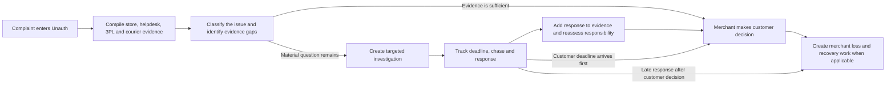

# Unauth MVP+ — Case Investigations and Responsibility Resolution

**Status:** Proposed implementation scope

**Purpose:** Build-ready product and technical specification

**Primary object:** Existing `support_payout_cases` record

**Audience:** Product owner and Codex implementation agent

## 1. Executive decision

Unauth should not stop at collecting data from Shopify, the helpdesk, a 3PL, and a courier. That data often proves what each system recorded, but it does not always prove what physically happened.

The MVP+ should therefore add a lightweight **Investigation layer** to the existing claim review flow:

1. Compile the evidence already available through integrations.
2. Identify the important unanswered question.
3. Recommend the most relevant party to contact first.
4. Let the agent create and send, or copy, a structured evidence request.
5. Track who was contacted, what is due, what is overdue, and what came back.
6. Turn the response into structured evidence.
7. Update an advisory responsibility assessment.
8. Leave the customer outcome and final responsibility decision under merchant control.
9. Feed confirmed responsibility into the existing loss and recovery flow after a customer payout decision.

This is not a separate outreach product, a new top-level ticketing system, or a fully autonomous claims investigator. It is an extension of the existing Unauth case.

Conceptually, the product has three layers:

1. **Evidence collection:** integrations assemble what Shopify, the helpdesk, warehouse/3PL, and courier systems already know.
2. **Investigation management:** when those records leave a material question, Unauth prepares and tracks targeted human outreach.
3. **Decision and recovery:** the returned evidence updates an advisory responsibility assessment; the merchant decides the customer outcome and later recovery action.

The integrations therefore do not replace contacting a warehouse or courier. They prevent unnecessary outreach, make necessary outreach more precise, and keep its result attached to the claim.

The product should feel like this:

> “Unauth has gathered everything available. One material question remains. We recommend asking ShipBob whether the order passed its final weight and pack checks. Send the prepared request, track the reply here, and then make the customer decision with the complete evidence.”

## 2. The problem this solves

An integration tells Unauth what a provider's system says. It does not guarantee that no human or physical-world error occurred.

Examples:

- ShipBob may show that the expected SKU was picked and packed, while an item was still left out of the parcel.
- UPS may show a delivered scan and a delivery image, while the image is of the wrong property.
- A courier may have received the correct parcel but damaged or opened it in transit.
- A warehouse may have dispatched the parcel late even though the courier later delivered within its own transit window.
- Both providers may report “no issue found,” leaving the evidence genuinely inconclusive.

Today, an agent bridges that gap outside Unauth by emailing a warehouse, opening a courier portal, chasing a response, and remembering to return to the claim. The MVP+ brings that work into the case without pretending that every investigation can be automated.

## 3. Product principles

These principles are requirements, not suggestions.

### 3.1 One canonical case

The existing `support_payout_cases` record remains the canonical unit of work. An investigation is attached to that case. It must not create a competing case lifecycle.

### 3.2 Evidence before outreach

Unauth first gathers the available integrated evidence. It only recommends outreach when a material question remains unanswered.

### 3.3 Targeted outreach, not “contact everyone”

The default is one primary investigation aimed at the party best placed to answer the unanswered question. Parallel outreach is available when two independent questions genuinely exist or an agent explicitly chooses it.

### 3.4 “Delivered” is not the same as “correctly delivered”

A delivered status is a carrier event. Proof of delivery is a separate artefact. A photo is evidence, but it is not automatically proof that the parcel reached the correct address.

### 3.5 No response is not an admission

An overdue or unanswered request must never be treated as proof of responsibility. It creates a task and forces a merchant decision; it does not silently assign responsibility.

### 3.6 Responsibility is advisory until confirmed

The product should use neutral language such as **responsibility assessment**, not legal or accusatory language such as “guilty.” Unauth can recommend an attribution. The merchant confirms or corrects it and records a reason.

### 3.7 Customer outcome and supplier recovery are separate decisions

The merchant may need to refund a customer before a courier or warehouse responds. The customer decision can be final while the investigation continues for later recovery. A late response must not automatically reverse the customer decision.

### 3.8 No AI dependency for the first release

The core workflow must work through deterministic rules, editable templates, and structured human findings. AI can improve drafting or image review later, but the MVP+ must not depend on computer vision or an autonomous fault model.

### 3.9 Provider-neutral core

ShipBob, UPS, FedEx, and future providers feed the same evidence and investigation model. Do not build a ShipBob-only or UPS-only case workflow.

## 4. What is included in the MVP+

### Included

- Correct classification of a whole missing parcel versus an item missing from a delivered parcel.
- A compiled evidence pack from the store, helpdesk, fulfilment provider, courier, and existing customer history.
- Clear separation between a delivery scan, a delivery photo/signature, and an agent's opinion about whether the image is consistent with the address.
- Deterministic recommendations for whether a warehouse/3PL, courier, supplier, customer, or internal team should be contacted.
- One primary investigation, with optional parallel secondary investigations.
- Editable evidence-request templates.
- One-click email where a partner email and merchant reply address are configured.
- A manual/portal path that copies the request, opens the contact page, and lets the agent mark it as sent with a reference number.
- Status, deadline, overdue, chase, response, and closure tracking.
- Structured response capture and attachment of returned files or links to the evidence pack.
- Recalculation of an advisory responsibility assessment.
- A manual responsibility confirmation/correction with a rationale.
- Work tasks, notifications, case timeline events, and existing queue states.
- Continued investigation after a customer outcome when recovery is still possible.
- Full merchant isolation, permissions, provenance, and audit events.

### Explicitly not included

- Automatic visual matching of a delivery photo to a property.
- Automatic GPS or map-based validation of a delivery location.
- Automatic interpretation of every courier portal or inbound email.
- A universal two-way messaging inbox.
- Automatic courier or 3PL claim submission.
- Automatic refunds when a timer expires.
- Automatic assignment of responsibility from a missed deadline.
- Percentage-based shared liability.
- Autonomous fraud accusations or customer blame.
- A new top-level Investigations navigation area.
- Replacement of the merchant's existing helpdesk.

These exclusions are deliberate. They keep the release meaningfully better than a basic MVP without turning it into a multi-quarter communications and computer-vision platform.

## 5. How this attaches to the existing product

The new capability should use existing product surfaces rather than creating a parallel application.

| Existing area | How the investigation capability attaches |
| --- | --- |
| `support_payout_cases` | Remains the parent and canonical claim. Every investigation references one case. |
| Claim detail `/claims/[id]` | Gains an **Investigations** card between Evidence and Responsibility/Recovery, plus context-sensitive actions in the right rail. |
| Evidence pack | Continues to compile store, helpdesk, fulfilment, carrier, and policy evidence. External replies become new canonical evidence items. |
| Claim status machine | Uses the existing `awaiting_carrier_response`, `awaiting_3pl_response`, and `awaiting_supplier_response` states when the primary request is open. |
| Claims queue | Existing waiting-state filters show cases waiting on an external party. No new queue is needed. |
| Work `/work` | Creates due and overdue tasks for responses, chases, response review, and customer-decision deadlines. |
| Notifications | Existing overdue-task projection surfaces investigation work. |
| Case timeline | Adds investigation draft, sent, chased, response, closure, and responsibility events to the unified timeline. |
| Partners | Reuses partner records and adds investigation contact method and response SLA settings. |
| Helpdesk widget | Shows the current evidence gap and next action, with a deep link to Unauth. Sending and response review remain in the full product. |
| Customer decision | Continues through the existing merchant-controlled approve/deny flow. Investigation results inform it but do not bypass it. |
| Loss and recovery | Receives confirmed responsibility after a customer payout decision. Existing recovery workflows remain downstream. |

The existing `external_clarification_requests` and `external_correspondence` records belong to post-loss recovery operations. They must not be reused as a second pre-decision case system. Before the customer outcome, use `case_clarification_requests`; after a merchant loss exists, hand the result into the existing loss/recovery flow.

### Required page order on the claim detail

The case detail should read as one story:

1. Customer and order context.
2. Issue and current case state.
3. Evidence collected.
4. Investigations and outstanding questions.
5. Responsibility assessment.
6. Customer decision.
7. Recovery, if a merchant loss exists.
8. Timeline and audit history.

The user should never need to understand that these are separate backend services.

## 6. Language and concepts

Use these terms consistently in product copy and code-facing documentation.

### Case

The existing customer claim represented by `support_payout_cases`.

### Evidence pack

All available source material attached to the case, with its source and collection time. A source statement is not automatically a proven physical fact.

### Evidence gap

A specific material question the existing evidence cannot answer, such as “Did the parcel pass the warehouse's final weight check?”

### Investigation

A structured request to one external or internal party for facts or evidence needed to resolve an evidence gap. Technically, this extends the existing `case_clarification_requests` model.

### Primary investigation

The open request most important to the next case decision. It determines the case's current waiting status and the main next action.

### Secondary investigation

An additional request running in parallel. The UI may say “Waiting on 2 investigations,” while the existing single `nextAction` field continues to represent the primary action.

### Responsibility assessment

Unauth's advisory view of which party most likely caused the merchant loss, together with confidence and reasons.

### Customer outcome

The merchant's approve, partially approve, replace, credit, or deny decision for the customer. Existing supported outcome values remain authoritative.

### Recovery

The downstream attempt to recover a merchant loss from a responsible partner. It begins only after the customer outcome produces a merchant loss or a later investigation identifies a recoverable party.

## 7. End-to-end case flow



### Stage 1 — Ingest and classify the complaint

Unauth receives or creates the case from the helpdesk and links the store order, fulfilment, tracking, refund, and customer context.

The case reason must distinguish:

- **Whole parcel missing:** `item_not_received`.
- **One or more products missing from a delivered parcel:** normalized reason `missing_item`, even if the existing stored claim-type compatibility value remains `item_not_received`.
- **Wrong product received:** `wrong_item` or the existing canonical equivalent.
- **Damaged item:** `damaged`.
- **Late delivery:** `late_delivery` or the existing canonical equivalent.

The agent must be able to correct the normalized **Case issue** from the claim page. That correction is audited and is used on the next evaluation.

### Stage 2 — Compile the integrated evidence

The existing evidence assembly should present separate, labelled groups:

- Customer complaint and helpdesk attachments.
- Shopify order, products, quantities, fulfilment, refunds, and customer history.
- Warehouse/3PL pick, pack, weight, exception, dispatch, and claim information.
- Courier tracking events, delivered scan, delivery timestamp, delivery image, signature, GPS/location data where actually supplied, and carrier exceptions.
- Relevant merchant rules and partner terms.

Only evidence from the identified provider should be requested or shown as missing. A UPS shipment must not display a missing FedEx integration hint, and vice versa.

Every evidence item must retain source, external reference, observed/created time, collection time, and relevant raw metadata.

### Stage 3 — Record manual evidence findings

Some evidence needs a human observation. The MVP+ should support a structured delivery-photo review:

- `consistent` — visible details appear consistent with the supplied address.
- `inconsistent` — visible details appear inconsistent, for example door 29 when the customer address is 27.
- `unclear` — the image does not contain enough information.
- A required note when the agent chooses `inconsistent`.

This finding is evidence of an agent's review, not a computer-vision result and not automatically a final responsibility decision.

### Stage 4 — Decide whether an investigation is needed

The recommendation engine should ask:

1. Is the customer decision already supported by sufficiently reliable evidence?
2. Is a material fact missing?
3. Which party is best placed to answer that exact question?
4. Is a second independent question important enough to justify parallel outreach?
5. Will the external response likely arrive before the customer-decision deadline?

The output is one of:

- No investigation required; proceed to merchant decision.
- Customer evidence required first.
- Create a primary warehouse/3PL investigation.
- Create a primary courier investigation.
- Create a primary supplier investigation.
- Create an internal investigation.
- Create two parallel investigations, with one marked primary.
- Manual review because the route is genuinely ambiguous.

The recommendation must include a plain-language reason and the exact evidence being requested. The agent may accept it, edit it, choose a different target, add a secondary target, or proceed without outreach with a recorded rationale.

### Stage 5 — Draft and send the request

When the agent starts an investigation, Unauth pre-fills:

- Target partner and contact method.
- Subject.
- Relevant order, fulfilment, and tracking references.
- A concise statement of the customer's issue.
- The unanswered question.
- A checklist of requested evidence.
- Requested response date.
- Merchant reply-to details.

The agent can edit all message text before sending.

Supported sending paths:

1. **Email:** Send from Unauth only when the partner contact email and merchant reply-to are configured. A successful acceptance response from the email provider is required before the request is marked sent.
2. **Partner portal:** Copy the message, open the configured contact URL, then record the portal case/reference number and mark sent.
3. **Manual:** Copy the message for any other channel, then mark it sent and optionally add a reference or URL.

If email delivery fails, the request remains a draft and the failure is shown. The product must not create a false audit record saying it was sent.

### Stage 6 — Track the wait

After the primary request is sent:

- The case enters the corresponding existing waiting state.
- A response task is created with `due_at`.
- The action rail shows who Unauth is waiting for and the due time.
- The Claims queue can be filtered by the existing waiting state.
- The Work page shows due and overdue investigation actions.
- The timeline records the send channel, target, actor, requested evidence, and deadline.

The external response deadline and customer-decision deadline remain separate.

The customer deadline continues to use the existing claim SLA, which is currently considered overdue after 72 hours from the case's opened/submitted time. An investigation does not reset that clock. The external request uses its own `due_at`, calculated from the partner or merchant investigation SLA. If that response is due after the customer deadline, the UI must warn the agent rather than implying that the customer case can safely wait.

When an external deadline passes, Unauth should offer:

- Send or record a chase.
- Extend the response deadline.
- Mark the investigation “No response” and continue to manual decision.
- Make the customer decision now while leaving recovery investigation open.

Unauth must never automatically refund, deny, close, or assign responsibility merely because the deadline passed.

### Stage 7 — Record the response

Inbound email parsing is not required for this release. The agent records the reply using a structured form:

- Response outcome:
  - `issue_confirmed`
  - `no_issue_found`
  - `inconclusive`
  - `referred_elsewhere`
  - `no_response`
- Response summary.
- Evidence received, as files or links.
- External reference or portal URL.
- Date/time received.
- Responding person or team, where known.

Each received file or link becomes a canonical `evidence_items` record linked to the existing case. Its source metadata must identify the investigation request that produced it.

### Stage 8 — Re-evaluate and assess responsibility

Recording a response triggers deterministic re-evaluation of the evidence pack and case recommendation.

Rules:

- A warehouse/3PL confirmation of a pick, pack, weight, labelling, or dispatch error supports warehouse/3PL responsibility.
- A courier confirmation of a misdelivery, loss, damage, or handling error supports carrier responsibility.
- A direct supplier confirmation supports supplier responsibility.
- “No issue found” does not prove that another party or the customer caused the issue.
- “No response” adds no causal evidence.
- Contradictory responses create manual review and a responsibility-judgement exception.
- Customer history can inform the merchant's customer-outcome policy, but it does not prove warehouse or courier responsibility.
- Customer responsibility should only be suggested from direct, case-specific evidence and must require explicit merchant confirmation.

The system displays:

- Recommended responsible party.
- Confidence: low, medium, or high.
- Supporting and conflicting evidence.
- Remaining uncertainty.
- Recovery owner, if applicable.

The agent can **Confirm responsibility** or **Correct assessment** and must provide a reason when overriding the recommendation. The resulting projection uses the existing attribution fields and appends an immutable event.

### Stage 9 — Make the customer decision

The existing merchant decision control remains the only way to finalize the customer outcome. The investigation can recommend a next action, but it must not approve or deny the case automatically.

If the customer-decision deadline arrives before an external response, Unauth creates a decision-needed task and explains the options. The merchant can refund or otherwise resolve the customer while the external investigation remains open.

### Stage 10 — Continue into recovery

When the customer decision produces a merchant loss, the existing domain flow creates or updates the loss and recovery records.

Confirmed responsibility should determine the likely recovery owner and target. If responsibility is learned after the customer case is final:

- Do not reopen or reverse the customer decision automatically.
- Update the advisory attribution and timeline.
- Show an explicit action to create or update the appropriate recovery case.
- Keep recovery submission merchant-controlled.

## 8. Routing rules

The initial router should be deterministic and easy to explain. It does not need an AI model.

| Customer issue and evidence | Primary target | Contact another party? | Reason |
| --- | --- | --- | --- |
| One item missing from a delivered multi-item parcel | Warehouse/3PL | Courier only if there is opened/damaged packaging, a transit-weight discrepancy, or other handling evidence | The unanswered question is normally whether all items entered the parcel. |
| Wrong item received | Warehouse/3PL | Supplier only if the warehouse evidence points to an upstream labelling/product problem | Pick/pack identity is the first material question. |
| Whole parcel not received and clear warehouse-to-carrier handover exists | Courier | Warehouse only if handover or dispatch evidence becomes disputed | The parcel was in the carrier network. |
| Whole parcel not received and dispatch/handover is unclear | Warehouse/3PL | Courier after handover is confirmed; parallel only when both hold independent evidence | First establish whether the carrier actually received it. |
| Delivered scan with a photo visibly inconsistent with the address | Courier | No warehouse request unless parcel contents are separately disputed | Correct delivery location is the courier question. |
| Delivered scan with a photo that is unclear | Courier, if customer still disputes receipt | No warehouse request unless handover/content is also uncertain | The delivered event has not resolved correct-location delivery. |
| Delivered scan with a photo manually judged consistent, but the customer disputes whole-parcel receipt | Usually proceed to merchant decision when policy says this evidence is sufficient; contact the courier when value, missing signature, location ambiguity, or other contradictory evidence justifies it | Do not contact the warehouse unless handover or contents are separately disputed | A consistent image strengthens the courier evidence but does not automatically prove customer possession or assign customer responsibility. |
| Delivered scan, signature belonging to customer, and no contradictory evidence | Usually no external investigation | Merchant may still request customer evidence under policy | Existing evidence may be enough for a merchant decision, but not an automatic one. |
| Damaged item with damaged outer packaging | Courier | Warehouse in parallel only for a separate packing-standard question | Transit handling is the leading question. |
| Damaged item with intact packaging and inadequate internal protection | Warehouse/3PL or supplier | Courier only if there is separate transit evidence | Packing or product condition is the leading question. |
| Damage source cannot be distinguished and value justifies investigation | One primary plus one parallel secondary request | Yes | Two independent material questions genuinely remain. |
| Late delivery where dispatch occurred after warehouse SLA | Warehouse/3PL | Courier only for additional post-handover delay | The first delay arose before carrier handover. |
| Late delivery where dispatch was timely but transit exceeded promise | Courier | No warehouse request | The delay arose after handover. |
| No useful evidence from integrations | The party holding the earliest missing fact | Add another target only after defining a separate question | Avoid broad, unfocused outreach. |

### When to contact both parties simultaneously

Parallel contact is allowed when all of these are true:

1. There are two separately worded evidence gaps.
2. Each party possesses evidence the other cannot supply.
3. Waiting sequentially would materially delay the customer outcome or recovery.
4. The expected value of the claim justifies the extra work, or the merchant explicitly chooses it.

The interface must never silently send two requests because the system is merely uncertain. The recommendation should say why each request is needed, and the agent confirms both.

### How to treat a delivery image

A delivery image never closes the courier question by itself. Unauth first asks what the image actually adds:

- If the image is inconsistent with the address, recommend courier outreach.
- If it is unclear, the courier remains the likely source of location/driver evidence.
- If it appears consistent and no evidence conflicts, it may be sufficient for the merchant to decide without more outreach under its policy.
- If it appears consistent but important uncertainty remains, such as a high-value parcel, no signature, an ambiguous communal entrance, or contradictory customer evidence, offer courier outreach.

In every case, “no further courier investigation recommended” means the current evidence is sufficient for a merchant decision. It does not mean Unauth has proven the courier could not have made an error.

## 9. Detailed example journeys

### 9.1 Delivered parcel with one item missing

**Inputs**

- Shopify confirms the customer bought three products.
- The helpdesk complaint says two arrived and one is missing.
- ShipBob says all three expected SKUs were fulfilled.
- Courier tracking and photo show a parcel delivered.

**What Unauth should conclude initially**

- This is `missing_item`, not a whole-parcel `item_not_received` case.
- The courier photo helps show that a parcel arrived, but says nothing about whether all three items were inside it.
- The ShipBob database record is useful but does not eliminate a physical pick/pack error.
- The primary evidence gap is warehouse-side: final weight, scan sequence, exceptions, and pack-station checks.

**Product action**

- Recommend a Warehouse/3PL investigation only.
- Pre-fill a request for pick/pack scans, expected and actual parcel weight, packing exception logs, and available pack-station evidence.
- After sending, move the case to `awaiting_3pl_response` and create a due task.

**Possible responses**

- ShipBob confirms a short pack or weight discrepancy: recommend warehouse/3PL responsibility with high confidence.
- ShipBob supplies consistent scans and weight but cannot rule out error: mark the response inconclusive; do not automatically blame courier or customer.
- Evidence shows damaged/opened packaging or carrier re-packaging: offer a secondary courier investigation.
- No response: create an overdue task; do not assign responsibility.

### 9.2 Whole parcel missing with wrong-door delivery image

**Inputs**

- Shopify and ShipBob confirm purchase, fulfilment, and carrier handover.
- UPS reports delivered and supplies an image.
- Customer address is number 27.
- Agent reviews the image and can clearly see number 29.

**What Unauth should conclude initially**

- “Delivered” is a carrier scan, not final proof of correct delivery.
- The agent records `delivery_photo_review = inconsistent` with a note.
- The material evidence gap is carrier-side: delivery coordinates, driver notes, and misdelivery investigation.

**Product action**

- Recommend a courier investigation only.
- Pre-fill the address, tracking number, conflicting door number, and requested driver/GPS evidence.
- Move the case to `awaiting_carrier_response` once sent.

**Possible responses**

- Courier confirms misdelivery: recommend carrier responsibility with high confidence.
- Courier says the image is correct without resolving the number conflict: mark conflicting/inconclusive and send to manual review.
- Courier does not reply before the customer deadline: ask the merchant to make the customer decision; continue the investigation for recovery if desired.

### 9.3 Damaged product with uncertain source

**Inputs**

- Customer supplies product and packaging photos.
- Warehouse data shows normal pick/pack.
- Courier shows no recorded exception.
- Outer packaging damage is visible but internal packing also appears weak.

**What Unauth should conclude initially**

- Two material questions exist: courier handling and warehouse packing standard.
- The recommendation can propose parallel requests, one marked primary based on the strongest visible evidence.

**Product action**

- Agent reviews both prepared requests and chooses whether to send both.
- UI shows “Waiting on 2 investigations” and each separate deadline.
- The primary request determines the canonical waiting status; both remain visible in the Investigations card.

**Possible responses**

- One party directly confirms error: recommend that party.
- Both responses remain inconclusive: manual merchant judgement; no percentage split in MVP+.
- Both claim the other party is responsible: create a responsibility-judgement exception with both source statements visible.

### 9.4 No response before the customer deadline

**Inputs**

- Courier request is overdue.
- Customer decision is due now.

**Product action**

- Do not auto-refund and do not auto-deny.
- Show “Customer decision required; courier response still outstanding.”
- Let the merchant decide the customer outcome using its policy and existing evidence.
- Keep the investigation open or mark it no-response at the merchant's choice.
- If the merchant pays the customer, allow the later courier response to support recovery without reopening the customer case.

## 10. Functional requirements

### FR-1 — Correct case subtype

- Detect deterministic phrases such as “one item missing,” “part of my order,” “box arrived but,” and quantity discrepancies as `missing_item`.
- Keep whole-parcel non-delivery as `item_not_received`.
- Add an editable **Case issue** control on the claim page.
- Pass the normalized subtype into the decision evaluator rather than relying only on the compatibility claim type stored in the database.
- Re-evaluate the case after an agent correction.

### FR-2 — Correct proof-of-delivery semantics

- A delivered tracking state and timestamp must not set `hasProofOfDelivery` by themselves.
- Store or derive separate facts for:
  - delivered carrier event;
  - delivery timestamp;
  - delivery photo present;
  - signature present;
  - carrier-provided location/GPS present;
  - manual image review finding.
- “Proof of delivery” may only be true when a real supporting artefact exists under the merchant's policy.
- Even when an artefact exists, correct-address consistency remains a separate question.
- Update all payout rules and attribution logic that currently treat a delivered scan as decisive proof.

### FR-3 — Investigation recommendation

- Produce zero, one, or more proposed targets, with exactly one primary target when any exist.
- Include evidence gap, reason, requested evidence, priority, and recommended deadline.
- Use deterministic rules from section 8.
- Allow agent override with a reason.
- Do not create duplicate open requests for the same case, target, and evidence gap.

### FR-4 — Investigation creation

- Create the investigation under the current merchant and case.
- Pre-fill target from the partner directory where possible.
- Allow target type: carrier, warehouse, 3PL, supplier, customer, or internal.
- Preserve email, API, manual, and the existing supported helpdesk-specific channel values; add portal. The MVP+ creation UI exposes email, portal, and manual only.
- Save drafts without changing the case waiting status.

### FR-5 — Sending and marking sent

- Email sending requires a configured recipient and merchant reply-to.
- Portal/manual requests require explicit **Mark sent** confirmation.
- Store exactly what was sent, to whom, by whom, through which channel, and when.
- Create an audit/timeline event only after successful send or explicit mark-sent.
- Failed email attempts remain drafts and expose a retry/manual fallback.
- Set the primary request's case waiting state through the canonical case transition service.

### FR-6 — Multiple investigations

- Support multiple investigation rows per case.
- Only one open request is primary at a time.
- The primary request drives the compatibility `nextAction` and target-specific case status.
- UI derives aggregate copy such as “Waiting on 2 investigations.”
- Closing or cancelling the primary request promotes an appropriate open secondary request or re-evaluates the case.

### FR-7 — Deadlines, tasks, and chases

- Calculate response `due_at` from a partner-specific SLA where configured, then `merchants.settings.investigation_response_sla_hours` where valid, with a 24-hour elapsed-time fallback.
- Keep the external response deadline separate from the existing customer-decision deadline.
- Create/update an existing `work_tasks` record with the investigation ID in source metadata.
- Derive overdue state from `due_at`; do not create an `overdue` persisted investigation status.
- Let an agent record a chase, including channel, note, actor, time, and new due date if extended.
- Append every chase to the case timeline.
- Do not automatically send external chasers in the initial release.

### FR-8 — Response capture

- Capture the structured outcome, summary, reference, responder, received time, and files/links.
- Preserve original source wording where the agent pastes it, while keeping the agent's summary separate if both are captured.
- Create canonical evidence records for attachments and source links.
- Mark the request `response_received` and show it as requiring review.
- Allow close, refer elsewhere, reopen, or create a follow-up request.

### FR-9 — Re-evaluation

- Load open and received clarification requests before deriving workflow state.
- An active request must generate `wait_for_response` rather than another duplicate recommendation.
- Re-run case evidence, next-action, and responsibility logic when a response or material manual finding is saved.
- If another primary/secondary request remains open, keep the appropriate waiting state.
- If no requests remain open, transition through the canonical state machine to ready, manual review, or evidence needed.
- Never reopen a final customer outcome automatically.

### FR-10 — Responsibility confirmation

- Show the recommended attribution, confidence, reasons, conflicts, and unknowns.
- High confidence requires a direct source confirmation or explicit agent-confirmed case evidence; provider status records alone are insufficient.
- Let an authorized merchant user confirm or correct the assessment with a rationale.
- Persist the current projection in the existing attribution/recovery-owner fields.
- Append an immutable responsibility event so the history is not lost when the projection changes.
- Support one primary responsible party for MVP+; send genuinely shared or unresolved cases to manual review.

### FR-11 — Customer decision independence

- The existing merchant decision remains authoritative.
- A customer decision can be completed with an investigation still open.
- Customer SLA expiry creates a decision-needed task, not an automated outcome.
- A late investigation response updates attribution and recovery options only; it does not reverse the customer outcome.

### FR-12 — Recovery handoff

- After a merchant loss exists, confirmed carrier/warehouse/3PL/supplier responsibility should identify a recovery target.
- Reuse the existing loss and recovery services and records.
- If no recovery exists yet, show an explicit create action.
- If responsibility changes, update through domain events and merchant-confirmed actions, preserving history.
- Do not auto-submit a partner claim in MVP+.

## 11. User experience specification

### 11.1 Claim page — Investigations card

Add `CaseInvestigationsCard` after the existing evidence content and before the responsibility/recovery section.

Empty states:

- **No investigation needed:** “The current evidence is sufficient for a merchant decision.”
- **Recommended:** Show target, evidence gap, reason, requested evidence, expected deadline, and **Review request**.
- **No recommendation:** “No external investigation is currently recommended,” with an optional **Start manually** action.

Each investigation row shows:

- Primary badge where applicable.
- Target type and partner name.
- Plain-language question being investigated.
- Requested evidence summary.
- Channel and recipient/destination.
- Draft, waiting, response received, closed, or cancelled state.
- Sent time and response due time.
- Overdue badge derived from the deadline.
- Latest response outcome and short summary.
- External reference/portal link.
- Contextual action: Edit, Send, Copy, Open portal, Mark sent, Chase, Extend, Record response, Review response, Close, or Cancel.

### 11.2 Create/review request modal

The modal should be understandable without operations jargon. It contains:

- “Who can answer this?” target selector.
- Partner/contact selector.
- “What do we still need to know?” evidence-gap field.
- Requested-evidence checklist.
- Subject and editable message.
- Contact channel.
- Response deadline.
- Primary/secondary selector when another request exists.
- Preview of the identifiers and personal data included.

The primary button changes by channel: **Send email**, **Copy and open portal**, or **Copy request**.

### 11.3 Record response modal

Fields:

- Outcome selector with plain-language descriptions.
- Response summary.
- Optional pasted original response.
- Files and links.
- Reference number.
- Responder/team.
- Received date/time.
- **Save and re-evaluate case** action.

After save, show the changed recommendation clearly. Do not make the agent infer it from a status colour.

### 11.4 Claim action rail

Add one context-sensitive investigation action, not a permanent cluster of buttons:

- **Review investigation request** when a draft recommendation exists.
- **Waiting for ShipBob** with due time when open.
- **Record response** when waiting.
- **Review response** when received.
- **Customer decision due** when the customer SLA is more urgent.

The action rail should continue to prioritize the single most important next action.

### 11.5 Responsibility section

Retain the existing advisory presentation and add:

- Recommended party and confidence.
- “Why Unauth thinks this” evidence list.
- Contradictory/unknown evidence.
- Confirmation state and confirmer.
- **Confirm responsibility** and **Correct assessment** actions.

Avoid absolute copy such as “UPS is at fault.” Prefer “Carrier responsibility recommended — high confidence.”

### 11.6 Claims queue

Reuse existing waiting filters and statuses. Add useful secondary text in rows, for example:

- “Waiting for UPS · due tomorrow.”
- “Waiting on 2 investigations · 1 overdue.”
- “Response received · review required.”

### 11.7 Work and notifications

Use existing work-task cards and overdue notifications. Investigation tasks should deep-link to the correct case and card.

Suggested task titles:

- “Courier response due — Order #1042.”
- “Review ShipBob response — Order #1042.”
- “Customer decision due while courier response is outstanding.”

### 11.8 Partner settings

Extend the existing partner management surface with:

- Investigation contact email.
- Investigation/contact portal URL.
- Default contact channel.
- Default response SLA in hours.
- Optional contact instructions/notes.

The partner recovery deadline remains separate. Do not reuse a recovery-claim filing deadline as an investigation response SLA.

### 11.9 Helpdesk widget

Show only:

- Current case status.
- Evidence gap.
- Who the case is waiting for.
- Response due/overdue state.
- Latest short response summary.
- Deep link to the Unauth case.

Do not place outbound sending, response application, or responsibility confirmation into the lightweight widget in MVP+.

## 12. Data model changes

Use a new forward-only Supabase migration. Never edit an already-applied migration.

### 12.1 Extend `case_clarification_requests`

This existing table becomes the pre-decision investigation record. Do not create a parallel `case_investigations` table.

Retain existing fields including:

- `id`
- `merchant_id`
- `support_payout_case_id`
- `target_type`
- `target_name`
- `status`
- `requested_evidence`
- `request_summary`
- `response_summary`
- `source_channel`
- `due_at`
- `sent_at`
- `response_received_at`
- timestamps

Add or extend:

| Field | Purpose |
| --- | --- |
| `partner_id` | Optional FK to the existing partner directory. |
| `is_primary` | Identifies the request driving the case waiting state. |
| `recommended_reason` | Plain-language explanation for the proposed target. |
| `subject` | Exact outbound subject. |
| `request_body` | Exact editable/sent request body. |
| `recipient` | Email address or destination label used at send time. |
| `external_reference` | Courier/warehouse portal ticket or email reference. |
| `external_url` | Direct portal or source URL. |
| `response_outcome` | Structured response result. |
| `response_body` | Original partner response text pasted by the agent, kept separate from `response_summary`. |
| `responder_name` | Responding person or team where known. |
| `created_by` | Actor who created the request. |
| `sent_by` | Actor who sent/marked sent. |
| `response_recorded_by` | Actor who recorded the response. |
| `closed_by` | Actor who closed/cancelled it. |
| `closed_at` | Closure timestamp. |
| `idempotency_key` | Prevents duplicate requests from retries. |
| `metadata` | Provider delivery IDs and non-canonical extension data. |

Extend constraints:

- `target_type`: retain existing values and add `warehouse` if merchant-owned or non-3PL warehouses must be distinguished. In the UI, both `warehouse` and `3pl` can display as **Warehouse / 3PL**. A warehouse target maps to the existing `awaiting_3pl_response` case status.
- `source_channel`: retain existing values and add `portal`.
- `status`: support `draft`, `sent`, `waiting_response`, `response_received`, `closed`, and `cancelled`. The normal UI flow can move directly from draft to waiting after recording `sent_at`; `sent` may remain a short-lived or compatibility state.
- `response_outcome`: `issue_confirmed`, `no_issue_found`, `inconclusive`, `referred_elsewhere`, `no_response`.

Required indexes and guards:

- Merchant + support case + status index.
- Waiting status + `due_at` index for task projection.
- Unique merchant-scoped idempotency key where present.
- At most one open primary investigation per case, enforced in the service and preferably with an appropriate partial unique index.
- Existing RLS pattern applied to every new field and query path.

Migration/backfill requirements:

- Do not assume the table is empty.
- Add actor, response, contact, and partner fields as nullable so historical rows remain valid.
- Add `is_primary` with a safe default, then deterministically select at most one currently waiting request per case as primary before adding the partial uniqueness guard. Prefer the earliest successfully sent waiting request; fall back to earliest creation time.
- Leave closed historical requests non-primary.
- Add or replace check constraints only after existing values have been inspected and normalized.
- Regenerate the repository's Supabase types through its established type-generation process after the migration is verified.

### 12.2 Extend `partners`

Reuse existing `contact_email`, `contact_url`, and notes. Add only if not already represented:

- `default_contact_channel`
- `response_sla_hours`

Do not duplicate partner contact data inside provider-specific settings. The investigation row snapshots the actual recipient/destination used so history survives later partner edits.

Store the optional merchant-wide fallback as `merchants.settings.investigation_response_sla_hours`. Use 24 elapsed hours when neither the partner nor merchant has a valid value. This timer is an operational chase target, not a statement that a courier or warehouse must complete its full formal claim investigation within 24 hours.

### 12.3 Evidence links

Response files and URLs must use existing `evidence_items` and `evidence_links`. Add the clarification request ID to canonical source metadata. Do not store important response evidence only inside arbitrary JSON.

### 12.4 Work-task linkage

Use existing `work_tasks.support_payout_case_id` and `source_metadata` containing the investigation request ID. A new `work_task_id` on the request is not required unless implementation evidence shows the existing task model cannot reliably upsert by source.

### 12.5 Attribution history

Keep the current projection in the existing support-case attribution, confidence, and recovery-owner fields. Preserve every material change through existing claim/domain events rather than creating silent mutable history.

## 13. Status and lifecycle rules

### Investigation lifecycle

```text
draft
  -> waiting_response (send succeeds or agent marks sent)
  -> response_received (agent records a reply)
  -> closed (response reviewed/applied)

draft/waiting_response/response_received
  -> cancelled (with reason)

waiting_response
  -> closed with response_outcome=no_response (explicit agent action only)
```

Overdue is derived from `due_at < now` while the request is waiting. It is not a stored lifecycle status.

A draft's recipient, subject, body, target, and requested evidence are editable. Once sent, the exact outbound snapshot must not be silently rewritten. Later corrections or chases are appended as audited events or explicit follow-up requests.

### Case status interaction

- Draft investigation: no case status change.
- Sent primary carrier request: transition to `awaiting_carrier_response`.
- Sent primary warehouse/3PL request: transition to `awaiting_3pl_response`.
- Sent primary supplier request: transition to `awaiting_supplier_response`.
- Sent primary customer request: transition to the existing `awaiting_customer_evidence` state.
- Internal request: use `manual_review` with a work task; do not invent an `awaiting_internal_response` status for MVP+.
- Response recorded for the primary request: that party is no longer counted as awaiting. Re-evaluate immediately; if another request is still waiting, promote it and use its waiting state, otherwise transition to ready, manual review, or evidence needed. The received request can remain `response_received` until the agent closes it, but it must not remain overdue or hold the case in an external-wait state.
- Multiple requests: primary request drives the persisted case status; UI displays aggregate waiting count.
- Primary request closes while another is open: promote the best remaining request and transition accordingly.
- Last open request closes: re-evaluate and transition to ready, manual review, or evidence needed through `transitionCase`.
- Final customer case: never transition back to a waiting state automatically. Continue the investigation as recovery-related work.

Every status mutation must use the existing canonical state transition service. Do not write case status fields directly.

## 14. Decision and evidence rules

### Evidence strength

Treat these as distinct levels:

1. **System record:** a provider says an event/status occurred.
2. **Supporting artefact:** photo, signature, scan sequence, recorded weight, exception, GPS, or other source document.
3. **Human finding:** an agent states what the artefact appears to show.
4. **Source confirmation:** the responsible provider directly confirms an error.
5. **Merchant confirmation:** an authorized user confirms the responsibility assessment.

Do not jump from level 1 to a high-confidence physical conclusion.

### Attribution confidence

- **High:** direct provider confirmation or explicit agent-confirmed evidence that clearly resolves the causal question.
- **Medium:** multiple consistent artefacts point to one party, but no direct confirmation exists.
- **Low:** incomplete or indirect evidence; a working recommendation only.

### Conflicts

When credible source evidence conflicts:

- Display both facts.
- Lower confidence.
- Create/retain a manual review exception using the existing responsibility-judgement exception category.
- Do not choose whichever source replied last.

### Customer history

Repeat-claim or customer-history indicators may change how the merchant applies its customer payout policy. They must not be used as proof that a warehouse packed correctly or a courier delivered correctly.

## 15. Request template requirements

Templates should ask for factual evidence and avoid claiming that the target is responsible before the investigation is complete.

### Warehouse/3PL request content

- Merchant/order and fulfilment references.
- Products and expected quantities.
- Customer's factual allegation.
- Pick and pack scan trail.
- Expected and recorded parcel weight.
- Pack-station or quality-control evidence where available.
- Exception/repack/relabelling logs.
- Dispatch and carrier-handover evidence.
- A direct question asking whether any discrepancy or operational issue was found.

### Courier request content

- Merchant/order and tracking references.
- Delivery address needed for the enquiry.
- Customer's factual allegation.
- Delivery scan, image, signature, and coordinates/driver notes where available.
- Any specific discrepancy, such as visible door number 29 versus address 27.
- Loss, damage, repack, or exception events.
- A direct question asking whether misdelivery, loss, or handling error was found.

### Supplier request content

- Product, batch, and order references where available.
- Factual defect/wrong-product allegation.
- Warehouse findings already obtained.
- Requested production, label, or quality evidence.

### Data minimization

Only include customer personal data required for the investigation. Do not include unrelated helpdesk history, risk scores, other claims, or internal comments in outbound messages.

## 16. Technical implementation map

Names may be adjusted to match repository conventions, but responsibilities should remain separate.

### Domain modules

- `lib/investigations/types.ts` — canonical types and allowed outcomes.
- `lib/investigations/recommend.ts` — deterministic evidence-gap and target router.
- `lib/investigations/templates.ts` — provider-neutral request composition.
- `lib/investigations/store.ts` — merchant-scoped persistence and idempotency.
- `lib/investigations/caseStatus.ts` — primary-request selection and canonical case transition orchestration.
- `lib/investigations/response.ts` — response validation, evidence creation, and re-evaluation.

Existing clarification helpers under `lib/payouts/clarifications.ts` should be moved, wrapped, or expanded rather than leaving two competing service paths.

### API routes

Suggested route contract:

- `GET /api/claims/[claimId]/investigations`
- `POST /api/claims/[claimId]/investigations`
- `PATCH /api/claims/[claimId]/investigations/[investigationId]`
- `POST /api/claims/[claimId]/investigations/[investigationId]/send`
- `POST /api/claims/[claimId]/investigations/[investigationId]/mark-sent`
- `POST /api/claims/[claimId]/investigations/[investigationId]/chase`
- `POST /api/claims/[claimId]/investigations/[investigationId]/response`
- `POST /api/claims/[claimId]/investigations/[investigationId]/close`
- `POST /api/claims/[claimId]/investigations/[investigationId]/cancel`

All mutation routes must:

- Authenticate the user.
- Resolve merchant membership and permission.
- Scope both parent and child records to that merchant.
- Validate request state transitions.
- Support idempotency for sends and response application.
- Append audit/timeline events.
- Return the refreshed canonical case summary needed by the UI.

For MVP+, reuse the existing payout-decision management permission if that is the closest established control. Document a future split into `MANAGE_INVESTIGATIONS` if merchants need separate roles.

### Email service

Reuse the existing email transport in `lib/email/send.ts` and configured provider. Set the merchant-controlled reply-to address. Store the provider message ID in investigation metadata.

Email requirements:

- No send without a valid recipient and reply-to.
- No state transition until the provider confirms acceptance.
- Idempotency prevents a double-send on retries.
- Error message offers retry, copy, and manual fallback.
- Do not build inbound parsing in this phase.

### Evaluation integration

The case evaluation service must load clarification/investigation requests **before** it derives workflow and `nextAction`. It is not sufficient to append them to the API response after evaluation.

An open request should cause the evaluator to return a wait-for-response action. A received response should be part of the next evidence evaluation. A final customer decision should be respected even if an investigation remains active.

### Evidence assembly fixes

Before routing investigations:

- Stop equating delivered status/time with proof of delivery.
- Pass the normalized missing-item subtype into payout evaluation.
- Present warehouse/3PL evidence as a clear evidence group.
- Only request on-demand carrier evidence from the carrier identified on the shipment.
- Preserve source provenance for manual findings and investigation responses.

### Timeline events

Add user-facing event labels and structured payloads for:

- `investigation_drafted`
- `investigation_sent`
- `investigation_chased`
- `investigation_response_recorded`
- `investigation_closed`
- `investigation_cancelled`
- `responsibility_confirmed`
- `responsibility_corrected`

Events should include case/request ID, target, actor, channel, time, deadline/reference where relevant, and changed responsibility projection. Do not place customer-sensitive message bodies in a broadly exposed event label.

## 17. Security, privacy, and audit requirements

- Every request and response query is scoped by both `merchant_id` and parent case ownership.
- A user cannot attach an investigation to another merchant's case by guessing an ID.
- Partner IDs must belong to the same merchant.
- Evidence links and uploads use the existing protected evidence access model.
- Outbound messages use the minimum customer data needed.
- Secrets, provider tokens, and raw email credentials never enter request metadata or timeline payloads.
- Every send, mark-sent, chase, response, close, cancellation, override, and responsibility confirmation records actor and timestamp.
- API retries must not send duplicate emails, create duplicate evidence, or duplicate tasks.
- Existing retention and deletion rules apply to investigation data.
- Do not expose internal risk/customer-history commentary to an external partner.

## 18. Reporting and product analytics

The first release should support operational metrics without creating a large analytics project:

- Number and percentage of cases requiring an investigation.
- Investigation target distribution: carrier, warehouse/3PL, supplier, customer, internal.
- Median time to first send.
- Median and percentile response time by partner.
- Response rate and overdue rate by partner.
- Outcome distribution: issue confirmed, no issue found, inconclusive, referred, no response.
- Percentage of cases where responsibility changed after an investigation.
- Percentage of customer decisions made before the external response.
- Recovery value associated with completed investigations.
- Agent override rate of the recommended target and responsibility assessment.

Use existing event data where possible. Do not block the operational release on a new analytics dashboard; verified event capture is the first requirement.

## 19. Delivery plan

The implementation should be split into reviewable phases. Do not attempt every integration and UI path in one unverified change.

### Phase 0 — Protect the current product

- Run and record the relevant current test baseline.
- Confirm the canonical case, decision, evidence, task, timeline, partner, and recovery paths.
- Add characterization tests around delivered/POD behavior and missing-item classification before changing them.

### Phase 1 — Evidence correctness prerequisites

- Separate delivered event from proof-of-delivery artefacts.
- Correct missing-item versus whole-parcel classification.
- Add agent-correctable case issue.
- Make carrier evidence requests carrier-specific.
- Make warehouse/3PL evidence visible as a distinct group.

This phase is required. Routing investigations on top of incorrect evidence semantics would create misleading recommendations.

### Phase 2 — Investigation data and domain layer

- Add the forward migration extending clarification requests and partners.
- Add types, validation, recommendation, template, persistence, idempotency, and case-status orchestration.
- Load requests inside case evaluation.
- Add domain/timeline events.
- Unit-test routing and lifecycle rules.

### Phase 3 — Core APIs and manual workflow

- Add list, create, edit, mark-sent, chase, response, close, and cancel endpoints.
- Create/upsert work tasks.
- Convert returned evidence into canonical evidence items.
- Implement deterministic re-evaluation.
- This phase should already be usable with the manual/portal channel even before email sending.

### Phase 4 — Claim-page experience

- Add the Investigations card.
- Add request and response modals.
- Add action-rail states.
- Add manual delivery-photo finding.
- Extend the responsibility section with confirmation/correction.
- Ensure mobile, keyboard, loading, error, empty, and dark-mode states.

### Phase 5 — Queues, work, and notifications

- Add investigation context to claim rows.
- Deep-link investigation work tasks.
- Project due/overdue notifications.
- Add timeline rendering for every investigation event.

### Phase 6 — One-click outbound email

- Add partner contact and SLA settings.
- Send through the existing email service with reply-to and idempotency.
- Add failure and manual fallback flows.
- Keep inbound response capture manual.

### Phase 7 — Responsibility and recovery handoff

- Complete response-to-attribution rules.
- Confirm/correct responsibility with durable audit.
- Continue open investigations after customer resolution.
- Add explicit recovery create/update handoff for late responses.

### Phase 8 — Hardening and release

- Full tenant-isolation and permission tests.
- Concurrency, retry, and idempotency tests.
- Accessibility and responsive QA.
- Typecheck, lint, authenticated design lint, full tests, and production build.
- Update `docs/PRODUCT.md`, `ARCHITECTURE.md`, and operational documentation with the shipped behavior.

## 20. Acceptance scenarios

The feature is not complete until these journeys pass end to end.

### Classification and evidence

1. “My parcel never arrived” is a whole-parcel non-delivery case.
2. “The box arrived but product B is missing” is a missing-item case.
3. An agent can correct the case issue and trigger re-evaluation.
4. A delivered scan without photo/signature/location artefact is not treated as proof of delivery.
5. A photo is shown as an artefact, while address consistency is separately recorded.
6. A UPS shipment does not show a missing-FedEx-evidence action.

### Routing

7. A delivered parcel with one item missing recommends warehouse/3PL only.
8. A fully missing parcel with confirmed handover recommends courier only.
9. A wrong-door manual photo finding recommends courier outreach.
10. Ambiguous damage can recommend two separate requests, with one primary.
11. The agent can override the target and must record why.
12. Re-evaluation does not create a duplicate open request.

### Sending and tracking

13. A draft does not change the case status.
14. A successfully sent carrier request moves the case through the canonical transition service to awaiting carrier response.
15. A failed email remains a draft and is not recorded as sent.
16. Missing contact email offers copy/portal/manual fallback.
17. Retrying the same send cannot send two emails.
18. A due work task is created and deep-links to the case.
19. Passing `due_at` makes the task/request overdue without assigning responsibility.
20. A chase is visible in the timeline and can extend the deadline.

### Responses and responsibility

21. An attachment returned by a partner appears in the canonical evidence pack with provenance.
22. Warehouse confirmation of a short pack recommends warehouse/3PL responsibility.
23. Carrier confirmation of misdelivery recommends carrier responsibility.
24. “No issue found” does not automatically blame another party or customer.
25. “No response” results in manual decision, not responsibility attribution.
26. Conflicting provider replies create manual responsibility review.
27. An authorized user can confirm or correct responsibility with an audited reason.

### Customer outcome and recovery

28. The customer deadline can require a decision while an investigation remains open.
29. No deadline automatically refunds or denies the customer.
30. The merchant can finalize the customer outcome while retaining the open investigation.
31. A late response does not reopen or reverse that customer outcome.
32. A late confirmed provider error can create/update a recovery action explicitly.

### Security and reliability

33. A user cannot read or mutate another merchant's investigation by changing IDs.
34. A partner from another merchant cannot be attached.
35. Repeated response submission cannot duplicate evidence or events.
36. Multiple open requests display correctly while only one drives the compatibility next action.
37. Final case states are never silently moved back to waiting.

## 21. Test requirements

### Unit tests

- Case subtype classifier.
- Delivered/POD fact construction.
- Investigation routing matrix.
- Primary request selection.
- Deadline/overdue derivation.
- Response-to-evidence mapping.
- Response-to-responsibility recommendation.
- No-response and no-issue-found neutrality.
- Final-case protection.

### Integration tests

- Merchant-scoped API access.
- Create/edit/send/mark-sent lifecycle.
- Email success, failure, and idempotent retry.
- Work-task upsert and overdue projection.
- Evidence item creation from responses.
- Case state transitions for each target.
- Multiple requests and primary promotion.
- Re-evaluation loads active requests before deriving next action.
- Responsibility event/projection consistency.
- Loss/recovery handoff after final customer decision.

### UI tests

- Empty, recommended, draft, waiting, overdue, response, closed, and error states.
- Manual photo finding.
- Request editing and channel fallback.
- Response attachment and changed recommendation.
- Two simultaneous investigations.
- Permission-disabled states.
- Mobile and keyboard operation.

### Release verification

Run focused tests during each phase, then the repository's required typecheck, lint, authenticated design lint, complete test suite, and production build. Any known pre-existing failure must be distinguished from a regression with evidence.

## 22. Definition of done

The MVP+ is complete when a merchant can open a real claim and, without maintaining a separate spreadsheet or memory-based chase process:

1. See the complete integrated evidence and its limitations.
2. Understand the exact unanswered question.
3. Know which party Unauth recommends contacting and why.
4. Send or manually submit an editable request.
5. See who is outstanding and by when across the claim queue and Work page.
6. Record a reply and its evidence.
7. Receive a refreshed, explainable responsibility recommendation.
8. Confirm the responsibility and make the customer decision themselves.
9. Continue a late investigation into recovery without changing the final customer outcome.
10. Audit every material action and trust that no provider silence or weak status record was treated as proof.

## 23. Instructions to the implementation agent

When Codex builds this scope:

1. Read `CLAUDE.md`, `docs/PRODUCT.md`, and `ARCHITECTURE.md` before making changes.
2. Preserve `support_payout_cases` as the canonical case.
3. Extend `case_clarification_requests`; do not introduce a parallel pre-decision investigation table or workflow.
4. Reuse existing evidence, case transition, task, timeline, partner, decision, loss, and recovery services.
5. Fix delivered/POD and missing-item semantics before building routing rules.
6. Keep provider adapters at the evidence boundary; do not create provider-specific case logic.
7. Use forward-only migrations and preserve existing applied migration history.
8. Keep merchant decisions authoritative and use neutral, advisory responsibility language.
9. Implement manual/portal workflow before relying on outbound email. Do not add inbound email parsing or image AI unless separately approved.
10. Build and verify one phase at a time, reporting any necessary deviation from this scope before expanding it.

The desired MVP+ is not “AI decides who is at fault.” It is a reliable operational system that gathers what it can, identifies what it cannot know, manages the correct outreach, and turns the answer into a better human decision.
