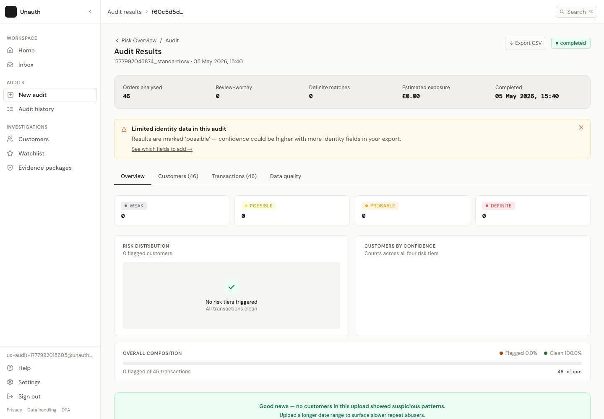
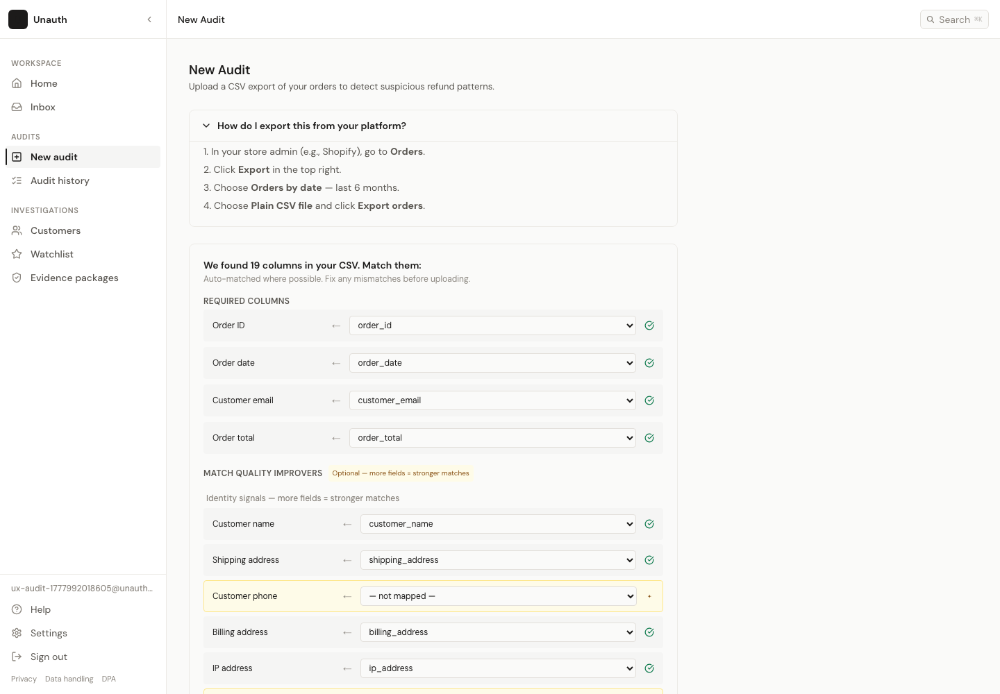
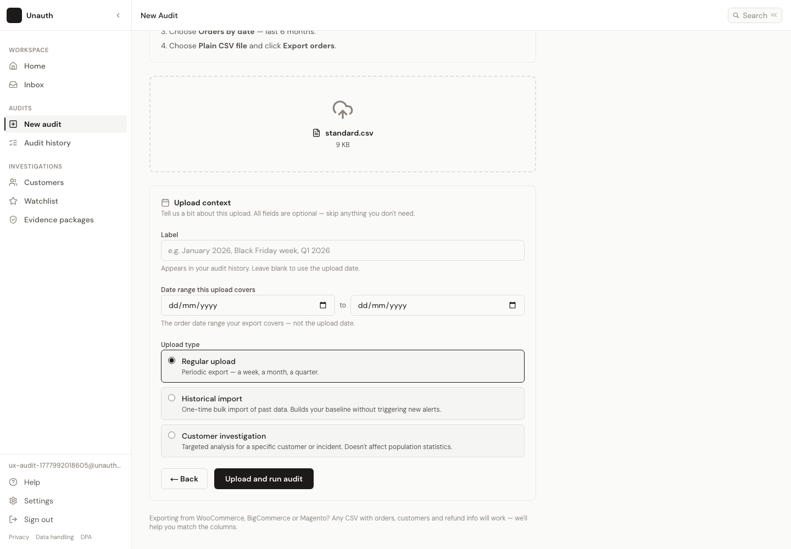
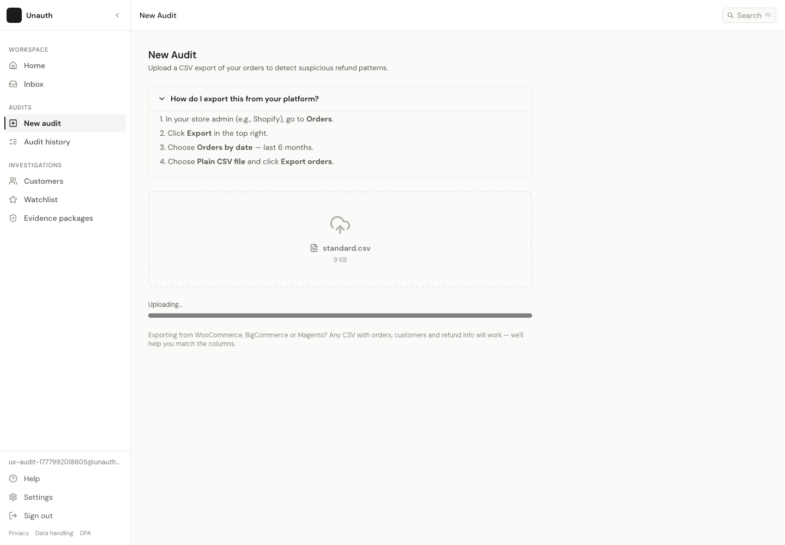
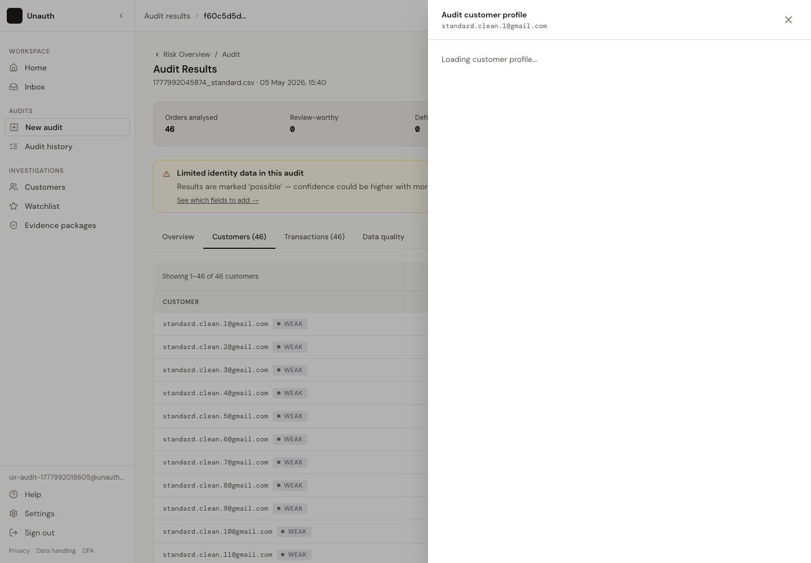
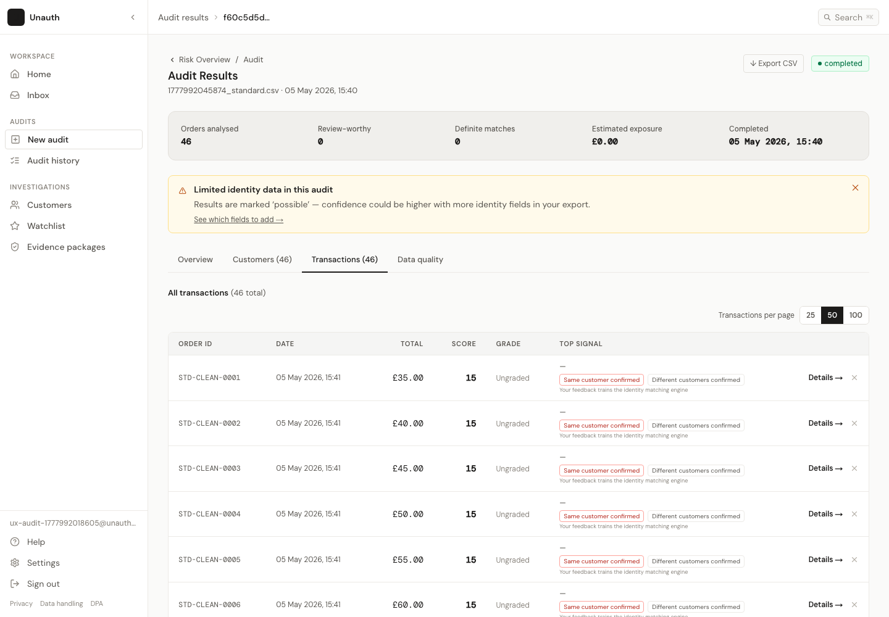
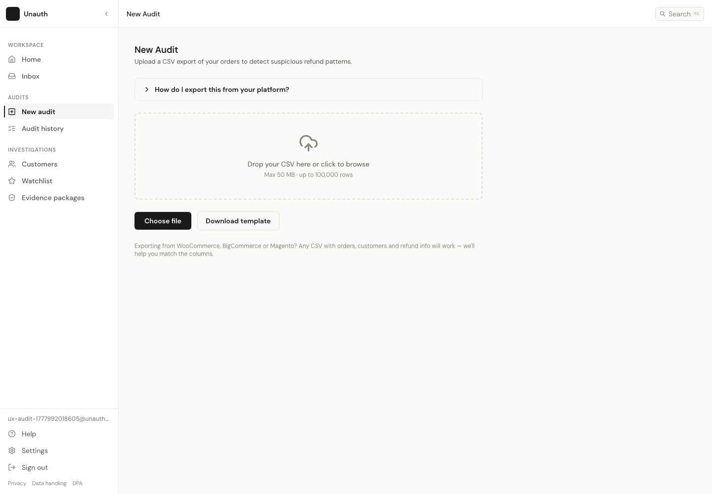
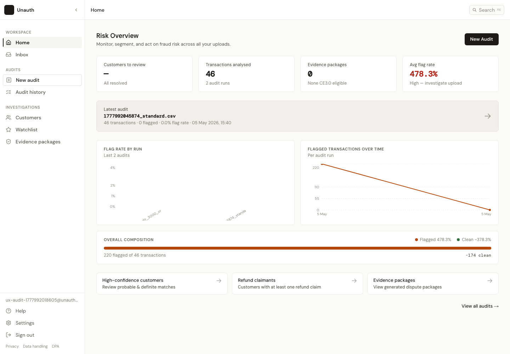
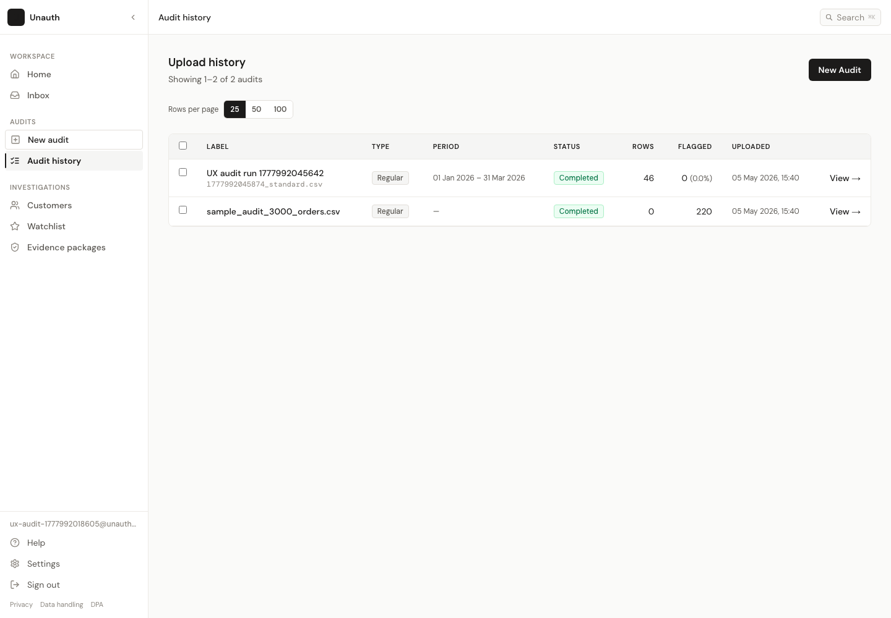
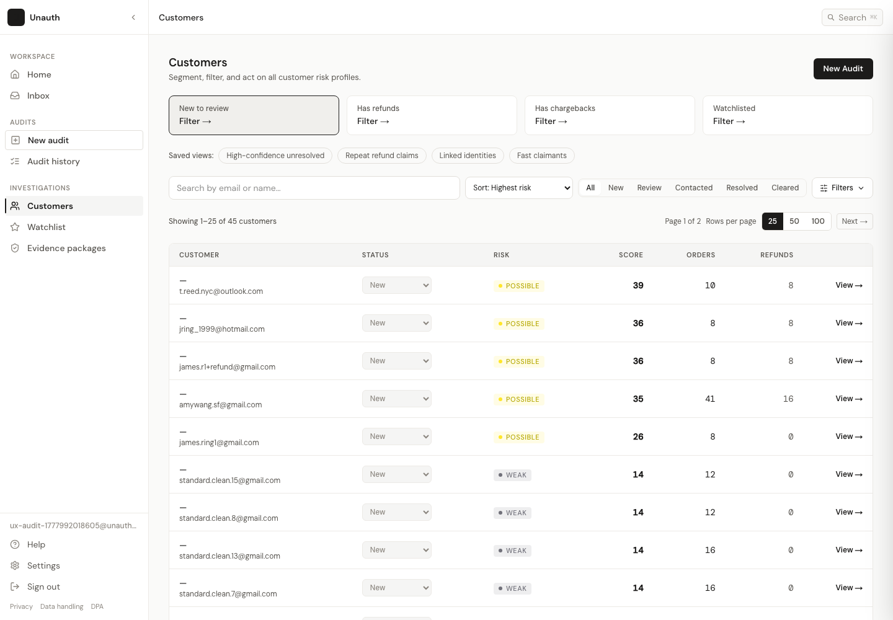

# UX Audit Report

Generated: 2026-05-05T14:40:32.434Z

## Scores

- Overall polish score: 6.4/10
- Visual cohesion: 6.6/10
- Flow/navigation: 6.1/10

The app is directionally solid: it has a restrained palette, a consistent sidebar shell, useful audit concepts, and a merchant workflow that can get from CSV upload to risk review. It feels slightly off because several key surfaces were built at different fidelity levels. The strongest parts use the tokenized design language in `app/globals.css`; the weaker parts fall back to ad hoc inline styles, inconsistent radii, mixed arrow glyphs, and page transitions where a merchant expects an in-context investigation surface.

**Audit note:** the browser reached the CSV upload progress state but did not complete the live storage upload within the timeout in this environment. Results, drill-down, tables, export, and navigation were audited through the app's seeded demo audit fallback, and the blocked CSV submit is treated as a critical flow limitation.

## Top 10 Issues

### 1. Results actions are visually too weak for the main journey

Explanation: The results page is the moment of truth, but the primary actions are small text links: `Export CSV`, `View ->`, tab labels, and transaction details. They do not create a clear hierarchy of "review risky customers next."

Why it matters: A merchant has just waited for analysis and needs a confident next step. The interface shows data, but it does not strongly guide action.

Exact fix: Add a compact action bar under the summary with one primary CTA, "Review risky customers", a secondary "Export report", and a tertiary "View all transactions". Use the same button primitives as upload. Keep tabs, but make the recommended next action explicit.

### 2. The upload page changes density and rhythm between steps

Explanation: The idle upload state is airy and centered, then the mapping state becomes a long dense form with many identical rows. Optional fields and required fields compete visually, and the page width stays narrow for a wide mapping task.

Why it matters: The merchant goes from "simple upload" to "spreadsheet admin" abruptly. This makes the product feel more technical than it needs to.

Exact fix: Use a two-column mapping layout on desktop: required fields in the left column, optional match improvers in grouped accordions on the right. Keep required fields pinned above optional fields. Standardize row height, icon placement, and helper text.

### 3. Terminology fragments the core concept

Explanation: The same journey uses "New Audit", "Upload", "Run audit", "Audit Results", "Risk Overview", "Regular upload", "Historical import", "Customer investigation", "runId", and "report" language in different places.

Why it matters: Merchants can understand the feature, but they have to mentally translate terms. That is the source of the "what exactly did I just create?" feeling.

Exact fix: Standardize around "Audit" for the object and "Upload" only for the file action. Rename "Risk Overview" breadcrumb to "Dashboard". Rename "Regular upload" to "Standard audit". Use "Audit result" only for the completed page.

### 4. Processing is technically present but not reassuring enough

Explanation: The progress state uses a small progress bar and plain status copy. It says the merchant can leave, but it does not show what happens next or preserve a visible route to history.

Why it matters: Processing is the highest-anxiety moment in the flow. Sparse feedback can make a successful upload feel stalled.

Exact fix: Make processing a dedicated in-page state with three stages: "Uploaded", "Analysing orders", "Preparing results". Add "View audit history" as a secondary action and keep the file name/row estimate visible.

### 5. Customer investigation is correctly a drawer, but the surrounding route model is mixed

Explanation: In audit results, customer detail opens as a drawer, which is the right pattern. Elsewhere, customers can also be full pages. That can be fine, but this audit flow does not clearly distinguish "audit-scoped customer detail" from "global customer profile."

Why it matters: Merchants may not know whether they are seeing this upload only or the customer's complete history.

Exact fix: Title the drawer "Customer in this audit" and add a secondary link "Open full customer profile" only when the global profile adds more context. Keep audit-scoped review in the drawer.

### 6. Tables look consistent at first glance but behave like static reports

Explanation: Tables have consistent header styling, but the audit flow lacks visible search, sorting affordances, and filter chips for confidence, signal, or status.

Why it matters: Results become harder to act on as row count grows. A merchant needs to narrow from "all transactions" to "the few I should investigate now."

Exact fix: Add a table toolbar above customers and transactions: search, confidence filter, signal filter, and "show unresolved only". Use explicit sort indicators on sortable columns.

### 7. Button and link variants are not standardized enough

Explanation: Some controls are filled buttons, some bordered buttons, some text links with arrows, some raw anchors with download glyphs, and some icon buttons with SVGs. The sidebar has a primary nav item that looks like a secondary outline button.

Why it matters: The app has a design system in tokens, but not a fully enforced component system. That is why pages feel assembled rather than composed.

Exact fix: Define shared Button variants: primary, secondary, ghost, danger, table-action, icon. Replace inline hover handlers and ad hoc anchors in upload/results with these variants.

### 8. Page headers are structurally similar but not standardized

Explanation: Pages use different outer widths, padding, title sizes, subtitle styles, and header actions. Upload uses `max-w-3xl`; results uses wider `p-6 md:p-8`; settings/help/history have their own density.

Why it matters: The app shell is stable, but page content feels like separate modules.

Exact fix: Introduce a `PageHeader` and `PageContent` layout primitive with standard padding, max width options, breadcrumb slot, title, subtitle, and action slot.

### 9. Empty and partial states need more specific merchant guidance

Explanation: Empty or low-data states often explain the state, but not always the next merchant action. Some are cheerful, some technical, and some sparse.

Why it matters: Empty states are navigation moments. They should answer "why am I here?" and "what should I do next?"

Exact fix: Standardize empty states with title, one-sentence explanation, primary CTA, optional secondary link. For audit results with no flags, add "Upload a longer range" and "View all transactions" actions.

### 10. Mobile navigation likely works, but audit tables are not mobile-native

Explanation: The shell has a mobile drawer, but dense audit/customer tables remain table-first. On small screens this will read as squeezed operational UI rather than a polished merchant investigation experience.

Why it matters: Even if merchants mostly use desktop, mobile review links and quick checks should not feel broken.

Exact fix: At mobile widths, convert result rows into stacked list items with the customer/order, score, grade, and one action. Keep full tables for desktop.

## Visual Inconsistencies

- Layout structure: sidebar shell is cohesive; page bodies vary between narrow forms, wide dashboards, and unstandardized content widths.
- Spacing scale: tokens exist, but page padding alternates between `p-8`, `p-6 md:p-8`, card-specific padding, and table-specific spacing.
- Typography: core classes exist, but table actions, helper text, badges, and headings mix `text-xs`, `text-body-sm`, raw font weights, and inline styles.
- Buttons: primary upload buttons feel solid; result actions are mostly small links. Download actions should be secondary buttons, not low-salience text links.
- Cards: radius ranges from `rounded-md` to `rounded-xl`; result summary uses a larger soft card than neighboring panels.
- Colour: palette is restrained and mostly cohesive, but success/risk/info panels sometimes dominate more than the neutral product language.
- Icons: lucide is used in many places, but some controls still use raw SVG or text glyph arrows.
- Hover/focus: focus styles exist globally; hover is implemented inconsistently via utility classes, inline mouse handlers, and native link underline.

## Flow Issues

- The journey works, but the mental model wobbles: upload, audit, risk overview, results, customer investigation, and history need tighter naming.
- The results page does not strongly answer "what now?" after upload completion.
- Customer drill-down is good as a drawer, but it needs clearer audit-scoped context.
- Export is available, but it is visually under-prioritized and appears before the merchant has reviewed anything.
- The upload mapping step is functional but too long and too technical for first-run confidence.
- The return path uses "Risk Overview", which feels like a different product area from "Dashboard".

## Full Audit Flow Review

### Step-by-step journey map

1. Dashboard: merchant lands in the product shell and can see the main sidebar routes.
2. Upload idle: merchant sees export guidance, dropzone, choose file, and template download.
3. Invalid file selected: the UI can enter a mapping-like state rather than immediately explaining file quality in merchant language.
4. Column mapping: required and optional fields are visible, auto-mapping is helpful, but the page becomes dense.
5. Upload context: label, date range, and upload type are clear, though "Regular upload" should be "Standard audit".
6. Processing: the app shows a progress state and routes to results.
7. Results overview: summary, grades, chart, and top customers are visible.
8. Customers tab: audit-scoped customer list opens detail in a drawer.
9. Customer drawer: detail, signals, and orders are available without leaving results.
10. Transactions tab: all transaction rows are visible with details/dismiss/feedback actions.
11. Data quality tab: coverage information is available, but it feels secondary to action.
12. Return: breadcrumb returns to dashboard.

### Every button clicked

| Page | Clicked | Result | Recommended pattern |
|---|---|---|---|
| upload-idle | How do I export this from your platform? | State changed in place. | inline |
| upload-idle | Download template | Downloaded unauth-template.csv | inline |
| upload-invalid-file-selected | Cancel | State changed in place. | inline |
| upload-column-mapping | Continue | State changed in place. | inline |
| upload-context | Historical import | State changed in place. | inline |
| upload-context | Customer investigation | State changed in place. | inline |
| upload-context | Regular upload | State changed in place. | inline |
| upload-context | Back | State changed in place. | inline |
| upload-context | Upload and run audit | Starts upload/processing state, then should route to audit results when complete. | page |
| history-fallback-after-upload-timeout | View completed audit fallback | State changed in place. | page |
| audit-results-overview | Export CSV | Downloaded audit-f60c5d5d.csv | inline |
| audit-results-overview | Customers tab | State changed in place. | inline |
| audit-results-customers-tab | View customer | State changed in place. | drawer |
| audit-customer-drawer | Close profile | State changed in place. | drawer |
| audit-results-customers-tab | Transactions tab | State changed in place. | inline |
| audit-results-transactions-tab | Data quality tab | State changed in place. | inline |
| audit-results-data-quality-tab | Risk Overview breadcrumb | Navigated to http://localhost:3000/dashboard | page |

### What worked

- The main app shell is predictable.
- The upload flow supports file selection, mapping, context, processing, and result routing.
- The customer drill-down as a drawer is the right interaction pattern for staying in the audit.
- Tabs keep overview, customers, transactions, and data quality in one connected result page.

### What felt off

- The core flow asks for too much mapping detail before it has earned the merchant's trust.
- Results are data-rich but action-light.
- The visual language weakens at the exact places where merchants need confidence: results actions, table actions, and processing.
- Naming shifts make the journey feel less connected than it is.

### Confusing moments

- "Risk Overview" breadcrumb after "Audit Results" feels like a destination rename.
- "Customer investigation" in upload context could be mistaken for the drawer/customer detail investigation.
- "View" links do not clarify whether they open a page, drawer, or filtered view.
- The transaction "Details ->" link points to a route that should be verified; if it 404s in some data states, it should be removed or implemented as a drawer.

### Dead ends and unnecessary transitions

- No hard dead end was observed in the main journey.
- The likely unnecessary transition is transaction details as a full page. Transaction detail should usually be a drawer or inline expansion from the table.
- Export guide opens inline, which is correct. Customer detail opens in a drawer, which is correct.

## Ideal Flow

1. Dashboard card: "Run a new audit" with last audit status.
2. New Audit: upload CSV, template download, and platform export guide.
3. Mapping: show required fields first; hide optional fields behind "Improve match quality".
4. Context: "Standard audit", "Historical baseline", or "Single customer check".
5. Processing: stage-based progress with file name and row count.
6. Results: summary plus primary CTA "Review risky customers".
7. Investigation drawer: audit-scoped customer, evidence, orders, signals, and next action.
8. Resolve/export: mark reviewed, export report, or return to dashboard.

## IA Improvements

- Sidebar: keep "New audit" and "Audit history"; rename Home to Dashboard if page header says Dashboard.
- Results: keep overview/customers/transactions/data quality as tabs under one audit.
- Customers: distinguish global Customers from audit-scoped customer review.
- Chargebacks/Evidence: link from customer drawer only when relevant, not as a competing next step in audit review.

## UI Structure Changes

- Pages: Dashboard, New Audit, Audit History, Audit Results, Global Customer Profile, Settings.
- Modals: destructive confirmations, template/download confirmations only if needed.
- Drawers: audit-scoped customer detail, transaction detail, cluster detail.
- Inline: export guide, field mapping warnings, table filters, data quality explanations.
- Remove or defer: full transaction detail page unless it contains substantial standalone workflow.

## Quick Wins

- Rename "Risk Overview" breadcrumb to "Dashboard".
- Rename "Regular upload" to "Standard audit".
- Promote "Review risky customers" as the primary result CTA.
- Convert `Export CSV` from tiny text link to secondary button.
- Replace text arrows with lucide icons.
- Add visible sort indicators to score, spend, orders, and date columns.
- Add standard table toolbar with search and confidence filter.
- Add `data-testid="audit-results"` or a stable completion landmark for E2E automation.

## Deeper Redesigns

- Build shared layout primitives: `PageHeader`, `PageShell`, `Toolbar`, `DataTable`, `EmptyState`, and `Button`.
- Redesign mapping as a guided wizard with progressive disclosure.
- Create a unified investigation drawer pattern for customer, transaction, and cluster review.
- Add an explicit review workflow: New -> Under review -> Resolved/Cleared, visible from audit results.

## Design System Alignment Checklist

| Area | What exists | Inconsistent | Needs standardising |
|---|---|---|---|
| Spacing scale | Token-aware Tailwind usage | Page padding and card padding vary | Page shell spacing and table density |
| Typography scale | `text-heading`, `text-body`, `text-caption` classes | Raw text sizes mixed into components | Header, table, action, helper text recipes |
| Colour palette | Strong neutral/risk token palette | Risk/success backgrounds sometimes overpower neutral UI | Semantic usage rules |
| Button variants | Primary and outline patterns exist | Links used as buttons; inline hover handlers | Shared Button component |
| Card styles | Neutral bordered cards | Radius `md/lg/xl` mixed | Card primitive with 6-8px default |
| Page headers | Titles/subtitles present | Breadcrumbs/actions vary | Shared PageHeader |
| Tables | Consistent basic headers | Missing search/filter/sort affordances | DataTable primitive |
| Empty states | Some helpful states | Mixed tone and CTA presence | EmptyState component |
| Loading/progress | Upload progress exists | Too sparse for long processing | Stage-based progress component |
| Badges/status | Confidence and status labels exist | Visual weight varies | Badge variants by semantic type |
| Charts | Audit chart exists | Not strongly connected to table filters | Clickable chart/filter interaction |
| Sidebar/nav | Strongest cohesive element | "Home" vs "Dashboard"; primary nav looks outline | Naming and active/primary styling |

## Routes Discovered

- `/`
- `/audit/:runId`
- `/audit/:runId/customer/:hash`
- `/audit/:runId/customers`
- `/audit/:runId/transaction/:id`
- `/chargebacks`
- `/chargebacks/:id`
- `/customers`
- `/customers/:id`
- `/customers/:id/evidence/new`
- `/dashboard`
- `/demo`
- `/eval`
- `/help`
- `/help/csv-export`
- `/help/how-it-works`
- `/history`
- `/inbox`
- `/legal/data-handling`
- `/legal/dpa`
- `/legal/privacy`
- `/login`
- `/lookup`
- `/network-metrics`
- `/onboarding`
- `/saved`
- `/settings`
- `/settings/account`
- `/settings/audit-trail`
- `/settings/team`
- `/upload`
- `/watchlist`

## Limitations

- Upload processing did not reach results within timeout: page.waitForURL: Timeout 45000ms exceeded.
=========================== logs ===========================
waiting for navigation until "commit"
============================================================
