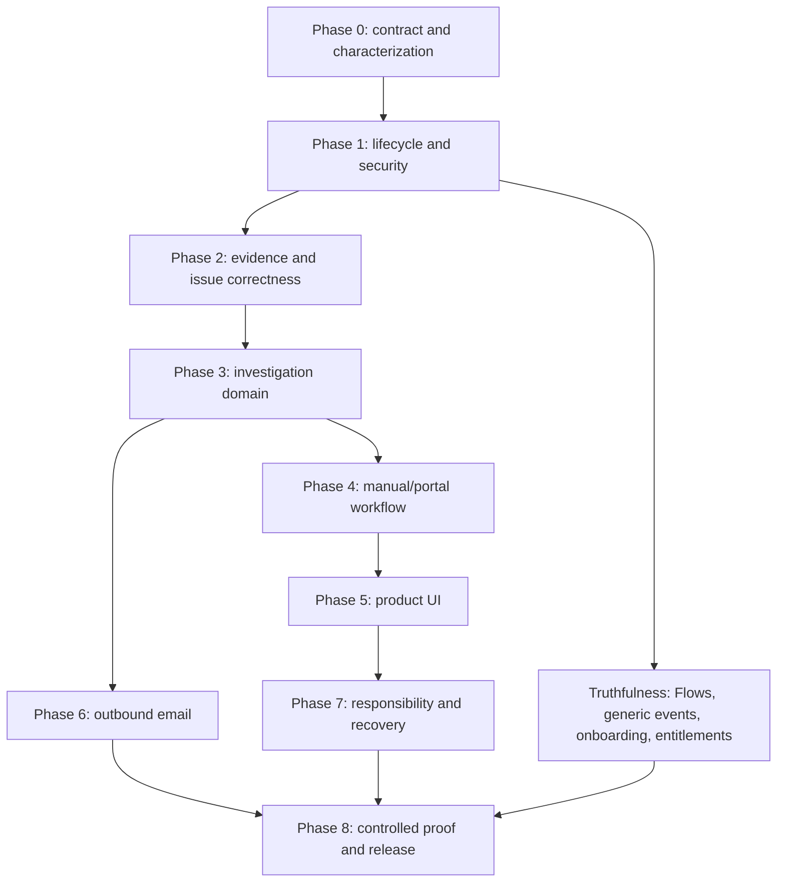

# Unauth Product Map — Release 1

**Status:** Implemented locally; external release gates pending

**Prepared:** 23 July 2026

**Repository snapshot:** `perf/architecture-overhaul` at `2fef68a3`

**Primary planning input:** [`docs/audits/current-product-capability-baseline-2026-07-23.md`](docs/audits/current-product-capability-baseline-2026-07-23.md)

**Target product input:** [`docs/MVP_PLUS_CASE_INVESTIGATIONS_SCOPE.md`](docs/MVP_PLUS_CASE_INVESTIGATIONS_SCOPE.md)

**Release mode:** Supervised shadow pilot; merchant-controlled decisions and external actions

**Implementation evidence:** [`docs/release-1-implementation-status-2026-07-23.md`](docs/release-1-implementation-status-2026-07-23.md)

This document turns the current-product audit and the proposed investigation scope into one build sequence. It is both a product map and an implementation plan. It does not authorize production access, provider mutations, migration deployment, credential rotation, customer communication, refunds, payouts, or recovery submissions.

The planned application and database changes have now been implemented and verified locally. The implementation-status document above is the authoritative handoff for delivered work, local test evidence, feature gates, deployment sequence, rollback, and the provider/production approvals that remain outstanding.

---

## 1. Executive decision

Release 1 should complete the existing decision-to-recovery product loop for one controlled merchant stack. It should not replace the platform, narrow Unauth to a missing-parcel demo, or create a separate investigations product.

The current application already has a meaningful core:

`source records → support payout case → evidence and recommendation → merchant decision → source-confirmed outcome → financial ledger → loss → recovery → reports and audit`

The missing part is the operational middle:

`material evidence gap → targeted investigation → send or record outreach → deadline and chase → response → canonical evidence → responsibility confirmation → recovery handoff`

Release 1 is therefore complete only when a merchant can run that whole loop without a spreadsheet, an unaudited inbox-only process, or a direct database edit.

### Release 1 product promise

A merchant using the selected Release 1 provider stack can:

1. Connect or import the source records required for a support payout case.
2. Distinguish a whole missing parcel from an item missing inside a delivered parcel.
3. See source-labelled evidence without treating a delivered scan as proof of correct delivery.
4. See the material unanswered question and the recommended party to contact.
5. Create, edit, email, copy, or manually record a targeted investigation request.
6. Track the primary and any secondary request, due time, overdue state, chase, and response.
7. Turn a recorded response and its files or links into canonical case evidence.
8. Receive a refreshed, deterministic responsibility recommendation.
9. Confirm or correct responsibility with an immutable rationale.
10. Make the customer decision independently, even while an investigation remains open.
11. Create or update a downstream recovery action after a real merchant loss exists.
12. Audit every material action without Unauth automatically moving money or assigning blame.

### Overall current-state conclusion

The app is **implemented but partial**, with a strong local core and an incomplete release loop.

- Case management, merchant decisions, source outcomes, financial projections, loss records, internal recovery records, Rules, Work, reports, audit, and local tenant controls are real.
- Investigation recommendations are currently text and derived workflow state, not an operable request lifecycle.
- The existing clarification table is a useful starting point, but there are no create/send/chase/respond/close services or interfaces.
- Delivered state is currently promoted to proof of delivery without requiring a supporting artefact.
- Missing-item meaning is not reliably preserved across classification, storage, manual correction, evaluation, and recovery.
- Responsibility remains an advisory mutable projection; the merchant cannot confirm or correct it as a first-class audited act.
- No provider has current controlled-runtime proof for this build.
- Local release evidence is strong, but production parity, credential rotation, provider behaviour, and several high-priority integrity issues remain unresolved.

---

## 2. Release boundary

### 2.1 Must ship

Release 1 includes:

- Correct delivered-event versus proof-of-delivery semantics.
- Reliable normalized case issues, including `missing_item`.
- An audited case-issue correction action.
- Provider-neutral evidence-gap and investigation routing.
- One primary investigation and optional secondary investigations.
- Draft, manual, portal, and configured email request paths.
- Durable send idempotency and truthful send-failure handling.
- Separate external-response and customer-decision deadlines.
- Work tasks, due/overdue projection, notification, queue context, and timeline events.
- Structured response capture with files or links.
- Canonical evidence creation with investigation provenance.
- Deterministic re-evaluation after material evidence changes.
- Merchant confirmation or correction of responsibility.
- Explicit late-response and recovery handoff behaviour.
- Same-merchant parent constraints for cases, partners, investigations, rules, and evidence links.
- Paired API-key/widget-token revocation.
- Read-only widget rendering; no GET-triggered case lifecycle mutation.
- A truthful disposition for disconnected Flows and generic event ingestion.
- Controlled provider proof for the exact pilot stack and exact release build.
- Production parity, credential, monitoring, and rollback gates before real merchant data.

### 2.2 Existing capabilities that must be preserved

Release 1 must preserve:

- `support_payout_cases` as the canonical case.
- Existing issue types and historical values.
- The distinction between advisory recommendation, merchant decision, and source-confirmed outcome.
- Append-only, currency-specific financial entries and reversals.
- Existing loss and recovery records and their history.
- Rules, Work, notifications, reports, exports, customer history, search, team, privacy, and audit.
- Existing connector code and source records, even when a provider is hidden from the first pilot.
- Existing URLs, widget deep links, and compatibility redirects until callers are migrated.
- Evidence provenance, source identifiers, timestamps, and protected file access.
- Optimistic concurrency, idempotency, final-state protection, and closure blockers.

### 2.3 Retain but hide, gate, or label

The following should remain in the code and data model but must not be presented as proven Release 1 behaviour unless their gate passes:

- Providers outside the selected pilot stack.
- Flows publication if normal domain-event dispatch is not connected and replay-tested.
- Generic `/api/v1/ingest/events` acceptance if there is no worker and status endpoint.
- Planned Stripe-dispute and carrier-claims integrations.
- Network/full-context language and related credit charging.
- Developer preview and design-system routes.
- PDF/CE3 evidence packages as a separate export capability until their relationship to case evidence is explicitly decided.

### 2.4 Release 1.1 or later

The following are not Release 1 requirements:

- Automatic refunds, reships, replacements, credits, denials, or case closure.
- Automatic carrier, 3PL, warehouse, or supplier claim submission.
- Inbound email parsing or a universal communications inbox.
- Automatic chaser emails.
- Computer-vision delivery-photo matching.
- GPS or map-based delivery validation.
- AI-generated responsibility decisions or contract extraction.
- Percentage-based shared liability.
- Autonomous action based on a missed deadline or provider silence.
- A new top-level Investigations area.
- Full provider breadth.
- Accounting-system write-back.

---

## 3. Current app versus Release 1

| Release outcome | Current implementation | Release 1 gap | Disposition |
|---|---|---|---|
| Canonical case lifecycle | Queue, detail, assignment, snooze, comments, timeline, decisions, reversals, and state RPCs are live locally. | Some evaluation and legacy gate paths still write lifecycle state outside the canonical transition service. | Preserve and harden first. |
| Case intake and linking | Manual intake is locally verified; Shopify/helpdesk/generic entity paths are substantial. | Provider runtime is unverified; generic event intake stops in an inbox; onboarding can complete too early. | Prove the selected stack and make unsupported intake truthful. |
| Compiled evidence | Canonical `evidence_items` and `evidence_links` feed decisions; provider evidence groups exist. | Provider completeness varies; response attachments have no case-investigation upload path. | Extend the canonical evidence graph. |
| Delivered/POD semantics | Delivery state, timestamp, photo, signature, and carrier fields exist. | `hasProofOfDelivery` is set from delivered state plus timestamp. | Correct before routing investigations. |
| Missing parcel versus missing item | Product types and some rules/tests know `missing_item`; stored compatibility type can remain `item_not_received`. | Classifiers collapse “missing item”; the manual issue is read-only; evaluator and recovery do not reliably receive the normalized subtype. | Add one normalized issue contract and audited correction. |
| Recommendation | Deterministic Rules and payout recommendations are real and explainable. | Evaluation can persist from a widget GET; active investigations are loaded after workflow derivation; status can be updated directly. | Split pure evaluation from explicit persistence and lifecycle orchestration. |
| Investigation lifecycle | `case_clarification_requests` and read helpers exist. | No supported create, edit, send, mark-sent, chase, response, close, cancel, primary selection, or UI path. | Extend the existing table and add a domain layer. |
| Work and deadlines | Work tasks, assignment, due dates, bulk actions, and deep links are live. | Investigation tasks and separate response/customer deadlines are absent. | Reuse Work; do not create a second queue. |
| Notifications | In-app notifications and preferences persist. | The operational projector is capped and not investigation-aware; assignment/due semantics are incomplete. | Add event-driven investigation notifications and bounded overdue scans. |
| Responsibility | Advisory attribution, confidence, recoverability, and owner fields exist. | No first-class merchant confirmation/correction; later evaluation could overwrite the current projection. | Add a merchant-controlled responsibility act and immutable event. |
| Customer decision | Immutable merchant decisions are separate from actual source outcomes. | UI/API naming can obscure the distinction; no investigation-aware deadline state. | Preserve the contract; add investigation context only. |
| Loss and recovery | Canonical loss and internal recovery records are locally verified. | External correspondence is read-only/manual; normalized missing-item and confirmed responsibility are not a complete handoff; no explicit late-response action. | Add a guarded case-to-recovery handoff, not automatic submission. |
| Providers | Shopify, Gorgias, ShipBob and several others have meaningful code and tests. | No current provider is controlled-runtime verified; carrier paths are Partial. | Select one stack, prove every advertised capability, keep labels truthful. |
| Security and tenancy | Representative local RLS, permissions, audit, privacy, and tenant tests are strong. | Cross-merchant partner association, paired-token revocation, URL PII/token exposure, and production parity remain open. | Release blockers. |
| Flows | Definitions, versions, tests, outputs, and run history exist. | Normal domain events do not register `workflowHandler` deliveries. | Connect and prove, or gate publication and label honestly. |
| Generic event ingestion | Auth, validation, idempotent inbox, leases, and schema exist. | No application consumer or returned status route was found. | Complete the contract or stop advertising acceptance. |
| Release evidence | The complete local gate passed at the audited commit. | Production/staging/provider evidence and 169 P0 items remain unverified. | Local green is necessary but not sufficient. |

### 3.1 What is genuinely net new

The genuinely new product work is limited to:

- Investigation request lifecycle and transport.
- Manual response capture.
- Delivery-photo human finding.
- Responsibility confirmation/correction.
- Investigation-to-recovery handoff.

Most other Release 1 work is integration, hardening, truthfulness, or controlled verification of capabilities that already exist.

---

## 4. Release assumptions and decisions

These are the planning defaults. A founder decision may change them before the named phase, but implementation should not remain ambiguous.

| ID | Planning default | Decision deadline |
|---|---|---|
| D-01 Pilot stack | Shopify + Gorgias + one fulfilment source + one carrier evidence source selected from the design partner’s actual stack. | Before Phase 1 exits. |
| D-02 Operating mode | Supervised shadow mode. Unauth recommends and records; the merchant executes all customer and partner actions. | Locked for Release 1. |
| D-03 Recovery | Assisted/manual recovery is acceptable. Unauth may record submission and correspondence but does not call a claims API. | Locked for Release 1. |
| D-04 Investigation channels | Manual and portal are required before email. Configured email is required for Release 1 but remains feature-gated until sender-domain and deliverability proof passes. | Before Phase 5 exits. |
| D-05 Inbound replies | Agents record responses manually. No mailbox parser. | Locked for Release 1. |
| D-06 Responsibility | One current responsible party. Shared or conflicting cases go to manual review. | Locked for Release 1. |
| D-07 Permissions | `VIEW_INBOX` reads investigations; `SUBMIT_PAYOUT_DECISIONS` mutates them and confirms responsibility; `MANAGE_SETTINGS` changes partner contacts. A dedicated permission is deferred. | Before Phase 3. |
| D-08 External response SLA | Partner value, then merchant setting, then 24 elapsed hours. It never changes the customer-decision SLA. | Before Phase 3. |
| D-09 Viewer role | Remove default audit export/settings/team access unless explicitly granted. Decide whether Release 1 also adds `VIEW_PII`; otherwise do not assign the viewer role in the pilot. | Before pilot users are invited. |
| D-10 Flows | Prefer connecting dispatch only after replay tests. If not complete, preserve definitions/history but gate publication and label the feature Preview. | Before release candidate. |
| D-11 Generic events | Audit callers and queued rows first. If no active client exists, feature-gate acceptance until a worker/status contract ships. If an active client exists, the worker/status path becomes Release 1 blocking. | Phase 0. |
| D-12 Retention | Investigation messages, response text, attachments, and audit envelopes need an approved retention rule or an explicit disabled/no-time-purge decision. | Before production migration. |

---

## 5. Target architecture

```mermaid
flowchart LR
    A["Shopify, helpdesk, fulfilment, carrier, manual/API source"] --> B["Canonical source records and links"]
    B --> C["Support payout case"]
    C --> D["Evidence graph and pure deterministic evaluation"]
    D -->|"Evidence sufficient"| I["Merchant customer decision"]
    D -->|"Material question remains"| E["Case investigation"]
    E --> F["Manual, portal, or idempotent email dispatch"]
    F --> G["Work task, deadline, chase, response"]
    G --> H["Canonical response evidence and re-evaluation"]
    H --> J["Merchant confirms or corrects responsibility"]
    J --> I
    I --> K["Source-confirmed outcome"]
    K --> L["Financial ledger and loss"]
    J --> M["Explicit recovery handoff"]
    L --> M
    M --> N["Existing recovery case and correspondence"]
    C -.-> O["Unified timeline and durable audit"]
    E -.-> O
    I -.-> O
    M -.-> O
```



### 5.1 Architectural invariants

1. `support_payout_cases` remains the parent and canonical case.
2. `case_clarification_requests` becomes the pre-decision investigation record; no competing investigation case table is introduced.
3. `external_clarification_requests` remains post-loss recovery correspondence.
4. `evidence_items` and `evidence_links` remain canonical case evidence.
5. `work_tasks` remains the operational queue.
6. Merchant Rules remain advisory and explainable.
7. A merchant decision remains distinct from a source-confirmed customer outcome.
8. Confirmed loss, recoverable amount, submitted amount, approved amount, recovered cash, prevented payout, and write-off remain distinct.
9. Every service-role mutation checks authenticated permission and same-merchant ownership of every parent and child ID.
10. Case state changes use `transitionCase`/`transition_payout_case`; evaluation code does not write lifecycle state directly.
11. Final customer cases are not automatically reopened by a late investigation response.
12. Provider adapters supply evidence; they do not own investigation, case, responsibility, or recovery lifecycles.

### 5.2 Split evaluation from lifecycle mutation

The current `evaluateClaimDecision()` mixes evidence collection, rule evaluation, advisory projection persistence, and case status persistence. The widget can call it during GET rendering. Release 1 should split this into:

- `computeClaimDecision(...)` — pure/read-only assembly and deterministic evaluation.
- `persistClaimEvaluation(...)` — explicit, idempotent recommendation/audit projection.
- `reconcileCaseWorkflow(...)` — explicit lifecycle transition using the current `state_version`.
- Read-only widget formatting from an existing projection or a pure computation.

`persistSupportPayoutCaseDecision()` must stop directly updating `status`, `payout_decision_state`, and `recovery_state`. Those axes change only through the canonical transition service.

---

## 6. Data model and migration plan

All changes use new forward-only migrations. Applied migrations are immutable.

### 6.1 Migration A — relationship and credential integrity

Add and validate:

- A unique parent key on `support_payout_cases (id, merchant_id)`.
- A unique parent key on `partners (id, merchant_id)`.
- A composite FK from `case_clarification_requests (support_payout_case_id, merchant_id)` to the case parent.
- A composite FK from investigation `partner_id, merchant_id` to the partner parent.
- A composite FK from `partner_recovery_rules (partner_id, merchant_id)` to the partner parent.
- Equivalent service-layer same-merchant lookups before insert/update.
- An atomic API-key revocation function or transaction that also revokes every paired `merchant_widget_tokens` row.
- Widget-token validation that requires both the widget token and parent API key to be active.

Before adding constraints:

1. Find foreign-parent rows without reading or exporting unrelated customer data.
2. Quarantine or correct inconsistent rows with an audited migration decision.
3. Add constraints as `NOT VALID` where appropriate, validate them, then make the service paths depend on them.

### 6.2 Migration B — investigation lifecycle

Extend `case_clarification_requests` with:

| Field | Purpose |
|---|---|
| `partner_id` | Same-merchant partner directory link. |
| `is_primary` | Identifies the request that drives compatibility case status. |
| `evidence_gap` | The exact material question. |
| `recommended_reason` | Plain-language routing explanation. |
| `subject` | Exact outbound subject snapshot. |
| `request_body` | Exact editable/sent request body. |
| `recipient` | Email address or destination label used. |
| `external_reference` | Portal ticket or correspondence reference. |
| `external_url` | Portal or source URL. |
| `response_outcome` | Confirmed issue, no issue found, inconclusive, referred, or no response. |
| `response_body` | Optional original response text, separate from the agent summary. |
| `responder_name` | Responding person or team. |
| `created_by` | Actor who created the request. |
| `sent_by` | Actor who sent or marked it sent. |
| `response_recorded_by` | Actor who recorded the response. |
| `closed_by` | Actor who closed or cancelled it. |
| `closed_at` | Closure time. |
| `closure_reason` | Required reason for cancellation or exceptional closure. |
| `idempotency_key` | Request-creation deduplication key. |
| `state_version` | Optimistic concurrency for edits and lifecycle transitions. |
| `metadata` | Non-canonical provider delivery metadata only. |

Extend constraints:

- Target types: existing values plus `warehouse` if needed.
- Channels: existing values plus `portal`.
- Statuses: `draft`, `sent`, `waiting_response`, `response_received`, `closed`, `cancelled`.
- Response outcomes: `issue_confirmed`, `no_issue_found`, `inconclusive`, `referred_elsewhere`, `no_response`.
- At most one open primary investigation per case.
- Unique merchant-scoped `idempotency_key` where present.
- Waiting lookup index on `(merchant_id, status, due_at)`.
- Case lookup index on `(merchant_id, support_payout_case_id, created_at desc)`.

Backfill rules:

1. Do not assume the table is empty.
2. Keep all new actor, response, partner, and transport fields nullable for historical rows.
3. Normalize existing status/channel values before replacing checks.
4. Select at most one primary per case: earliest successfully sent waiting request, then earliest open creation.
5. Set closed historical rows non-primary.
6. Freeze sent request snapshots; do not silently rewrite them during backfill.

### 6.3 Migration C — outbound dispatch ledger

Add a small child ledger such as `case_investigation_dispatches`. This is transport state, not a competing investigation lifecycle.

Required fields:

- `id`, `merchant_id`, `investigation_id`.
- `dispatch_kind`: initial request or chase.
- `channel`.
- `idempotency_key`.
- `request_hash`.
- `status`: requested, processing, accepted, failed.
- Lease/token fields for safe retry.
- `provider_message_id`.
- `attempt_count`, `last_error`, `accepted_at`.
- `created_by`, timestamps.

Required guarantees:

- Unique `(merchant_id, idempotency_key)`.
- Composite same-merchant FK to the investigation.
- A retry with the same key never sends a second logical message.
- The investigation remains a draft until the email provider accepts the request.
- If the provider accepts but the following database update fails, a retry reconciles the same provider message rather than sending again.

If the chosen email provider supplies a strong idempotency contract, the dispatch ledger still records the local attempt and provider ID. Send correctness must not exist only in opaque request metadata.

### 6.4 Migration D — partner and merchant investigation settings

Extend `partners` with:

- `default_contact_channel`.
- `response_sla_hours`.
- Optional contact instructions if current `notes` is not sufficient.

Reuse `contact_email` and `contact_url`.

Add typed merchant settings for:

- `investigation_response_sla_hours`.
- `investigation_reply_to`.
- `investigation_email_enabled`.

The investigation row snapshots the recipient and destination used so later partner edits do not rewrite history.

### 6.5 Migration E — responsibility confirmation projection

Keep advisory/current attribution fields on `support_payout_cases`, and add:

- `responsibility_confirmation_state`: unconfirmed, confirmed, corrected.
- `responsibility_confirmed_at`.
- `responsibility_confirmed_by`.
- `responsibility_event_id`.

An atomic `record_case_responsibility` function should:

1. Lock and merchant-scope the case.
2. Validate permission context supplied by the trusted server.
3. Record previous and new party, confidence, rationale, and supporting evidence IDs.
4. Update the current projection.
5. Append one immutable domain/audit event.
6. Increment `state_version`.
7. Replay safely by idempotency key.

A later evaluation may produce a different advisory recommendation, but it must not overwrite a merchant-confirmed responsibility projection. It should instead show that the recommendation changed and require an explicit merchant update.

### 6.6 Evidence and file storage

Investigation responses use `evidence_items` and `evidence_links`.

Each response-derived evidence item records:

- `source_system = investigation`.
- The investigation ID as `source_record_id` or structured source metadata.
- Target type, partner ID, response outcome, external reference, responder, received time, and collection time.
- File `storage_path` or validated external URL.
- Original source wording separately from the agent summary where retained.

Files must use a private merchant-scoped path, MIME and magic-byte checks, bounded size, safe filenames, quarantine/malware status, signed access, and deletion/retention cleanup. A file is not promoted into usable decision evidence until the configured safety gate passes.

Regenerate [`lib/supabase/types.ts`](lib/supabase/types.ts) after the migrations replay successfully.

---

## 7. Domain and service implementation

### 7.1 New investigation modules

| Module | Responsibility |
|---|---|
| `lib/investigations/types.ts` | Canonical targets, statuses, outcomes, channels, and view models. |
| `lib/investigations/validation.ts` | Request, response, transition, URL, recipient, and deadline validation. |
| `lib/investigations/recommend.ts` | Deterministic evidence-gap and target routing. |
| `lib/investigations/templates.ts` | Provider-neutral, data-minimized request composition. |
| `lib/investigations/store.ts` | Merchant-scoped reads, draft creation, updates, and idempotency. |
| `lib/investigations/lifecycle.ts` | Allowed transitions, primary selection/promotion, and concurrency. |
| `lib/investigations/caseStatus.ts` | Mapping the primary request to canonical case transitions. |
| `lib/investigations/tasks.ts` | Idempotent Work task creation/update/completion. |
| `lib/investigations/dispatch.ts` | Email/manual/portal dispatch and send reconciliation. |
| `lib/investigations/response.ts` | Structured response, evidence creation, and re-evaluation request. |
| `lib/investigations/responsibility.ts` | Response-to-advisory responsibility logic and conflicts. |
| `lib/investigations/events.ts` | Domain/timeline event types and safe payloads. |

Expand or wrap [`lib/payouts/clarifications.ts`](lib/payouts/clarifications.ts); do not leave it as a competing service path.

### 7.2 Investigation lifecycle

```text
draft
  -> waiting_response  (email accepted or agent marks manual/portal request sent)
  -> response_received (agent records a response)
  -> closed            (response reviewed/applied)

draft | waiting_response | response_received
  -> cancelled          (reason required)

waiting_response
  -> closed with response_outcome=no_response
     only after an explicit merchant action
```

Overdue is derived from `due_at`; it is not a stored lifecycle state.

Once sent:

- Target, recipient, subject, body, requested evidence, and send channel become an immutable snapshot.
- Corrections use an audited follow-up request or chase event.
- Provider silence never changes responsibility.
- The customer-decision deadline continues independently.

### 7.3 Primary request and case status

- A draft does not change case status.
- Primary carrier request → `awaiting_carrier_response`.
- Primary warehouse/3PL request → `awaiting_3pl_response`.
- Primary supplier request → `awaiting_supplier_response`.
- Primary customer request → `awaiting_customer_evidence`.
- Internal request → `manual_review` plus a Work task.
- Secondary requests do not independently overwrite case status.
- When the primary completes or cancels, promote the best remaining open request deterministically.
- When no open request remains, re-evaluate and transition to ready, evidence needed, or manual review.
- A final customer case never transitions back to a waiting state automatically.

Every status mutation uses the current case version and the canonical transition service.

### 7.4 Deterministic routing

Routing must distinguish at least:

- Missing item in a delivered parcel → warehouse/3PL first.
- Whole parcel missing after confirmed handover → carrier first.
- Unclear handover → warehouse/3PL first.
- Wrong-door photo finding → carrier.
- Wrong item → warehouse/3PL, supplier only when upstream evidence supports it.
- Damaged outer packaging → carrier.
- Inadequate internal packing → warehouse/3PL or supplier.
- Two genuinely independent damage questions → one primary and one optional secondary.
- Late dispatch before handover → warehouse/3PL.
- Late transit after timely handover → carrier.

Every recommendation includes:

- The evidence gap.
- Target and proposed partner.
- Reason.
- Requested evidence.
- Priority and due date.
- Whether another independent request is justified.

The merchant may override the target, add a secondary request, or proceed without outreach, but must record a rationale.

### 7.5 Evidence semantics

Replace the current overloaded POD boolean with distinct facts:

- Delivered carrier event.
- Delivery timestamp.
- Delivery photo present.
- Signature present.
- Carrier-provided location present.
- Manual photo finding: consistent, inconsistent, or unclear.
- Merchant policy outcome on whether current artefacts are sufficient for a decision.

`hasProofOfDelivery` may remain as a compatibility field only if it now means that a real supporting artefact exists under the merchant rule. A delivered timestamp alone must never set it.

### 7.6 Case issue contract

Use:

- Stored compatibility `claim_type` for existing schema/history.
- `reason_normalized` as the authoritative Release 1 case issue.

For an item missing from a delivered order:

- Store compatible `claim_type = item_not_received` if the enum remains unchanged.
- Store `reason_normalized = missing_item`.
- Pass `missing_item` into evidence, routing, Rules signals, attribution, reporting, and recovery rule selection.

Add a merchant action to correct the case issue. It records previous value, new value, actor, rationale, time, and an idempotency key, then requests re-evaluation.

### 7.7 Work and notifications

Use deterministic Work keys such as:

- `investigation:{id}:response`
- `investigation:{id}:review`
- `investigation:{id}:chase:{due_at}`
- `case:{caseId}:customer-decision`

Store them in `source_metadata.migration_key` so the existing unique index prevents duplicates.

Task behaviour:

- Sending creates or updates a response-due task.
- A recorded response completes the response task and creates a review task.
- A chase updates the due task and records an event.
- Closing/cancelling completes active investigation tasks.
- Customer-decision tasks remain separate.
- Final-case late responses create recovery-review work, not case reopen work.

Critical investigation notifications should be event-driven. The scheduled overdue projector remains a safety net and must paginate or cursor through all due work rather than silently relying on a top-three scan.

### 7.8 Responsibility and recovery

Response semantics:

- `issue_confirmed` can support the responding party’s responsibility.
- `no_issue_found` does not prove another party or the customer caused the issue.
- `no_response` adds no causal evidence.
- `inconclusive` retains uncertainty.
- Conflicting credible evidence lowers confidence and creates manual review.

Responsibility display separates:

- Advisory recommendation.
- Confidence.
- Supporting evidence.
- Conflicting evidence.
- Unknowns.
- Merchant confirmation state.

Recovery handoff rules:

- A real canonical loss must exist before a financial recovery case is created.
- The confirmed responsibility party identifies the recovery target.
- Missing-item normalized reason must reach partner rule selection.
- A late response updates advisory context and exposes an explicit handoff action.
- The handoff uses existing loss/recovery services and preserves history.
- It never submits a provider claim automatically.

---

## 8. API contract

All mutations authenticate the user, resolve membership, require permission, merchant-scope both parent and child IDs, validate lifecycle state, accept an idempotency key, append audit events, and return the refreshed case/investigation summary.

| Method and route | Purpose | Important preconditions |
|---|---|---|
| `GET /api/claims/[claimId]/investigations` | List requests, recommendation, aggregate waiting state, and permissions. | `VIEW_INBOX`; case belongs to merchant. |
| `POST /api/claims/[claimId]/investigations` | Create a draft from recommendation or manual input. | `SUBMIT_PAYOUT_DECISIONS`; unique idempotency key; no duplicate open target/gap. |
| `PATCH /api/claims/[claimId]/investigations/[id]` | Edit a draft. | Draft only; expected request version. |
| `POST .../[id]/send` | Send configured email. | Draft; recipient and reply-to valid; dispatch idempotency key. |
| `POST .../[id]/mark-sent` | Record manual or portal send. | Draft; channel manual/portal; external reference when required. |
| `POST .../[id]/chase` | Record a chase and optional new due time. | Waiting request; reason/note; no automatic responsibility change. |
| `POST .../[id]/response` | Record structured response and request re-evaluation. | Waiting request; response idempotency key; attachment ownership validated. |
| `POST .../[id]/close` | Close after response review or explicit no response. | Reviewable state; closure rationale where needed. |
| `POST .../[id]/cancel` | Cancel a draft/open request. | Reason required; promote another primary if present. |
| `POST .../[id]/attachments` | Upload or register protected response evidence. | Valid file/link; private merchant path; quarantine policy. |
| `POST /api/claims/[claimId]/issue` | Correct normalized case issue. | Reason and expected case version. |
| `POST /api/claims/[claimId]/responsibility` | Confirm or correct responsibility. | Authorized user; rationale for override; evidence IDs same merchant/case. |
| `POST /api/claims/[claimId]/recovery-handoff` | Explicitly create/update recovery from confirmed loss/responsibility. | Canonical loss exists; no automatic external submission. |

Use:

- `Idempotency-Key` for logical mutation/send retries.
- `If-Match` or explicit `state_version` for optimistic concurrency.
- `409` for version conflicts or illegal transitions.
- `422` for valid JSON that cannot satisfy a domain precondition.
- `404` for merchant-scoped missing parents rather than leaking foreign existence.

Do not put customer message bodies, long-lived bearer tokens, or raw PII in URLs, event labels, error logs, or analytics properties.

---

## 9. UI implementation map

### 9.1 Case detail

The target order is:

1. Customer and order context.
2. Issue and current state.
3. Evidence.
4. Investigations.
5. Responsibility.
6. Customer decision.
7. Recovery.
8. Timeline and audit.

Current payout content is bundled in `PayoutCaseLeadBlock`. Refactor it so evidence, attribution, and recovery can be positioned independently.

Add:

- `components/claims/investigations/CaseInvestigationsCard.tsx`
- `components/claims/investigations/InvestigationRequestDialog.tsx`
- `components/claims/investigations/InvestigationResponseDialog.tsx`
- `components/claims/investigations/InvestigationTimeline.tsx`
- `components/claims/investigations/DeliveryPhotoFinding.tsx`
- `components/claims/payout/ResponsibilityAssessmentCard.tsx`

Required states:

- No investigation needed.
- Recommendation available.
- No recommendation/manual start.
- Draft.
- Sending.
- Send failed.
- Waiting.
- Multiple waiting.
- Due soon.
- Overdue.
- Response received/review required.
- Closed.
- Cancelled.
- Permission disabled.
- Version conflict.
- Attachment quarantined or failed.
- Re-evaluation pending or failed.

The right action rail shows one highest-priority action, not a permanent button cluster.

### 9.2 Claims queue

Extend the queue data projection and row copy with:

- Waiting target/partner.
- Due time.
- Number of open investigations.
- Overdue count.
- Response-received review state.

Reuse existing waiting filters and statuses.

### 9.3 Work

Investigation tasks deep-link to:

`/claims/[id]#investigation-[investigationId]`

Work remains the only cross-case operational queue.

### 9.4 Partner settings

Extend the existing partner/recovery rule surface rather than adding a new top-level area:

- Contact email.
- Portal URL.
- Default contact channel.
- Response SLA.
- Contact instructions.
- Merchant reply-to setting.

### 9.5 Helpdesk widget

The widget is read-only and compact. Show:

- Current case state.
- Evidence gap.
- Waiting party.
- Due/overdue state.
- Latest short response summary.
- Deep link to the case.

Do not send requests, apply responses, confirm responsibility, or mutate case lifecycle during widget GET rendering.

### 9.6 Accessibility and responsive behaviour

Use the authenticated design system and shared dialog/form primitives.

Required:

- Keyboard-complete dialogs and menus.
- Focus return after close.
- Screen-reader labels for target, status, deadline, and validation.
- Non-colour status indicators.
- Error summary and field association.
- Reduced motion.
- Mobile access to the primary action and response form.
- Loading, empty, stale, denied, and retry states.

---

## 10. Implementation phases

Effort estimates are focused engineering days including focused tests and review, not elapsed calendar promises. They exclude external account procurement, legal/policy decisions, provider support delays, and production change-window approval.

### Phase 0 — Lock the contract and characterize the current paths

**Effort:** 2–3 days

Work:

- Record the exact baseline commit and focused test results.
- Approve the pilot provider stack and supported issue journeys.
- Add characterization tests for current delivered/POD and missing-item behaviour before changing them.
- Inventory callers and queued rows for generic event ingestion and the public claim gate.
- Inventory published Flow definitions and whether any merchant relies on them.
- Define feature flags for investigations, email dispatch, Flow publication, and provider exposure.
- Record the Release 1 metric definitions and owner.

Exit:

- No unresolved scope ambiguity on the critical path.
- Every legacy/exposed path has a connect, gate, migrate, or preserve decision.
- Current behaviour is protected by characterization tests.

### Phase 1 — Canonical lifecycle and security foundation

**Effort:** 5–8 days

Work:

- Add same-merchant composite parent constraints.
- Fix partner rule validation.
- Revoke paired widget tokens with API keys and validate parent-key activity.
- Split pure evaluation from lifecycle mutation.
- Remove case status writes from evaluation persistence.
- Make widget rendering read-only.
- Route selected public-gate callers through canonical transition/decision/outcome services or gate the legacy path.
- Correct viewer defaults and log denied attempts.
- Redact sensitive query values and tokens from request logs; replace long-lived query bearer use where the provider allows.

Primary files:

- `lib/claims/decision/evaluate.ts`
- `lib/cases/transitionCase.ts`
- `lib/claim-gate/*`
- `app/api/gorgias/widget/route.ts`
- `lib/partners/store.ts`
- `lib/api/apiKeys.ts`
- `lib/api/widgetTokens.ts`
- `lib/permissions/index.ts`
- New forward migration and focused security tests

Exit:

- No selected Release 1 path changes case lifecycle outside canonical services.
- Cross-merchant partner IDs fail in service and database.
- Revoking an API key immediately invalidates the paired widget token.
- Widget GET produces no case, evidence, recommendation, audit, or billing mutation.

### Phase 2 — Evidence correctness and case issue

**Effort:** 5–8 days

Work:

- Separate delivered event, timestamp, artefacts, and manual findings.
- Update checklist, attribution, rules signals, UI copy, and tests.
- Add deterministic `missing_item` classification before generic INR patterns.
- Preserve normalized issue through Gorgias, Zendesk, Freshdesk, manual, and generic entity intake.
- Add audited case-issue correction and re-evaluation.
- Pass normalized issue into recovery rule selection.
- Request carrier evidence only from the identified carrier.
- Present fulfilment/3PL evidence as a distinct group.

Primary files:

- `lib/claims/decision/deliveryEvidence.ts`
- `lib/integrations/trackingEvidenceSlice.ts`
- `lib/support/intake/classifyClaim.ts`
- `lib/support/intake/tagClaimDetection.ts`
- `lib/payouts/supportPayoutCase.ts`
- `lib/payouts/evidenceChecklist.ts`
- `lib/payouts/attribution.ts`
- `lib/recoveries/createFromSupportPayoutCase.ts`
- `components/claims/payout/*`
- New issue-correction route and tests

Exit:

- A delivered scan without an artefact is never represented as POD.
- “Box arrived but one item is missing” reaches evaluation and recovery as `missing_item`.
- An authorized user can correct the issue and see an audited refreshed recommendation.
- UPS evidence never produces a missing-FedEx action, and vice versa.

### Phase 3 — Investigation schema and domain engine

**Effort:** 7–10 days

Work:

- Apply the investigation, partner-setting, dispatch, and responsibility migrations locally.
- Backfill existing clarification rows safely.
- Add investigation types, validation, storage, lifecycle, primary selection, routing, templates, and events.
- Load active and received investigations before workflow derivation.
- Add idempotent task projection.
- Add deterministic re-evaluation requests.
- Add unit and PostgreSQL runtime verification.

Exit:

- The full investigation lifecycle is usable from domain tests without UI.
- No duplicate open request is created for the same case, target, and evidence gap.
- Only one open request is primary.
- Final cases remain final.
- Every lifecycle transition is merchant-scoped, versioned, and idempotent.

### Phase 4 — Manual/portal workflow and response evidence

**Effort:** 7–10 days

Work:

- Implement list, create, edit, mark-sent, chase, response, close, cancel, and attachment APIs.
- Implement copy/open-portal/manual-reference flows.
- Create and complete Work tasks.
- Add private attachment validation, quarantine, signed access, and cleanup.
- Convert responses into canonical evidence.
- Re-evaluate after response/finding and expose pending/failure recovery.
- Add API integration tests for cross-merchant IDs, retries, and concurrent transitions.

Exit:

- A merchant can complete the full investigation journey without email.
- A repeated create, mark-sent, response, or attachment request does not duplicate facts.
- Returned files/links appear in the evidence pack with investigation provenance.
- Failed re-evaluation does not lose the recorded response and is recoverable.

### Phase 5 — Case, queue, Work, notification, partner, and widget UI

**Effort:** 8–12 days

Work:

- Add the Investigations card, request dialog, response dialog, and delivery-photo finding.
- Refactor case-detail ordering and responsibility presentation.
- Add the single next action to the rail.
- Add queue summaries and waiting filters.
- Add Work deep links and event-driven notifications.
- Add partner contact/SLA and merchant reply-to settings.
- Add the read-only widget summary.
- Cover loading, empty, error, denied, conflict, partial, stale, mobile, and keyboard states.

Exit:

- The manual/portal journey passes in Playwright from case intake through response review.
- Queue, Work, notification, widget, and case detail agree on who is outstanding and when.
- A user who did not build the feature can complete the path without database edits.

### Phase 6 — Idempotent outbound email

**Effort:** 4–6 days

Work:

- Extend the email transport to accept a durable idempotency key.
- Add dispatch leases/attempts, provider message ID, retry, and reconciliation.
- Require valid partner recipient and merchant reply-to.
- Store the exact sent snapshot.
- Keep failures as drafts and offer retry, copy, and manual fallback.
- Add sender-domain, SPF/DKIM/DMARC, acceptance, bounce, and log-redaction proof in a controlled environment.

Exit:

- Provider acceptance is required before the request becomes waiting.
- Retrying the same logical send cannot send a second logical email.
- A database failure after provider acceptance can be reconciled safely.
- Email failure never creates a false “sent” timeline event.

### Phase 7 — Responsibility confirmation and recovery handoff

**Effort:** 6–8 days

Work:

- Add response-to-advisory responsibility rules.
- Add conflict/manual-review behaviour.
- Implement atomic confirm/correct responsibility.
- Prevent evaluation from overwriting a confirmed projection.
- Add late-response handling.
- Add explicit recovery create/update handoff.
- Update missing-item partner rule selection and recovery target mapping.
- Correct recovery-board “approved” versus recovered-cash copy.

Exit:

- An authorized user confirms or corrects responsibility with an immutable rationale.
- Provider silence and “no issue found” remain neutral.
- A final customer decision remains final after a late response.
- A real loss can be handed to the existing recovery model without auto-submission or double counting.

### Phase 8 — Product truthfulness, provider proof, and release

**Effort:** 7–12 engineering days plus external lead time

Work:

- Connect Flow deliveries with replay/idempotency tests or gate publication and label Preview.
- Complete the generic event worker/status contract or gate acceptance after caller/queue review.
- Fix onboarding completion and callback resumption for the selected stack.
- Unify evidence entitlement/credit checks on widget/v1 paths.
- Fix report timezone boundaries and remaining KPI copy.
- Run the full local release gate on the final commit.
- Rotate exposed credentials and prove old values invalid.
- Verify exact staging/production schema, policies, grants, buckets, jobs, and monitoring.
- Run controlled connect/import/update/webhook/retry/reconcile/disconnect/reconnect proof for the selected stack.
- Run three fresh-account rehearsals and a non-founder usability pass.
- Deploy the exact approved artifact to shadow mode with stop gates.

Exit:

- Every advertised Release 1 provider capability has current controlled evidence.
- No open P0/P1 remains.
- Every accepted P2/P3 has an owner, workaround, and disclosure.
- Exact build, migration set, provider accounts, evidence artifacts, deployment, and rollback owner are recorded.

---

## 11. Critical path and parallel work



Evidence correctness is on the critical path. Building routing, responsibility, or recovery on the current POD and missing-item semantics would make the product confidently wrong.

### Estimated delivery

- Total: approximately **51–77 focused engineering days**, plus external/provider lead time.
- One experienced engineer: approximately **11–16 weeks** with review and release work.
- Two engineers: approximately **7–11 weeks** if one owns the domain/migrations and one owns UI/integration after Phase 1; adding more people does not remove the sequential evidence/domain critical path.

The estimate should be revised after Phase 0 caller inventories and the pilot stack decision.

---

## 12. Reviewable pull-request sequence

1. Characterization tests and feature flags.
2. Partner composite ownership and paired token revocation.
3. Pure evaluation/lifecycle split and read-only widget.
4. POD semantics and regression tests.
5. Missing-item classifier, correction API, and normalized issue propagation.
6. Investigation/partner/dispatch/responsibility migration and generated types.
7. Investigation domain engine and PostgreSQL runtime proof.
8. Manual/portal APIs, tasks, and response evidence.
9. Investigation card and dialogs.
10. Queue, Work, notifications, partner settings, and widget summary.
11. Outbound email dispatch ledger and controlled transport proof.
12. Responsibility confirmation and recovery handoff.
13. Flows/generic intake/onboarding/entitlement/report truthfulness.
14. Full release gate, documentation, and controlled-provider evidence.

Each change should be independently reviewable and keep the existing product usable.

---

## 13. Verification plan

### 13.1 Unit tests

Add focused tests for:

- Missing-item phrase and tag classification.
- Delivered event versus POD artefacts.
- Manual photo findings.
- Evidence-gap routing matrix.
- No duplicate target/gap recommendation.
- Primary request selection and promotion.
- Lifecycle transition table.
- Deadline and overdue derivation.
- Request template data minimization.
- Response-to-evidence mapping.
- No-response/no-issue neutrality.
- Responsibility conflicts and confirmation pinning.
- Final-case protection.
- Normalized reason in recovery rule selection.

### 13.2 API and integration tests

Cover:

- Merchant-scoped list/create/update.
- Foreign case, partner, evidence, attachment, and investigation IDs.
- Draft/send/mark-sent/chase/response/close/cancel.
- Version conflicts.
- Creation and response idempotency.
- Email success, failure, replay, and accepted-but-DB-failed reconciliation.
- Work task upsert and completion.
- Notification deduplication and preferences.
- Attachment type, size, magic bytes, quarantine, signed access, and cleanup.
- Re-evaluation with active requests loaded before workflow.
- Multiple requests with one primary.
- Responsibility atomic event/projection.
- Late response and recovery handoff.
- API-key/widget-token revocation.

### 13.3 Browser tests

Add Release 1 journeys for:

1. Whole parcel missing → carrier request → response → responsibility → decision → recovery.
2. Delivered parcel with missing item → 3PL request → response → responsibility.
3. Wrong-door photo finding → courier request.
4. Ambiguous damage → two requests with one primary.
5. Email failure → manual fallback.
6. Customer deadline before provider response.
7. Late response after final customer decision.
8. Permission-disabled and cross-merchant deep links.
9. Mobile and keyboard completion.
10. Empty, stale, conflict, partial-provider, and retry states.

### 13.4 Required local gate

Run focused tests during each phase, then:

```bash
npm run typecheck
npm run lint
npm run lint:authenticated-design
npm run audit:supabase-contract
npm run verify:canonical-db
npm run verify:tenant-boundaries
npm run verify:webhook-event-safety
npm run verify:privacy-erasure
npm run verify:source-to-recovery
npm run verify:p0-ledger
npm test -- --runInBand
npm run test:release-browser
npm run build
npm run release:readiness
```

Add a deterministic `verify:investigations-runtime` PostgreSQL gate and make it non-skippable in `release:readiness`.

### 13.5 Controlled-runtime proof

For each selected provider, record:

- Environment and controlled account.
- Exact commit/build.
- Connect/account identity.
- Initial import.
- Incremental update or webhook.
- Duplicate and stale/out-of-order event.
- Reconciliation and retry after failure.
- Credential expiry/revocation.
- Disconnect and reconnect without duplication.
- Tenant isolation.
- Limitations and artifact link.

Code and mocked tests do not promote a provider to Live.

---

## 14. Observability and operational controls

### 14.1 Domain events

Record:

- `investigation.drafted`
- `investigation.sent`
- `investigation.send_failed`
- `investigation.chased`
- `investigation.response_recorded`
- `investigation.closed`
- `investigation.cancelled`
- `case.issue_corrected`
- `responsibility.confirmed`
- `responsibility.corrected`
- `recovery.handoff_requested`

Payloads include stable IDs, target type, channel, actor, deadline/reference, result, and projection change. They exclude external message bodies, bearer tokens, unrelated customer history, and raw PII.

### 14.2 Operational alerts

Alert on:

- Dispatches stuck in processing.
- Repeated email failure.
- Response stored but re-evaluation pending.
- Waiting investigation without an active Work task.
- Case waiting status that disagrees with the primary investigation.
- More than one open primary request.
- Dead-lettered investigation projection.
- Foreign-parent constraint attempts.
- Attachment cleanup or malware-scan failure.
- Overdue customer decisions with open investigations.
- Provider evidence freshness outside the pilot SLA.

### 14.3 Product metrics

Capture from events first; a new dashboard is not a release blocker.

- Cases requiring investigation.
- Target distribution.
- Time to first send.
- Response time, response rate, and overdue rate by partner.
- Response outcome distribution.
- Responsibility changed after investigation.
- Customer decision made before external response.
- Recovery value associated with completed investigations.
- Recommended-target and responsibility override rates.

Metrics must retain currency and must not treat “submitted”, “approved”, and “recovered cash” as synonyms.

---

## 15. Rollout and rollback

### 15.1 Rollout stages

1. Local migration replay and deterministic gates.
2. Synthetic internal merchant with investigations hidden by default.
3. Manual/portal path enabled for internal users.
4. Email enabled for controlled addresses only.
5. Exact-build staging proof with the selected provider stack.
6. Three consecutive fresh-account rehearsals.
7. Non-founder usability and accessibility pass.
8. Production schema/credential/provider preflight.
9. One merchant, shadow mode, existing process remains authoritative.
10. Seven-day observation before any scope expansion.

### 15.2 Stop gates

Stop or disable the feature on:

- Cross-merchant read/write or foreign-parent association.
- Duplicate external send.
- Wrong case status or final-case reopen.
- Wrong amount/currency or duplicate recovery/loss.
- Missing immutable audit evidence.
- Lost response or attachment.
- Provider action recorded as successful when it was not.
- Unrecoverable migration drift.
- Credential, PII, or token leakage.

### 15.3 Rollback strategy

- Use feature flags to disable investigation creation and email while retaining read access to already-recorded facts.
- Do not delete investigation, evidence, task, dispatch, or responsibility history during rollback.
- Prefer application rollback plus forward database repair; do not reverse an applied data migration destructively.
- Preserve provider webhooks and scheduled jobs according to the approved rollout packet.
- Reconcile provider-accepted email dispatches before retrying after rollback.

Use [`docs/audits/unauth-mvp-plus/13-production-rollout-approval-packet.md`](docs/audits/unauth-mvp-plus/13-production-rollout-approval-packet.md) as the base remote-change runbook and issue a new packet for the final Release 1 migration set and artifact.

---

## 16. Risk register

| Risk | Failure mode | Mitigation and release gate |
|---|---|---|
| False POD | Delivered scan drives a high-confidence decision or carrier/customer attribution. | Phase 2 first; characterize and regression-test every evidence consumer. |
| Missing-item collapse | Warehouse evidence and recovery route are skipped. | One normalized issue contract across all intake, correction, evaluation, report, and recovery paths. |
| Duplicate email | Partner receives the same request twice on retry. | Durable dispatch ledger, provider idempotency, leases, request hash, reconciliation tests. |
| Accepted email, failed DB write | External message exists but UI says draft. | Replay the same provider idempotency key and atomically apply acceptance. |
| Cross-merchant partner link | Foreign partner details leak through a nested select. | Composite FK plus service check and two-merchant tests. |
| Confirmed responsibility overwritten | Later evaluation silently replaces merchant judgment. | Confirmation projection is pinned; changed recommendation requires explicit update. |
| Final customer case reopens | Late evidence changes the customer outcome lifecycle. | Final-state guard; late response creates recovery review only. |
| Investigation/task divergence | Case says waiting but Work has no task, or vice versa. | One idempotent projection and reconciliation alert. |
| Attachment risk | Malicious or foreign file becomes decision evidence. | Private paths, validation, quarantine, signed access, scanner/approval, cleanup proof. |
| Provider overclaim | Beta code is sold as Live. | Controlled capability-level evidence on the exact build. |
| Legacy path divergence | Public gate or generic inbox bypasses canonical facts. | Caller inventory, migrate/gate decision, no unchanged ambiguous route. |
| Flow surprise | Connecting handler runs historical/published workflows unexpectedly. | Feature flag, bounded event types, replay test, dry-run report before dispatch. |
| Scope growth | Carrier claims, inbound messaging, AI, or full provider breadth delays the loop. | Enforce Release 1 non-goals and move validated expansion to 1.1. |
| Production drift | Local schema/security assumptions do not exist remotely. | Read-only parity, backup/restore proof, exact migration plan, stop on drift. |

---

## 17. Definition of done

Release 1 is done only when all of the following are true:

### Product

- A fresh supported merchant account completes source → case → evidence → investigation → response → responsibility → decision → loss/recovery without database edits.
- Whole missing parcel and missing item take different, correct evidence routes.
- Manual/portal and configured email paths work.
- Multiple investigations work with one primary.
- Customer and external deadlines remain independent.
- Late evidence does not rewrite a final customer outcome.

### Integrity and security

- No direct lifecycle writer remains on a selected Release 1 path.
- Same-merchant parent constraints and API checks pass.
- Paired credential revocation passes.
- Send/response/task/evidence/recovery idempotency passes.
- Every material action has durable actor/time/audit evidence.
- Files, logs, URLs, and events meet the data-minimization contract.

### Provider and operations

- The selected provider stack has exact-build controlled-runtime proof.
- Previously exposed credentials are rotated and old values fail.
- Production schema, policies, grants, buckets, jobs, and monitoring are verified.
- Three rehearsals and one non-founder completion pass.
- Rollback and manual fallback have named owners.

### Quality

- No open P0/P1 remains.
- Required loading, empty, error, stale, partial, denied, conflict, retry, keyboard, mobile, and accessibility states pass.
- The full local release gate is green on the final commit.
- Documentation and merchant-facing provider labels match shipped behaviour.

### Pilot

- The pilot merchant, stack, support owner, response promise, known limitations, success metric, stop conditions, and data agreement are recorded.
- The first seven days run in shadow mode.

If any item above lacks repeatable evidence, Release 1 remains incomplete regardless of visual polish or a green build alone.

---

## 18. Immediate next actions

1. Approve D-01 through D-12, especially the pilot stack, email sender/reply-to, generic-event disposition, Flows disposition, viewer role, and retention.
2. Create the Phase 0 characterization test change.
3. Implement Phase 1 relationship/credential fixes before adding investigation fields.
4. Fix POD and missing-item semantics before writing the investigation router.
5. Build the manual/portal path to completion before enabling outbound email.
